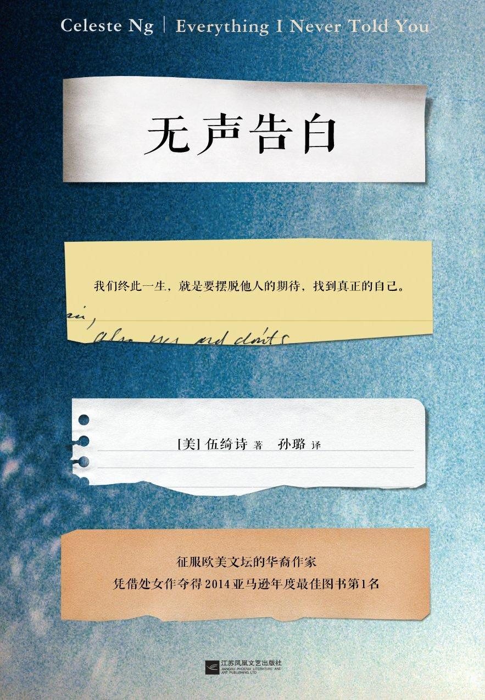

### [错误的期望，是扼杀孩子希望的凶手](http://www.jianshu.com/p/6861f0e32f16)

看完伍绮诗写的《无声的告白》有半年多了，可我写不出一个字。

直至前天看了唐纳德.克利夫顿和畅销书作家葆拉.纳尔逊合作写的《放飞你的优势》提及的“错误的期望“，我恍然大悟。

一个叫莉迪亚的女孩子因为承受不了父母投射在她身上的期望而自杀了，我能说点什么呢？一味地谴责父母不该把自己未完成的愿望和遗憾强加在子女的身上，显得太过于肤浅了。

我陷入一阵沉思，作者伍绮诗真正想要向读者表达的是什么？

书腰上面写着“`我们终其一生，就是要摆脱他人的期待，找到真正的自己`“，很多人把这句话当成故事的真正用意，可我在想：很多伟人的成就也是来自于父母的期待，他们不会像迪莉亚感受被扼杀的绝望、无奈和委屈求全，相反他们非常的感激。

同样的是父母的期待，为什么会有天翻地覆的差别呢？

莉迪亚的父亲是中国移民到美国的第二代，从小饱受种族的歧视，渴望融入人群，让自己和别人一样。社交的缺憾，他希望大女儿来替他完成。

莉迪亚的母亲是一名普通的美国白人，在女性就业受到歧视的年代，她的梦想是成为一名医生。可当她快要完成大学学业时，她怀孕了，只能休学生小孩，照顾家庭。曾经一度离开家庭，捡起中断的学业，可是怀孕再度使她放下了。工作的遗憾，她希望大女儿来替她完成。

莉迪亚上面有个哥哥，下面有个妹妹，均不受父母的重视。

只有莉迪亚承受着父母所谓的宠爱，也承受他们的未完成的梦想的压力。本来一切相安无事，可是当莉迪亚长大了，知道自己内心对什么排斥时，矛盾就来了。

莉迪亚想要推开父母的期望，做自己真正想做，可是她不忍父母的失望，无奈之下只有逃学、撒谎，伪装，最后在夜里出走，把自己沉入冰冷的湖水里，无声无息地向父母告别，用死的方式向父母告白自己的一切。

以前有一位心理医师告诉我：孩子天生爱父母。莉迪亚的母亲第一次离家出走时，她爱着妈妈，害怕失去她，因此只要能够取悦母亲，她都愿意做。可是父母天生爱孩子吗？并不尽然，做母亲是天生，但母爱却不是。因此，想要做好一个婴孩的父亲和母亲是需要学习和训练。

莉迪亚的父母最大的错误是用自己强大的意志力把未完成的愿望强加在女儿身上，扼杀莉迪亚生活上一切可能。莉迪亚的真实存在不被父母看见，不被父母了解，说白了，只是他们实现愿望的一个工具。莉迪亚的心里是多么的悲哀，而她那么的弱小，不懂得反抗也不敢反抗，死亡是最好的告别了。

那么，是不是父母不应该对子女抱有期望呢？

也不是。当父母能够从心里看到孩子的真实存在，了解她的优劣势，鼓励她发展自己的优势，鼓励她去追求属于自己的理想和生活。`顺应孩子天性的期望，希望她成为真正的自己，这才是最亲密、最高级的天伦之爱。`

作为像莉迪亚那样的孩子是不是没有活路呢？也不是。真实的案例是畅销书作家，美国洛杉机前市长的华裔陈愉，在她的《30岁前别结婚》中介绍她自己的家庭时，他的父亲是麻省理工学院的硕士毕业，从不参加年度圣诞晚会，原因是“不知道该跟人说啥”。同样是不擅长交际的父亲，陈愉却是“下定决心，要多学一些，搞清楚这个社会如何运转，也弄明白人要怎么做才能出人头地“。

没有父母意志的强加，时机到了，孩子自然会明白如何获取成功。至于父母的梦想，梦想是他们自己，那就自己去完成啊。

《无声的告白》真正厉害的地方在于`写出华人潜意识里的语言，也就是人们心里想却没有说出来的话在作者的笔下流淌而出`。作为一个读者，我从她的笔下看见了被父母意志强大的小孩的痛苦的世界，但是真正的出路，要靠自己思索、感悟。

真正扼杀孩子的希望是父母错误的期望，顺应孩子天性的期望才是真爱！

文／灵林玖玖（简书作者）
原文链接：http://www.jianshu.com/p/6861f0e32f16
著作权归作者所有，转载请联系作者获得授权，并标注“简书作者”。
