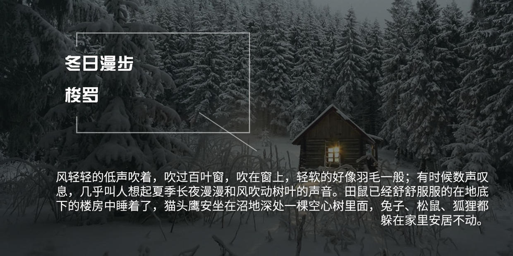

### [冬日漫步——梭罗]

风轻轻的低声吹着，吹过百叶窗，吹在窗上，轻软的好像羽毛一般；有时候数声叹息，几乎叫人想起夏季长夜漫漫和风吹动树叶的声音。田鼠已经舒舒服服的在地底下的楼房中睡着了，猫头鹰安坐在沼地深处一棵空心树里面，兔子、松鼠、狐狸都躲在家里安居不动。看家的狗在火炉旁边安静地躺着，牛羊在栏圈里一声不响的站着。大地也睡着了——这不是长眠，这似乎是它辛勤一年以来的第一次安然入睡。时虽半夜，大自然还是不断地忙着，只有街上商店招牌或是木屋的门轴上，偶然轻轻地发出叽咯的声音，给寂寥的自然添一些慰藉。茫茫宇宙，在金星和火星之间，只有这些声音表示天地万物还没有全体入睡——我们想起了远处(就在心里头吧?)还有温暖，还有神圣的欢欣和友朋相聚之乐；可是这种境界只有当天神们互相往来时才能领略，凡人是不胜其荒凉的。天地现在是睡着了，可是空中还是充满了生机，鹅毛片片，不断地落下，好像有一个北方的五谷女神，正在我们的田亩上撒下无数银色的谷种。

我们也睡着了，一觉醒来，正是冬天的早晨。万籁无声，雪厚厚地堆着，窗台上像是铺了温暖的棉花；窗格子显得加宽了，玻璃上结了冰纹，光线暗淡而恬静，更加强了屋内舒适愉快的感觉。早晨的安静，似乎静在骨子里，我们走到窗口，挑了一处没有冰霜封住的地方，眺望田野的景色；可是我们单是走这几步路，脚下的地已经在吱吱作响。窗外一幢幢的房子都是白雪盖顶；屋檐下、篱笆上都累累地挂满了雪条；院子里像石笋似站了很多雪柱，雪里藏的是什么，我们却看不出来，大树小树从四面八方伸出白色的手臂，指向天空；本来是墙壁篱笆的地方，形状更是奇怪，在昏暗的大地上面，它们向左右延伸，如跳如跃，似乎大自然一夜之间，把田野风景重新设计过，好让人间的画师来临摹。

我们悄悄地拔去了门闩，雪花飘飘，立刻落到屋子里来；走出屋外，寒风迎面扑来，利如刀割。星光已经不这么闪烁光亮，地平线上面笼罩着一层昏昏的铅状的薄雾。东方露出一种奇幻的古铜色的光彩，表示天快要亮了；可是四面的景物，还是模模糊糊，一片幽暗，鬼影幢幢，疑非人间。

大自然在这个季节，显得特别纯洁，这是使我们觉得最为高兴的。残干枯木，苔痕斑斑的石头和栏杆，秋天的落叶，到现在被大雪掩盖，像上面盖了一块干净的毛巾。寒风一吹，无孔不入，一切乌烟瘴气都一扫而空，凡是不能坚贞自守的，都无法抵御；因此凡是在寒冷荒僻的地方(例如在高山之顶)，我们所能看得见的东西，都是值得我们尊敬的，因为它们有一种坚强的纯朴的性格——一种清教徒式的坚韧。别的东西都寻求隐蔽保护去了，凡是能卓然独立于寒风之中者，一定是天地灵气之所钟，是自然界骨气的表现，它们具有天神般的勇敢。空气经过洗涤，呼吸进去特别有劲。空气的清明纯洁，甚至用眼睛都能看得出来；我们宁可整天处在户外，不到天黑不回家，我们希望朔风像吹过光秃秃的大树一般地吹彻我们的身体，使得我们更能适应寒冬的气候。我们希望借此能从大自然借来一点纯洁坚定的力量，这种力量对于我们是一年四季都是有用的。
