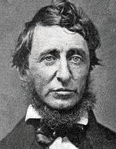

### [无论你的生活如何卑微——梭罗](http://www.jianshu.com/p/8d24c2f7a2e7)

无论你的生活如何卑微，要正视它，生活下去；不要躲避它，也不要恶语相加。你的生活不像你本人那么糟糕。你最富有的时候，你的生活看上去倒是最贫穷的。

吹毛求疵的人即便在天堂也能挑出瑕疵。要热爱你的生活，尽管生活一贫如洗。即使身处贫民院，你也可能享受一段愉快、兴奋、辉煌的时光。西斜的落日映照在贫民院窗户上的余晖，与照射在富贵人家的豪宅上一样光芒万丈；门前的积雪一样在早春消融。我只看到，一个气定神闲的人在那里可以过着自得其乐的生活，抱着振奋乐观的思想，如同居住在皇宫里一般。依我之见，城镇的贫民倒是往往过着最独立的生活。也许他们十分伟大，对任何事情皆可坦然受之。大多数人认为他们不屑于接受城镇的施救；但是实际上他们经常使用不诚实的手段来维持自己的生计，这是更为不体面的。像圣贤一样，如同栽培花园中的花草一般来培养贫困吧。犯不着千辛万苦以求获得新东西，无论是衣服还是朋友。把旧的翻新，回到它们中去。万事万物没有变，是我们在变。

衣服要卖掉，思想要保留。上帝会证明，你并不需要社会。如果我被终日关闭在阁楼的一隅，如同一只蜘蛛，只要我还有自己的思想，那么世界还是原来那样大。一位哲人曾说过：“三军可夺帅也，匹夫不可夺志也。”不要急于谋求发展自己，不要让自己受到各种影响的利用，这全都是浪费。谦卑如同黑暗，展现着天国之光。贫穷与卑贱的阴影笼罩着我们，“看啊!天地万物在我们的眼界中扩大了”。我们常常被提醒，假使上天赐予我们克洛索斯一样的财富，我们的目标必须依然保持不变，我们的手段也将维持基本不变。此外，如果你受到贫困的约束，比如买不起书和报纸，你的经验不过是仅限于最有意义、最为重要的那一部分；你将不得不与那些可以产生最多的糖和淀粉的物质打交道。但是最接近骨头的地方的生活最甜美，你不可能再成为一个无所事事的人。较高层次上的宽宏大量，不会使任何人在较低层次上获得损失。多余的财富只能够买多余之物。人所必需的灵魂是不需要花钱购买的。

我蛰居在一堵铅墙的角落里，铅墙里浇注了一点钟铜的合金。在我正午休息的时候，常常有一阵阵嘈杂不堪的喧闹声从外面传入我的耳中。这是我同代人发出的噪音。我的邻居向我讲述他们与那些知名的绅士淑女之间的奇遇，他们在宴会桌上碰见了哪些显要人物；但是我对这些事情，如同我对《每日时报》的内容一样，毫无兴致。兴趣的对象和谈话的主题主要是围绕服饰打扮和礼节举止；但是呆头鹅总归是呆头鹅，随便你怎么去刻意装扮它。他们向我不断唠叨加利福尼亚和得克萨斯，英格兰和东西印度群岛，来自佐治亚或马萨诸塞的尊敬的某某先生，全是短暂易逝、昙花一现的事情，直到我几乎要像马穆鲁克大人一样从他们的庭院中逃之夭夭。

我喜欢进入我自己的世界——不愿引人注目地走在盛大的游行庆祝队伍中，而愿与宇宙的缔造者平等地并肩同行，如果我可以的话——不愿生活在这个浮躁不安、神经质的、喧嚣忙碌、轻浮浅薄的19世纪，而愿随着19世纪一天天地消逝，或立或坐，思考着。人们在庆祝些什么呢?他们都参加了某个筹备委员会，时时刻刻盼着某个大人物的演说。上帝只是今天的轮值主席，韦伯斯特是他的演说家。那些强烈地、合情合理地引起我注意的事物，我喜爱掂量它们的分量，处理它们，被它们吸引——决不吊在秤杆上来试图减轻重量——对任何事情不妄加推测，而是完全按照其实际情况来处理；只走我自能够走的那条唯一的道路，在这条路上，没有任何力量可以阻止我。在打下坚实稳固的基础之前，就开始着手建造起一座拱门，这不会给我带来任何满足。任何地方的底部都是结实的。我们读到过这样一个故事，一个旅行者问一个男孩，他面前的这块沼泽底部是否坚固。男孩回答说是坚固的。可是不久，旅行者的马深陷沼泽，直到马的腰部，他对男孩说：“我还以为，你告诉我的是这块沼泽底部是坚固的。”“是坚固的啊，”男孩回答，“可是你还没有到达它的底部一半深呢。”社会的泥沼和流沙也是如此，但是只有少年老成的人才了解这一点。
