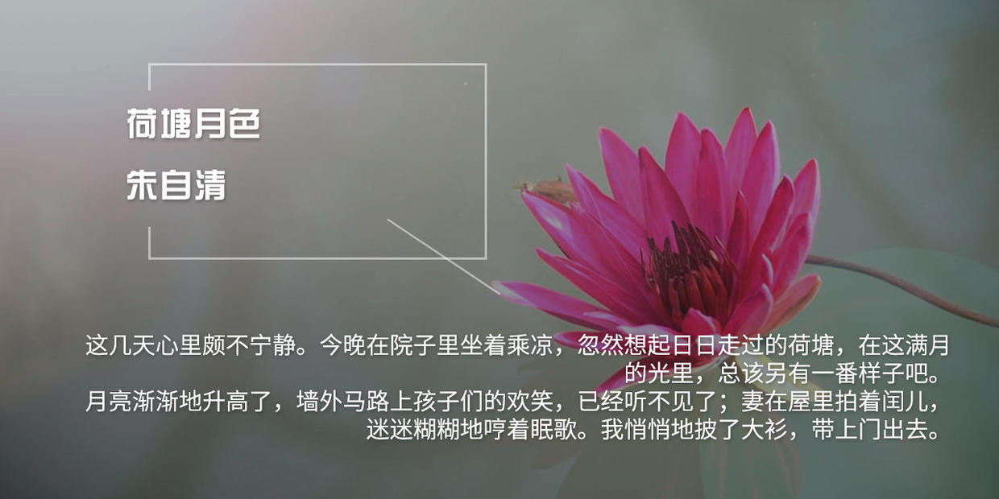

### [荷塘月色——朱自清](http://www.jianshu.com/p/0f56a0b0370f)

>这几天心里颇不宁静。今晚在院子里坐着乘凉，忽然想起日日走过的荷塘，在这满月的光里，总该另有一番样子吧。月亮渐渐地升高了，墙外马路上孩子们的欢笑，已经听不见了；妻在屋里拍着闰儿，迷迷糊糊地哼着眠歌。我悄悄地披了大衫，带上门出去。

>沿着荷塘，是一条曲折的小煤屑路。这是一条幽僻的路；白天也少人走，夜晚更加寂寞。荷塘四面，长着许多树，蓊蓊郁郁的。路的一旁，是些杨柳，和一些不知道名字的树。没有月光的晚上，这路上阴森森的，有些怕人。今晚却很好，虽然月光也还是淡淡的。

>路上只我一个人，背着手踱着。这一片天地好像是我的；我也像超出了平常的自己，到了另一世界里。我爱热闹，也爱冷静；爱群居，也爱独处。像今晚上，一个人在这苍茫的月下，什么都可以想，什么都可以不想，便觉是个自由的人。白天里一定要做的事，一定要说的话，现在都可不理。这是独处的妙处，我且受用这无边的荷香月色好了。

>曲曲折折的荷塘上面，弥望的是田田的叶子。叶子出水很高，像亭亭的舞女的裙。层层的叶子中间，零星地点缀着些白花，有袅娜地开着的，有羞涩地打着朵儿的；正如一粒粒的明珠，又如碧天里的星星，又如刚出浴的美人。微风过处，送来缕缕清香，仿佛远处高楼上渺茫的歌声似的。这时候叶子与花也有一丝的颤动，像闪电般，霎时传过荷塘的那边去了。叶子本是肩并肩密密地挨着，这便宛然有了一道凝碧的波痕。叶子底下是脉脉的流水，遮住了，不能见一些颜色；而叶子却更见风致了。

>月光如流水一般，静静地泻在这一片叶子和花上。薄薄的青雾浮起在荷塘里。叶子和花仿佛在牛乳中洗过一样；又像笼着轻纱的梦。虽然是满月，天上却有一层淡淡的云，所以不能朗照；但我以为这恰是到了好处——酣眠固不可少，小睡也别有风味的。月光是隔了树照过来的，高处丛生的灌木，落下参差的斑驳的黑影，峭楞楞如鬼一般；弯弯的杨柳的稀疏的倩影，却又像是画在荷叶上。塘中的月色并不均匀；但光与影有着和谐的旋律，如梵婀玲上奏着的名曲。

>荷塘的四面，远远近近，高高低低都是树，而杨柳最多。这些树将一片荷塘重重围住；只在小路一旁，漏着几段空隙，像是特为月光留下的。树色一例是阴阴的，乍看像一团烟雾；但杨柳的丰姿，便在烟雾里也辨得出。树梢上隐隐约约的是一带远山，只有些大意罢了。树缝里也漏着一两点路灯光，没精打采的，是渴睡人的眼。这时候最热闹的，要数树上的蝉声与水里的蛙声；但热闹是它们的，我什么也没有。

>忽然想起采莲的事情来了。采莲是江南的旧俗，似乎很早就有，而六朝时为盛；从诗歌里可以约略知道。采莲的是少年的女子，她们是荡着小船，唱着艳歌去的。采莲人不用说很多，还有看采莲的人。那是一个热闹的季节，也是一个风流的季节。梁元帝《采莲赋》里说得好：于是妖童媛女，荡舟心许；鷁首徐回，兼传羽杯；欋将移而藻挂，船欲动而萍开。尔其纤腰束素，迁延顾步；夏始春余，叶嫩花初，恐沾裳而浅笑，畏倾船而敛裾。可见当时嬉游的光景了。这真是有趣的事，可惜我们现在早已无福消受了。

>于是又记起《西洲曲》里的句子：采莲南塘秋，莲花过人头；低头弄莲子，莲子清如水。今晚若有采莲人，这儿的莲花也算得“过人头”了；只不见一些流水的影子，是不行的。这令我到底惦着江南了。——这样想着，猛一抬头，不觉已是自己的门前；轻轻地推门进去，什么声息也没有，妻已睡熟好久了。
