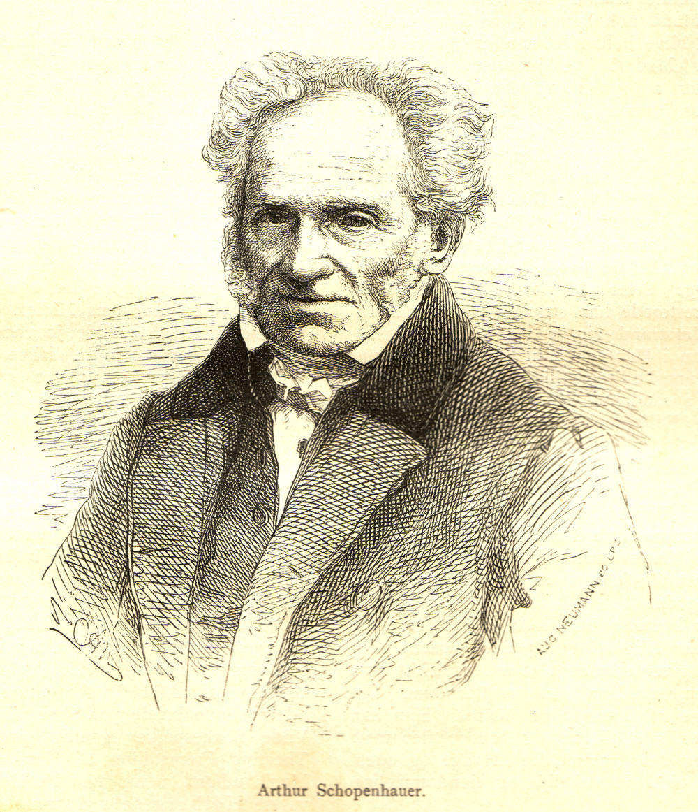

### [要么庸俗，要么孤独——叔本华](http://www.jianshu.com/p/fac791968a23)

能够自得其乐，感觉到万物皆备于我，并可以说出这样的话：我的拥有就在我身——这是构成幸福的最重要的内容。因此，亚里士多德说过的一句话值得反复回味：幸福属于那些容易感到满足的人（这也是尚福的妙语所表达的同一样思想，我把这句妙语作为警句放置这本书的开首）。这其中的一个原因是人除了依靠自身以外，无法有确切把握地依靠别人；另一个原因则是社会给人所带来的困难和不便、烦恼和危险难以胜数、无法避免。

获取幸福的错误方法莫过于追求花天酒地的生活，原因就在于我们企图把悲惨的人生变成接连不断的快感、欢乐和享受。这样，幻灭感就会接踵而至；与这种生活必然伴随而至的还有人与人的相互撒谎和哄骗。

首先，生活在社交人群当中必然要求人们相互迁就和忍让；因此，人们聚会的场面越大，就越容易变得枯燥乏味。只有当一个人独处的时候，他才可以完全成为自己。谁要是不热爱独处，那他也就是不热爱自由，因为只有当一个人独处的时候，他才是自由的。拘谨、掣肘不可避免地伴随着社交聚会。

社交聚会要求人们做出牺牲，而一个人越具备独特的个性，那他就越难做出这样的牺牲。因此，一个人逃避、忍受抑或喜爱独处是和这一个人自身具备的价值恰成比例。因为在独处的时候，一个可怜虫就会感受到自己的全部可怜之处，而一个具有丰富思想的人只会感觉到自己丰富的思想。一言以蔽之：一个人只会感觉到自己的自身。进一步而言，一个人在大自然的级别中所处的位置越高，那他就越孤独，这是根本的，同时也是必然的。如果一个人身体的孤独和精神的孤独互相对应，那反倒对他大有好处。否则，跟与己不同的人进行频繁的交往会扰乱心神，并被夺走自我，而对此损失他并不会得到任何补偿。大自然在人与人之间的道德和智力方面定下了巨大差别，但社会对这些差别视而不见，对每个人都一视同仁。更有甚者，社会地位和等级所造成的人为的差别取代了大自然定下的差别，前者通常和后者背道而驰。受到大自然薄待的人受益于社会生活的这种安排而获得了良好的位置，而为数不多得到了大自然青睐的人，位置却被贬低了。因此，后一种人总是逃避社交聚会。而每个社交聚会一旦变得人多势众，平庸就会把持统治的地位。社交聚会之所以会对才智卓越之士造成伤害，就是因为每一个人都获得了平等的权利，而这又导致人们对任何事情都提出了同等的权利和要求，尽管他们的才具参差不一。接下来的结果就是：人们都要求别人承认他们对社会作出了同等的成绩和贡献。所谓的上流社会承认一个人在其他方面的优势，却唯独不肯承认一个人在精神思想方面的优势；他们甚至抵制这方面的优势。社会约束我们对愚蠢、呆笨和反常表现出没完没了的耐性，但具有优越个性的人却必须请求别人对自己的原谅；或者，他必须把自己的优越之处掩藏起来，因为优越突出的精神思想的存在，本身就构成了对他人的损害，尽管它完全无意这样做。因此，所谓“上流”的社交聚会，其劣处不仅在于它把那些我们不可能称道和喜爱的人提供给我们，同时，还不允许我们以自己的天性方式呈现本色；相反，它强迫我们为了迎合别人而扭曲、萎缩自己。具有深度的交谈和充满思想的话语只能属于由思想丰富的人所组成的聚会。在泛泛和平庸的社交聚会中，人们对充满思想见识的谈话绝对深恶痛绝。所以，在这种社交场合要取悦他人，就绝对有必要把自己变得平庸和狭窄。因此，我们为达到与他人相像、投契的目的就只能拒绝大部分的自我。当然，为此代价，我们获得了他人的好感。但一个人越有价值，那他就越会发现自己这样做实在是得不偿失，这根本就是一桩赔本的买卖。人们通常都是无力还债的；他们把无聊、烦恼、不快和否定自我强加给我们，但对此却无法作出补偿。绝大部分的社交聚会都是这样的实质。放弃这种社交聚会以换回独处，那我们就是做成了一桩精明的生意。另外，由于真正的、精神思想的优势不会见容于社交聚会,并且也着实难得一见，为了代替它，人们就采用了一种虚假的、世俗常规的、建立在相当随意的原则之上的东西作为某种优越的表现——它在高级的社交圈子里传统般地传递着,就像暗语一样地可以随时更改。这也就是人们名之为时尚或时髦的东西。但是，当这种优势一旦和人的真正优势互相碰撞，它就马上显示其弱点。并且，“当时髦进入时,常识也就引退了。”

大致说来，一个人只能与自己达致最完美的和谐，而不是与朋友或者配偶，因为人与人之间在个性和脾气方面的差异肯定会带来某些不相协调，哪怕这些不协调只是相当轻微。因此，完全、真正的内心平和和感觉宁静——这是在这尘世间仅次于健康的至高无上的恩物——也只有在一个人孤身独处 的时候才可觅到；而要长期保持这一心境，则只有深居简出才行。

这样，如果一个人自身既伟大又丰富，那么，这个人就能享受到在这一贫乏的世上所能寻觅得到的最快活的状况。确实，我们可以这样说：友谊、爱情和荣誉紧紧地把人们联结在一起，但归根到底人只能老老实实地寄望于自己，顶多寄望于他们的孩子。由于客观或者主观的条件，一个人越不需要跟人们打交道，那么，他的处境也就越好。孤独的坏处就算不是一下子就被我们感觉得到，也可以让人一目了然；相比之下，社交生活的坏处却深藏不露：消遣、闲聊和其他与人交往的乐趣掩藏着巨大的，通常是难以弥补的祸害。青年人首要学习的一课，就是承受孤独，因为孤独是幸福、安乐的源泉。据此可知，只有那些依靠自己，能从一切事物当中体会到自身的人才是处境最妙的人。所以，西塞罗说过，“一个完全依靠自己，一切称得上属于他的东西都存在于他的自身的人是不可能不幸福的。”

除此之外，一个人的自身拥有越多，那么，别人能够给予他的也就越少。正是这一自身充足的感觉使具有内在丰富价值的人不愿为了与他人的交往而作出必需的、显而易见的牺牲；他们更不可能会主动寻求这些交往而否定自我。相比之下，由于欠缺自身内在，平庸的人喜好与人交往，喜欢迁就别人。这是因为他们忍受别人要比忍受他们自己来得更加容易。此外，在这世上，真正具备价值的东西并不会受到人们的注意，受人注意的东西却往往缺乏价值。每一个有价值的、出类拔萃的人都宁愿引退归隐——这就是上述事实的证明和结果。据此，对于一个具备自身价值的人来说，如果他懂得尽量减少自己的需求以保存或者扩大自己的自由，尽量少与他的同类接触——因为这世上人是无法避免与其同类打交道[139]的，那么，这个人也就具备了真正的人生智慧。

促使人们投身于社会交往的，是人们欠缺忍受孤独的能力——在孤独中人们无法忍受自己。他们内心的厌烦和空虚驱使他们热衷于与人交往和到外地旅行、观光。他们的精神思想欠缺一种弹力，无法自己活动起来；因此，他们就试图通过喝酒提升精神，不少人就是由此途径变成了酒鬼。出于同样的原因，这些人需要得到来自外在的、持续不断的刺激——或者，更准确地说，通过与其同一类的人的接触，他们才能获取最强烈的刺激。一旦缺少了这种刺激，他们的精神思想就会在重负之下沉沦，最终陷进一种悲惨的浑噩之中。我们也可以说：这类人都只各自拥有人性的理念之中的一小部分内容。因此，他们需要得到他人的许多补充。只有这样，他们才能在某种程度上获得人的完整意识。相比之下，一个完整、典型的人就是一个独立的统一体，而不是人的统一体其中的一小部分。因此，这个人的自身也就是充足完备的。在这种意义上，我们可以把平庸之辈比之于那些俄罗斯兽角乐器。每只兽角只能发出一个单音，把所需的兽角恰当地凑在一起才能吹奏音乐。大众的精神和气质单调、乏味，恰似那些只能发出单音的兽角乐器。确实，不少人似乎毕生只有某种一成不变的见解，除此之外，就再也没有能力产生其他的念头和思想了。由此不但解释清楚为什么这些人是那样的无聊，同时也说明了他们何以如此热衷于与人交往，尤其喜欢成群结队地活动。这就是人类的群居特性。人们单调的个性使他们无法忍受自己，“愚蠢的人饱受其愚蠢所带来的疲累之苦”。人们只有在凑到一块、联合起来的时候，才能有所作为。这种情形与把俄罗斯兽角乐器集合起来才能演奏出音乐是一样的道理。但是，一个有丰富思想头脑的人，却可以跟一个能单独演奏音乐的乐手相比；或者，我们可以把他比喻为一架钢琴。钢琴本身就是一个小型乐队。同样，这样一个人就是一个微型世界。其他人需要得到相互补充，但这种人的单个的头脑意识本身就已经是一个统一体。就像钢琴一样，他并不是一个交响乐队中的一分子，他更适合独自一人演奏。如果他真的需要跟别人合作演奏，那他就只能作为得到别的乐器伴奏的主音，就像乐队中的钢琴一样。或者，他就像钢琴那样定下声乐的调子。那些喜爱社会交往的人尽可以从我的这一比喻里面得出一条规律：交往人群所欠缺的质量只能在某种程度上通过人群的数量得到弥补。有一个有思想头脑的同伴就足够了。但如果除了平庸之辈就再难寻觅他人，那么，把这些人凑足一定的数量倒不失为一个好的办法，因为通过这些人的各自差异和相互补充——沿用兽角乐器的比喻——我们还是会有所收获的。但愿上天赐予我们耐心吧！同样，由于人们内心的贫乏和空虚，当那些更加优秀的人们为了某些高贵的理想目标而组成一个团体时，最后几乎无一例外都遭遇这样的结果：在那庞大的人群当中——他们就像覆盖一切、无孔不钻的细菌，随时准备着抓住任何能够驱赶无聊的机会——总有那么一些人混进或者强行闯进这一团体。用不了多长时间，这个团体要么遭到了破坏，要么就被篡改了本来面目，与组成这一团体的初衷背道而驰。

除此之外，人的群居生活可被视为人与人相互之间的精神取暖,，这类似于人们在寒冷的天气拥挤在一起以身体取暖。不过，自身具有非凡的思想热力的人是不需要与别人拥挤在一块的。在《附录和补遗》的第二卷最后一章里,读者会读到我写的一则表达这层意思的寓言。一个人对社会交往的热衷程度大致上与他的精神思想的价值成反比。这一句话，“他不喜好与人交往”，就几乎等于说“他是一个具有伟大素质的人”了。

孤独为一个精神禀赋优异的人带来双重的好处：第一，他可以与自己为伴；第二，他用不着和别人在一起。第二点弥足珍贵，尤其我们还记得社会交往所意味着的束缚、烦扰甚至危险，拉布叶说过：“我们承受所有不幸皆因我们无法独处”。热衷于与人交往其实是一种相当危险的倾向，因为我们与之打交道的大部分人道德欠缺、智力呆滞或者反常。不喜交际其实就是不稀罕这些人。一个人如果自身具备足够的内涵，以致根本没有与别人交往的需要，那确实是一大幸事；因为几乎所有的痛苦都来自于与人交往，我们平静的心境——它对我们的幸福的重要性仅次于健康——会随时因为与人交往而受到破坏。没有足够的独处生活，我们也就不可能获得平静的心境。犬儒学派哲学家放弃所拥有的财产、物品，其目的就是为了能够享受心境平和所带来的喜悦。谁要是为了同样的目的而放弃与人交往，那他也就做出了一个最明智的选择。柏那登·德·圣比埃的话一语中的，并且说得很美妙：“节制与人交往会使我们心灵平静。”因此，谁要是在早年就能适应独处，并且喜欢独处，那他就不啻获得了一个金矿。当然，不是每一个人都能够这样做。正如人们从一开始就受到匮乏的驱赶而聚集在一起，一旦解决了匮乏，无聊同样会把人们驱赶到一块。如果没有受到匮乏和无聊的驱赶，人们或许就会孤身独处，虽然其中的原因只是每个人都自认为很重要，甚至认为自己是独一无二的，而独自生活恰好适合如此评价自己的人；因为生活在拥挤、繁杂的世人当中，就会变得步履艰难，左右掣肘，心目中自己的重要性和独特性就会被大打折扣。在这种意义上说，独处甚至是一种自然的、适合每一个人的生活状态：它使每一个人都像亚当那样重新享受原初的、与自己本性相符的幸福快乐。

但当然，亚当并没有父亲和母亲！所以，从另一种意义上说，独处对于人又是不自然的，起码，当人来到这一世界时，他发现自己并不是孑然一身。他有父母、兄弟、姐妹，因此，他是群体当中的一员。据此，对独处的热爱并不是一种原初的倾向，而是在经历经验和考虑以后的产物；并且，对独处的喜爱随着我们精神能力的进展和与此同时岁数的增加而形成。所以，一般而言，一个人对社会交往的渴望程度与他的年龄大小成反比。年幼的小孩独自呆上一会儿的时间就会惊恐和痛苦地哭喊。要一个男孩单独一人则是对他的严厉惩罚。青年人很容易就会凑在一块，只有那些气质高贵的青年人才会有时候试图孤独一人，但如果单独呆上一天的时间，则仍然是困难的。但成年人却可以轻而易举做到这一点，他们已经可以独处比较长的时间了；并且，年纪越大，他就越能够独处。最后，到达古稀之年的老者，对生活中的快感娱乐要么不再需要，要么已经完全淡漠，同辈的人都已一一逝去，对于这种老者来说，独处正好适合他们的需要。但就个人而言，孤独、离群的倾向总是与一个人的精神价值直接相关。这种倾向正如我已经说过的，并不纯粹自然和直接地出自我们的需要，它只是我们的生活经验和对此经验进行思考以后的结果，它是我们对绝大多数人在道德和思想方面的悲惨、可怜的本质有所认识以后的产物。我们所能碰到的最糟糕的情形莫过于发现在人们的身上，道德上的缺陷和智力方面的不足共同联手作祟，那样，各种令人极度不快的情形都会发生。我们与大部分人进行交往时都感到不愉快，甚至无法容忍，原因就在这里。因此，虽然在这世界上不乏许许多多的糟糕东西，但最糟糕的莫过于聚会人群。甚至那个交际广泛的法国入伏尔泰也不得不承认：“在这世上，不值得我们与之交谈的人比比皆是。”个性温和的彼特拉克对孤独有着强烈的、永恒不变的爱。他也为自己的这种偏好说出了同样的理由：

我一直在寻求孤独的生活河流、田野和森林可以告诉你们，我在逃避那些渺小、浑噩的灵魂我不可以透过他们找到那条光明之路。

彼特拉克在他优美的《论孤独的生活》里面，详细论述了独处的问题。他的书似乎就是辛玛曼的那本着名的《论孤独》

的摹本。尚福以一贯嘲讽的口吻谈论了导致不喜与人交往的这一间接和次要的原因。他说：有时候，人们在谈论一个独处的人时，会说这个人不喜欢与人交往，这样的说法就犹如当一个人不愿意深夜在邦地森林行走，我们就说这个人不喜欢散步一样。甚至温柔的基督教徒安吉奴斯也以他独特、神秘的语言表达了一模一样的意思：

希律王是敌人，上帝在约瑟夫的睡梦中让他知晓危险的存在。

伯利恒是俗界，埃及则是孤独之处。

我的灵魂逃离吧！否则痛苦和死亡就等待着你。

同样，布鲁诺也表示了这一意见：“在这世上，那些想过神圣生活的人，都异口同声地说过：噢，那我就要到远方去，到野外居住。”波斯诗人萨迪说：“从此以后，我们告别了人群，选择了独处之路，因为安全属于独处的人。”他描述自己说：“我厌恶我的那些大马士革的朋友，我在耶路撒冷附近的沙漠隐居，寻求与动物为伴。”一句话，所有普罗米修斯用更好的泥土塑造出来的人都表达了相同的见解。这类优异、突出的人与其他人之间的共通之处只存在于人性中的最丑陋、最低级，亦即最庸俗、最渺小的成分；后一类人拉帮结伙组成了群体，他们由于自己没有能力登攀到前者的高度，所以也就别无选择，只能把优秀的人们拉到自己的水平。这是他们最渴望做的事情。试问，与这些人的交往又能得到什么喜悦和乐趣呢？因此，尊贵的气质情感才能孕育出对孤独的喜爱。无赖都是喜欢交际的；他们的确可怜。相比之下，一个人的高贵本性正好反映在这个人无法从与他人的交往中得到乐趣，他宁愿孤独一人，而无意与他人为伴。然后，随着岁月的增加，他会得出这样的见解：在这世上，除了极稀少的例外，我们其实只有两种选择：

要么是孤独，要么就是庸俗。这话说出来虽然让人不舒服，但安吉奴斯——尽管他有着基督徒的爱意和温柔——还是不得不这样说：

孤独是困苦的；但可不要变得庸俗；因为这样，你就会发现到处都是一片沙漠。

对于具有伟大心灵的人来说——他们都是人类的真正导师——不喜欢与他人频繁交往是一件很自然的事情，这和校长、教育家不会愿意与吵闹、喊叫的孩子们一齐游戏、玩耍是同一样的道理。这些人来到这个世上的任务就是引导人类跨越谬误的海洋，从而进入真理的福地。他们把人类从粗野和庸俗的黑暗深渊中拉上来，把他们提升至文明和教化的光明之中。

当然，他们必须生活在世俗男女当中，但却又不曾真正地属于这些俗人。从早年起他们就已经感觉到自己明显与他人有别，但只是随着时间的流逝才逐渐清晰地认识到自己的处境。他们与大众本来就有精神上的分离，现在，他们刻意再辅之以身体上的分离；任何人都不可以靠近他们，除非这些人并不属于泛泛的平庸之辈。

由此可知，对孤独的喜爱并不是一个原初的欲望，它不是直接形成的，而是以间接的方式、主要是在具有高贵精神思想的人们那里逐渐形成。在这个过程中我们免不了要降服那天然的、希望与人发生接触的愿望，还要不时地抗拒魔鬼靡菲斯特的悄声的建议：

停止抚慰你那苦痛吧，它像一只恶鹰吞噬着你的胸口！

最糟糕的人群都会让你感觉到你只是人类中的一员而已。

——《浮士德》

孤独是精神卓越之士的注定命运：对这一命运他们有时会嘘唏不已，但是他们总是两害相权取其轻地选择了孤独。随着年岁的增长，在这方面做到“让自己遵循理性”变得越来越容易和自然。当一个人到了 60 岁的年龄，他对孤独的渴望就已经真正地合乎自然，甚至成为某种本能了，因为到了这个年纪，一切因素都结合在一起，帮助形成了对孤独的渴望。对社交的强烈喜好，亦即对女人的喜爱和性的欲望，已经冷淡下来了。

事实上，老年期无性欲的状态为一个人达致某种的自足无求打下了基础；而自足无求会逐渐吸掉人对于社会交往的渴望。我们放弃了花样繁多的幻象和愚蠢行为；活跃、忙碌的生活到了此时也大都结束了。这时，再没有什么可期待的了，也不再有什么计划和打算。我们所隶属的一代人也所剩无几了。周围的人群属于新的、陌生的一代，我们成了一种客观的、真正孤零零的存在。时间的流逝越来越迅速，我们更愿意把此刻的时间投放在精神思想方面。因为如果我们的头脑仍然保持精力，那么，我们所积累的丰富知识和经验，逐步经过完善了的思想见解，以及我们所掌握的运用自身能力的高超技巧都使我们对事物的研究比起以往更加容易和有趣。无数以前还是云山雾罩的东西，现在都被我们看得清晰明白；事情有了个水落石出的结果，我们感觉拥有了某种彻底的优势。丰富的阅历使我们停止对他人抱有太高的期待，因为，总的说来，他人并不都是些经我们加深了解以后就会取得我们的好感和赞许的人。相反，我们知道，除了一些很稀有和幸运的例子以外，我们碰到的除了是人性缺陷的标本以外，不会是别的东西。对于这些人我们最好敬而远之。因此，我们不再受到生活中惯常幻象的迷惑。我们从一个人的外在就可以判断其为人；我们不会渴望跟这种人做更深入的接触。最后，与人分离、与自己为伴的习惯成为了我们的第二天性，尤其当孤独从青年时代起就已经是我们的朋友。因此，对于独处的热爱变成了最简单和自然不过的事情。但在此之前，它却必须先和社交的冲动作一番角力。在孤独的生活中，我们如鱼得水。所以，任何出色的个人——正因为他是出色的人，他就只能是鹤立鸡群、形单影只——在年轻时都受到这必然的孤独所带来的压抑，但到了老年，他可以放松地长舒一口气了。

当然，每一个人享受老年好处的程度，由这个人的思想智力所决定。因此，虽然每个人都在某种程度上享受到老年期的好处，但只有精神卓越的人才最大程度地享受老年的时光。只有那些智力低劣和素质太过平庸的人才会到了老年仍然像在青年时期那样对世俗人群乐此不疲。对于那个不再适合他们的群体来说，他们既啰嗦又烦闷；他们顶多只能做到使别人容忍他们。但这以前，他们可是受到人们欢迎的人。

我们的年龄和我们对社交的热衷程度成反比——在这里，我们还可以发现哲学上的目的论发挥了作用。一个人越年轻，他就越需要在各个方面学习。这样，大自然就为年轻人提供了互相学习的机会。人们在与自己相仿的人交往时，也就是互相学习了。在这方面，人类社会可被称为一个庞大的贝尔·兰卡斯特模式的教育机构。一般的学校和书本教育是人为的，因为这些东西远离大自然的计划。所以，一个人越年轻，他就越感兴趣进入大自然的学校——这合乎大自然的目的。

正如贺拉斯所说的，“在这世上根本就没有什么完美无瑕”。印度的一句谚语说：“没有不带茎柄的莲花”。所以，独处虽然有着诸多好处，但也有小小的不便和麻烦。不过，这些不便和麻烦与跟众人在一起时的坏处相比却是微不足道的。因此，一个真正有内在价值的人肯定会发现孤身的生活比起与他人在一起更加轻松容易。但是，在孤独生活的诸多不便当中，一个不好之处却并不容易引起我们的注意：正如持续呆在室内会使我们的身体对外界的影响变得相当敏感，一小阵冷风就会引致身体生病；同样，长期离群索居的生活会使我们的情绪变得异常敏感，一些不值一提的小事、话语，甚至别人的表情、眼神，都会使我们内心不安、受伤和痛苦。相比之下，一个在熙攘、繁忙当中生活的人却完全不会注意到这些鸡毛蒜皮的事情。

如果一个人出于对别人的有理由的厌恶，迫于畏惧而选择了孤独的生活，那么，对于孤独生活的晦暗一面他是无法长时间忍受的，尤其正当年轻的时候。我给予这种人的建议就是养成这样的习惯：把部分的孤独带进社会人群中去，学会在人群中保持一定程度上的孤独。这样，他就要学会不要把自己随时随地的想法马上告诉别人；另外，对别人所说的话千万不要太过当真。他不能对别人有太多的期待，无论在道德上抑或在思想上。对于别人的看法，他应锻炼出一副淡漠、无动于衷的态度，因为这是培养值得称道的宽容的一个最切实可行的手段。

虽然生活在众人之中，但他不可以完全成为众人的一分子；他与众人应该保持一种尽量客观的联系。这样会使他避免与社会人群有太过紧密的联系，这也就保护自己免遭别人的中伤和侮辱。关于这种与人交往的节制方式，我们在莫拉丹所写的喜剧《咖啡厅，或新喜剧》中找到那值得一读的戏剧描写，尤其在剧中第一幕的第二景中对 D．佩德罗的性格的描绘。从这种意义上说，我们可以把社会人群比喻为一堆火，明智的人在取暖的时候懂得与火保持一段距离，而不会像傻瓜那样太过靠近火堆；后者在灼伤自己以后，就一头扎进寒冷的孤独之中，大声地抱怨那灼人的火苗。

文／经典重读（简书作者）
原文链接：http://www.jianshu.com/p/fac791968a23
著作权归作者所有，转载请联系作者获得授权，并标注“简书作者”。
