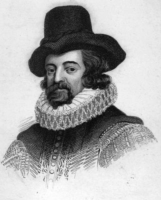

### [论对孩子的教育——蒙田](http://www.jianshu.com/p/a25a77a48bc8)

#### 一、教育孩子是人类最重要而又困难的学问

一位读过我的〈论学究气〉的人，一天在我家里对我说，我应该在孩子的教育问题上展开讲一讲。然而，夫人，如果说我有这方面的才能的话，那最好用来献给您即将出世的小男孩（您是南洋高贵，头胎不可能不是男孩）。因为我一直是您忠诚的奴仆，我有义务祝愿您万事如意，再则，我曾积极促成您的婚事，因此有权关注您家庭的兴盛和繁荣。不过，话要说回来，教育和扶养孩子是人类最重要也是最困难的学问。

正如种田，播种前的耕作可靠而简单，播种也不难，可是播下的种子一旦有了生命，就有各种抚育的方式，会遇到种种困难；人也一样，播种无甚技巧，可是人一旦出世，就要培养和教育他们，给予无微不至的关怀，为他们鞍前马后，忙忙碌碌，担惊受怕。

人在幼年时，有什么爱好还显得嫩幼脆弱，若明若暗，前途尚未确定，因此很难作出可靠的判断。

你看西门、地米斯托克利和其他许多人，他们的行为与自己的本性相差多远。熊和狗的后代总是显示它们天生的癖性，而人则很快屈服于习俗、成见和法律，易于改变和装扮自己。

但是，强迫孩子做超越他们本性的事，是很难很难的。常有人用很多时间，孜孜不倦于培养孩子做他们勉为其难的事，因为选错了路，结果徒劳无功。但是，既然教育孩子如此之难，我认为应该引导他们做最好最有益的事，不要过分致力于猜测与预料他们的发展。就连柏拉图在他的〈理想国〉中，似乎也给予孩子们很多的权力。

夫人，知识给人以华丽的装饰，是服务于人的不可思议的工具，尤其是对您这样极其富贵极有教养的人。说实话，知识在地位卑微的人手中是无用武之地的。它引以为荣的与其说能相帮人们确立论据、为申诉辩护或开药方，毋宁说能为引导战争、指挥人民或赢得某亲王或某国家的友谊助一臂之力。夫人，您出身诗书门第，您品味过教育的甜头，我深信您不会忘记所受的教育，因此，在这个问题上，我只想对您谈一点看法，是与习惯做法格格不入的，这就是我可能为您做的一切。

选择什么样的人做您儿子的家庭教师，决定着他受教育的效果。家庭教师的指责涉及其他许多方面，但我不谈这些，因为我知道自己谈不好。在本文中，我想给那位教师一些忠告，他越觉得有道理，就会越相信我。作为贵族子弟，学习知识不是为了图利（这个目的卑贱浅陋，不值得缪斯女神垂青和恩宠，再说，有没有利益，这取决于别人，与自己无关），也不是为了适应外界，而是为了丰富自己，装饰自己的内心；不是为了培养有学问的人，而是为了造就能干的人。因此，我希望能多多注意给孩子物色一位头脑多于知识的老师，二者如能兼得则更好，如不能，那宁求道德高尚，判断力强，也不要选一个光有学问的人。我希望他能用新的方式来教育孩子。

#### 二、教育不是培养驮着书本的蠢材

人们不停地往我们耳朵里灌东西，就像灌入漏斗里，我们的任务只是鹦鹉学舌，重复别人说的话。我希望您孩子的老师改变一下做法，走马上任时，就要根据孩子的智力，对他进行考验，教会他独立欣赏、识别和选择事物，有时领着他前进，有时则让他自己披荆斩棘。老师不应该一个人想，一个人讲，也应该听他的学生讲一讲。苏格拉底及后来的阿凯西劳斯就先让学生讲，然后他们再说。“教师的权威部分时间不利于学生学习。”

老师应让学生在他面前小跑，以便判断其速度，决定中怎样放慢速度以适应学生的程度。如果师生的速度不相适应，事情就会弄糟。善于选择适当的程度，取得一致的步调，这是我所知道的最艰难的事。一个高尚而有眼力的人，就要善于屈尊俯就于孩子的步伐，并加以引导。对我来说，上坡比下坡步子更稳健，更踏实。

通常，不管学生的能力和习惯多么相异，课程和方法却千篇一律，因此，豪不奇怪，在一大堆学生中，能学有所成者寥寥无几。

教师不仅要求学生说得出学过哪些词，还要讲得出它们的意思和实质，在评估学生的成绩时，不是看他记住多少，而是会不会生活。学生刚学到新的知识后，老师应遵照柏拉图的教学法，让他举一反三，反复实践，看他是否真正掌握，真正变为自己的东西。吞进什么，就吐出什么，这是生吞活削、消化不良的表现。肠胃如果不改变吞进之物的外表和形状，那就是没有进行工作。

我们的思想徒劳无益地听凭别人的想法摆布，受它们的奴役和束缚。我们脖子上被套了根绳索，也就步履沉重，失去了活力和自由。“他们不可能做到自己支配自己。”我在意大利的比萨市私访过一位有学问的人，但他把亚里士多德奉为神明，他的信条中最概括的一条是，衡量一个学说的可靠性和真实性，要看它是否符合亚里士多德的学说，否则就是空想和玄想。他认为亚里士多德见多识广，他的学说包罗万象。他这个信条被解释歪了，因此，他曾陷入困境，长期受到罗马宗教裁判所的查究。

教师如果让学生把学到的东西严格筛选，而不是专横而徒劳地让他记住一切，那么，亚里士多德的那些原则，也和斯多葛派和伊壁鸠鲁派的原则一样，对他而言就不是单纯的原则了。如果提出各种看法让他判断，那么，他能区别就会做区别，不能区别也会提出怀疑。

> 我喜欢怀疑不亚于肯定。——但丁

因为，如果学生能通过思考来掌握色诺芬和柏拉图的观点，那就不再是他们的观点，而是他自己的了。跟在别人后头的人其实什么也没跟。他会一无所获，甚至可以说他什么也不想获得。“我们不受任何国王的统治，人人有权支配自己。”学生起码应该知道自己知道了什么。应该运用那些哲学家的观点，而不是死背他们的教条。如果愿意，他尽管忘记那些教导出自何处，但应把它们变成自己的东西。真理和理性是大家共有的，不分谁先说谁后说，也不管是柏拉图说的，还是我说的，就不再是荚蒾或牛至了；同样，学生从他人那里借来断章残篇，经过加工和综合，做成自己的作品，那就是自己的看法。他受的教育，他的工作和学习，都是为了形成自己的看法。

他从哪里得到的帮助，可以隐瞒起来，而只将成果展示出来。大凡抄袭和借用的人，只炫耀他们建造的房屋，他们购得的物品，而非从别人那里汲取的东西。法官收受的礼品，你是看不见的，你只见他为他的孩子们赢得了姻亲和荣誉。谁都不会将自己的收入归于公家，只会讲获得的财物据为己有。

通过学习，我们变得更完美，更聪明了。这就是学习的收获。

埃庇卡摩斯说，唯有理解力看得着，听得见，它利用一切，支配一切，影响和君临一切：其他一切都耳聋眼瞎，没有灵魂。自然，由于我们不给理解力以行动自由，它变得唯唯诺诺，畏首畏尾。谁曾让自己的学生就西塞罗这个或那个格言的修辞和语法谈过自己的看法？人们把这些装有羽毛的警句格言当作神谕往我们的脑袋里灌，一个字母一个音节都构成事物的要旨。背熟了不等于知道，那不过是把别人讲的东西储存在记忆中。真正知道的东西，就要会使用，不必注意老师，不必看着书本。死背书本得来的才能，是令人遗憾的才能。但愿这种才能只作为装饰，而不作为基础。这是柏拉图的看法，他说，坚定、信念、真诚是真正的哲学，与之无关的一切知识都是装饰品。

人通过接触世界来提高判断力，使自己对事物洞入观火。我们每个人都囿于自己，目光短浅，只看见鼻子底下的事，有人问苏格拉底是哪里人，他不说：“雅典人”，而回答：“世界人”。他比我们有更丰富深湛的想像力，视宇宙为自己的故乡，把自己的知识投向整个人类，热爱全人类，与全人交往，不像我们只注意眼皮底下的事。我家乡的葡萄园冻冰时，我的神甫下结论说是上帝将怒于人类，并且断言，野蛮民族因此而口燥唇焦。看到我们内战汹汹，谁不叫嚷天下已打乱，最后审判的日子已来临？他们也不想想，比这更坏的事常有发生，可在世界的多少地方，人们依然生活得快快乐乐。而我，尽管战争肆无忌惮，为所欲为，我却惊讶地看见它们温和而无力。有的人头上挨了冰雹，就以为风暴席卷了半个地球。萨瓦人亨利·埃蒂安纳想像不出还有比他的主人公爵先生更伟大的人。我们谁都可能不知不觉地犯类似的错误，它会造成严重的后果和损失。但是，只有像在一幅画中那样，看到大自然那威严无比的形象，从我们这位母亲的脸上观察到瞬间万变的千姿百态，并且从中发现，不仅是我们自己，而且整个王国有如一个精美无比的圆点，我们才能对事物的大小作出正确无误的判断。

这个大千世界，是一面镜子，我们应该对镜自照，以便正确地认识自己；有人还把它分门别类，使之更加五彩缤纷。总之，我希望世界是我学生的教科书。它包容形形色色的特性、宗派、见解、看法、法律和习俗，可以教会我们正确地判断自己，发现自己的判断力有哪些不足和先天缺陷：这可不是轻易能学会的。看到国家历尽沧桑，命运多舛，这教我们懂得我们自己以为抓十个轻骑兵，攻占一个鸡棚似的防御工事就能名垂史册，那就会发现这个想法多么可笑。看到多少外国对本国的奢华印以为自豪，多少宫廷对自身的威严感到骄傲，我们的视力就会受到锻炼，就能一眼不眨地逼视我们自己的光彩夺目的豪华。在我们之前，多少人已埋葬于地下，这使我们勇气徒增，不怕到另一个世界去寻找良师益友。如此等等。

毕达哥拉斯说，人生犹如庞大而繁杂的奥林匹克运动会。拿到那里去兜售。有的人在那里运动身体，为在比赛中争得荣誉，另一些人为了挣钱，把商品拿到那里去兜售。还有的人——不是最坏的——只是袖手旁观每件事如何进行，为什么这样进行，观察别人如何生活，以便对此作出判断，调整自己的生活。

当我们教会了孩子如何使自己变得更聪明更优秀之后，就可以教他逻辑学、物理学、几何学和修辞学了。他的判断力已经培养起来，他所选择的学科，他很快便能融会贯通。授课方式有时可以通过闲谈，有时则讲解书本；老师可以让他阅读跟他的课程有关的作者选段，也可以详细讲解精神实质。如果孩子自己不十分善于读书，发现不了书中的精彩论述，老师可以有目的地给他选些作家，根据不同需要提供不同材料，发给他的学生。谁能怀疑，这种授课方法不比夹杂的方法更容易更自然呢？夹杂授课时，尽讲些晦涩难懂、索然寡味的原理和空洞枯燥的词语，毫无能够启发智力的有意义的东西。而采用我说的方法，有的是可以理解和吸收的东西。这样结出的果子一定硕大无比，也更加成熟。

为此，我不愿人们把你的孩子当成囚犯，不愿把他教给一个性情忧郁、喜怒无常的老师看管。我不愿腐蚀他的心灵，让他和其他孩子一样，每天学习十四五个小时，像脚夫那样受苦受累。假如他性格孤僻或阴郁，过分埋头于书本，而人们明知他这样做太不审慎却还姑息迁就，我认为这很不合适，这会使孩子对社交生活和更好的消遣不感兴趣。我见过多少和我同时代的人盲目贪求知识，最终变得傻头傻脑，愚不可及。

#### 三、要孩子锤炼心灵和锻炼肌肉

不光要锤炼他们的心灵，还要锻炼他们的肌肉。心灵若无肌肉支撑，孤身承担双重任务，会不堪重负。我就深有体会。我身体娇弱敏感，心灵要做多大努力，才能承受身体的压力。我在书中常常发现，我那些老师们在谈论高尚和勇敢时，往往赞赏钢筋铁骨之躯。我看见有些男人、女人和孩童，生来就身强体壮，对他们而言，挨一顿棍打，犹如被手指头弹一下，声不吭，眉不皱。竞技者同哲学家比赛耐力，更多的是用体力，而不是心灵。然而，习惯于耐劳，就是习惯于吃苦：“劳动能磨出耐痛的茧子。”要锻炼孩子吃苦耐劳，这样，他们就能忍受脱臼、肠绞痛、烧伤、坐牢和酷刑。很难说他们不会遭受牢狱和酷刑之苦，有时候，好人也会像坏人那样坐牢和被拷打。我们要经得住考验。有些人目无法律，会用皮鞭和绳索威胁正人君子。

再说，老师对孩子的权威应该至高无上，如果父母在场，就会受到中断和妨碍。此外，依我之见，孩子受父母溺爱，或者从小就知道自己家是豪门贵族，这对他只有坏处。

在培养交往能力时，我每每发现有一个缺点：我们总是竭力显示自己，兜售自己的货色，而不是去了解别人，汲取新的知识。沉默和谦逊有利于同人交往。等您的孩子有了才华时，我们要教育他不要露财扬己；听到别人胡言乱语，不要怒形于色，因为听到不合自己趣味的东西就面有愠色，是不礼貌和令人讨厌的行为。要教育孩子注意自身修养，自己拒绝做的事，别人做了也无须责怪，不必同习俗格格不入。“为贤人者当不卖弄学问，不盛气凌人。”要教育孩子有礼貌，不要好为人师，不要小小年纪就野心勃勃，为让人另眼相看就显示自己比别人聪明，用指謫别人和标新立异来捞取名声。只有大诗人才可以在艺术上别出心裁，同样，也只有伟大而杰出的任务才可以撇开传统，独树一帜。“即使曾有个苏格拉底和亚里斯提卜远离了习惯和传统，人们也不能步其后尘，他们才华出众，超凡脱俗，所以就能独树一帜。”要教会孩子只有在棋逢对手时才发表议论或进行争论，即便如此，也不要把所有的招数都展示出来，而只消使用对他最有利的。要教会他精于选择自己的论据，说理切中要害，因此也就要言简意赅。要教导他一旦发现真理，就要立即缴械投降，不管真理出自对方之手，还是由自己的看法稍加修改而成。因为他登台演讲，不是为了说一些规定的台词。要不不受任何理由的约束，除非自己赞成这个理由，也不要用政党的钱去买悔恨的自由。“他不是非得为规定的思想观点辩护。”

要让孩子的言谈闪烁着良知和道德，惟有理性作指导。教他懂得，当他发现自己的论说有误时，即使旁人尚未发现，也要公开承认，这是诚实和判断力强的表现，而诚实和判断力正是他觅求的重要品质；还要他懂得，坚持或否认错误是庸人的品质，这在越是卑贱的人身上越明显；他应该知道，修改看法，改正错误，中途放弃一个错误的决定，这是难能可贵的品质，是哲学家的品质。

要告诉孩子，和别人在一起时，要眼观四路，耳听八方，因为我发现最重要的位置往往被平庸之辈占据，财富多不等于才华出众。

当做在餐桌上放的人大谈某一挂毯如何华丽，马尔维细亚酒如何美味时，我听见另一端响起了风趣的谈话。

他要探测每个人的价值：放牛人，泥瓦工，过路人。应该把一切都调动起来，取众人之长，因为一切都是有用的，哪怕是别人的愚蠢和缺点，对他也不无教育意义。通过观察每个人的举止风度，他就会羡慕得体的举止，鄙夷不好的姿态。

应该培养他探询一切的好奇心，周围一切奇特的东西，他都要看个明白：一幢房子、一池泉水、一个人、古战场、恺撒或查里曼的通道：

什么土地会结冰，什么土地烈日下尘土飞扬，什么风把帆船吹向意大利。——普鲁佩斯

老师不仅应教学生崇尚美德，还要，甚至更要教他崇尚爱情，让美德和爱情充满他的意愿，他会对他说，诗人作诗总是遵循普遍的特征，把爱情作为永恒的主体，奥林匹斯山的诸神更乐意把汗水洒在通往维纳斯而不是雅典娜的道路上。当孩子开始有自我意识时，就把布拉达曼或昂热利克介绍给他当情妇：一个的美是璞玉挥金，积极主动，慷慨大方，并非男性却阳刚气十足；另一个的美有气无力，矫揉造作，娇娇滴滴，极不自然。一个穿男孩衣衫，戴闪光高顶盔；另一个穿女孩服装，戴饰有珍珠的无边软帽；如果他作的选择与弗里吉亚那位女人气十足的牧羊人相反，那么，他就会认为他的爱情有阳刚气。老师将给他上新的一课，使他懂得，真正美德的价值和高贵之处，在于简单、实用和愉快，它离困难很远很远，无论是孩子还是大人，头脑简单的，还是机敏过人的，都一学就会。美德使用的手段是给以规定，而不是强制。它的第一个宠儿苏格拉底有意放弃强制的做法，而是自自然然，轻轻松松，逐渐地获得美德。它就像母亲，用乳汁哺育人类的快乐：当它使快乐合情合理，也就使它们变得真实纯洁；如果节制快乐，也就使它们精神振奋，兴致勃勃；如果它把拒不接受的快乐失掉，就会使我们对剩下的更感兴趣；它把我们本性所需的快乐全部留给我们，十分充裕，我们得以尽情享受慈母般的关怀，直到心满意足，甚至直到厌倦（也许我们不愿说控制饮食是快乐的敌人，它使饮者未醉便休，食者胃未反酸便停止咀嚼，淫荡者未患秃发症便洗手不干）。

加入美德缺少通常的好命运，它就干脆避开或放弃，另选一个完全属于它自己的命运，不再是摇摇摆摆，变化不定。它善于成为富豪、强者和有学问的人，睡在用麝香熏过的床垫上。它热爱生活，热爱美丽、荣誉和健康。但它所特有的使命，就是善于合法地使用这些财富，也善于随时失去它们：这使命与其说艰难，不如说崇高。没有它，说明的任何进程就会违反常态，动荡不安，丑陋不堪，也就只有暗礁、荆棘和畸形的怪物。如果这个学生很特别，喜欢听老师讲奇文轶事，而不是叙述一次愉快的旅行或明智的劝告；如果他的伙伴们听到咚咚的战鼓声边热血沸腾，而他却禁不住街头艺人的诱惑，转身去看他们的表演；如果他觉得风尘仆仆从战场凯旋而归没什么意思，更希望在玩球或舞会上大出风头；如果是这样，我对此也别无他法，只有奉劝他的老师趁无人在场时，极早把他掐死，或者让他到城里去做糕点，哪怕他是公爵的儿子，因为按照柏拉图的教导，孩子将来在社会上谋职，不应靠父亲的财产，而应靠自己的本事。

因此，毫无疑问，我们的孩子不讳像其他孩子那样闲着无事。但是，正如在画廊里徜徉，走的路比到指定地点多3倍，却不会感到疲倦，同样，我们的课程仿佛是遇到什么讲什么，不分时间和地点，融于我们所有的行动中，将在不知不觉中进行。就连游戏和活动，如跑步、格斗、音乐、跳舞、打猎、驭马，操练武器等，也将是学习的重要内容。我希望，在塑造孩子心灵的同时，也要培养他举止得体，善于处世，体格健康。我们造就的不是一个心灵、一个躯体，而是一个人，不应把心灵和躯体分离开来。正如柏拉图所说的，不应只训练其中一个而忽视另一个，应将它们同等对待，犹如两匹马套在同一个辕杆上。从柏拉图这句话中可以感到，他并没有给予身体锻炼更多的时间和关注，而认为心灵和身体同样重要，而不是相反。

此外，对孩子的教育应该既严厉又温和，而不是遵照习惯的做法，那样，不是在激励孩子们读书，事实上却让他们感到读书很可怖、很残酷。

我不主张采用暴力和强制的做法。我认为没有比暴力和强制更会使孩子智力衰退和晕头转向了。如果你想让孩子有廉耻心和怕受惩罚，就不要让他变得麻木。要锻炼他不怕流血流汗，不怕寒冷、狂风和烈日，蔑视一切危险；教他在衣食住方面不挑三拣四，而对什么都能适应。但愿他不是一个漂亮柔弱，而是茁壮活泼的小男孩。我始终都是这样认为的， 不管在我孩提时代，还是在我成人和老年的时候。但是，最另我不悦的，是我们大部分学校的管理方式。加入能多一点宽容，孩子受的危害也许可以少一点。学校是一座不折不扣的囚禁孩子的监狱。人们惩罚孩子，直到他们精神失常。您可以去学校看一看：您只会听到孩子的求饶和先生的怒吼。孩子们是那样娇弱胆怯，为激发他们的求知欲望，先生却手握柳条鞭，板着可怕的面孔，强迫他们埋头读书，这是怎样的做法呀？这难道不是极不公正、极其危险的吗？在这个问题上，我还可以引用昆体良的看法：他清楚地注意到，老师的专权蛮横，尤其是体罚孩子的做法，只会带来危险的后果。按说他们的教室本该铺满鲜花和绿叶，而不是鲜血淋淋的柳条鞭！我要让教室里充满欢乐，洋溢着化身和美惠女神的欢笑，正如哲学家斯珀西普斯在他的学校里所做的那样。他们收获的地方，也应该是 他们玩乐的地方。有益于孩子的事物应用糖水浸渍，而有害的事物则应充满苦味。
