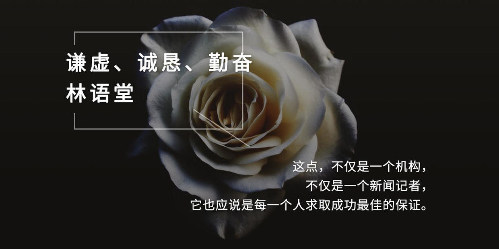

### [谦虚、诚恳、勤奋 ——林语堂](http://www.jianshu.com/p/3b1bb79bae41)

不久以前，有一个新闻系刚毕业的同学问我：做一个成功的新闻记者需要具备什么条件？我的答覆只有六个字：谦虚、诚恳、勤奋。

“学识经验、机智，难道不重要吧？”

“这些都是时间加上勤奋所必然产生的。”

新闻记者接触面广，关系容易建立，要想暴得名利并非难事，但想长久得到他人衷心的欢迎与赞誉，则非保持上述六个字不可。

名记者不是写几篇文章，找几个达官贵人品题所能获致，他必须谦虚的不断求上进，诚恳的傅取别人的友谊，勤奋的多跑几条权威而独家的新闻。

不管你的生命历程有多远，不管你的事业成就有多大，假如有一天你与这六个字分离，你就不能算是一个成功的新闻记者。

被誉为经营很成功的合众国际社（UPI），也承认成功是没有终极的，她在报史———“截稿时间”（Deadline，EveryMinute）的结语中也指出：“即令在五十年之后，依然无人敢表自满，谓目标已达成，或者梦幻已告实现。”

这点，不仅是一个机构，不仅是一个新闻记者，它也应说是每一个人求取成功最佳的保证。
