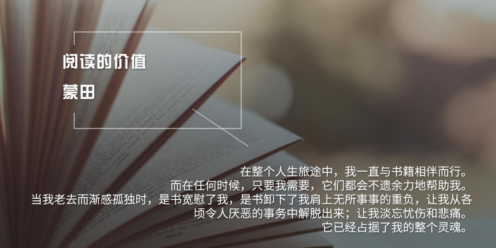

### [阅读的价值——蒙田](http://www.jianshu.com/p/85fafb36a8b9)

>在整个人生旅途中，我一直与书籍相伴而行。而在任何时候，只要我需要，它们都会不遗余力地帮助我。当我老去而渐感孤独时，是书宽慰了我，是书卸下了我肩上无所事事的重负，让我从各顷令人厌恶的事务中解脱出来；让我淡忘忧伤和悲痛。它已经占据了我的整个灵魂。

>我飞也似地从讨厌的白日梦中逃出来，奔向书，它们马上就能抓住我的思想，把其他令人生厌的思绪从我的头脑中驱逐出去。我为了贪图方便，从书里寻求一种更加真实、更加自然而生动的东西，久而久之就对它们产生了依赖。但是它们并不会因此而背叛我，每一次它们都用同样的热情迎接我。它们说：“手中牵着马的人，也一样有充分的理由步行。”詹姆斯，这位英朗健壮的那不勒斯和西西里岛的君王，就曾睡在一辆颠簸的手推车上，头下枕着一个有点寒酸的羽毛枕头，身上穿的是粗糙的灰布衣服，头上戴的也是同样质地的帽子。但是尽管如此，他依然能坐上皇家火车，骑着各式名马，指挥着形形色色的绅士和官员，只不过建立在这之上的他的威严就得打点折扣了。这个胸中自有妙计的人是不需要别人的同情的。

>我从这句话中学会的以及从中得到的锻炼，都体现了书本带给我的所有好处；但是和那些并不了解这一切的人一样，我却没有很好的利用它们，就像一个守财奴看重他的每一分钱，并会在他高兴的时候把弄那些钱一样。我酷爱书，也会在心情不错的时候看书，也会因为拥有这份财富而感到十分满足。无论是在战争时期还是和平时期，我旅行时一定要带上书。但是我却会几天、有时是几个月都不看它们一眼。我告诉自己，我会一点点地看，或是等我有了兴致时再看。然而时间却在不知不觉中一点一点地流逝了。关于这一点，我真的想不出来，到底要到什么时候我才会有迫切想读书的念头，并且意识到书本给我的生活带来的慰藉和帮助。我不知道究竟这种想法要到一种什么程度，我才会去看书。书是迄今为止我所发现的最好的一种能陪伴我们走完人生旅途的伴侣，而且我也很同情那些没有书陪伴的人们。我可以从书里获得任何娱乐活动能带给我的欢愉和兴奋，而且无论何时何地，它都从没让我失望过。

>在家时，我经常会光顾藏书室，从那里我可以了解到家人们的喜好。走进藏书室，就可以全面了解我的花园，庭院，后院以及房子的其他部分。在那儿，我可以随意浏览各种各样的书。有时我会陷入沉思，有时我又会做些纪录，并在来回踱步的时候口述些随想之类的东西，正如现在你们看到的这篇文章。

>我的藏书室位于三楼，一楼是我做礼拜的小教堂，二楼是一套有一个小隔间和壁橱的公寓，那儿是我休息生活的地方；而在此之上的就是这个伟大的书橱，这儿原来曾是整座房子里最没用的地方。在这儿，我度过了一生中的大部分时光。白天的大部分时间我都待在这儿，但我从不在这里过夜。这是一个漂亮、整洁的小房间，屋里有一个冬日里取暖用的壁炉。房间里有很多窗户，所以这儿不仅有充足的光线，还有美丽的风景。在这个三十步长，十二步宽的小小的空间里，我免去了很多麻烦，还省下不少开支，还有那足够高的隔音墙，这些都使得我可以远离一切，安心沉静在书的世界里。

>每个休息的地方都应该有散步的空间；如果我静静地坐着，我的思想就会沉沉睡去；但我从不会任幻想飘摇而不加制止。我的双腿会让它们在适当的时候停下来；而那些学习时不看书的人则通常都是一样的。我的书房是圆形的，除了几面干干净净的墙壁、—张书桌和一把椅子，剩下的就是环绕着墙壁排放的五排书架了。这样我就可以坐在中间，对我的那些藏书一览无余了。

>这个以十六步距离为半径的圆房子三面墙上都有窗户，所以从这里望出去，可以看到三个优雅宽阔的视野。冬天，我并非一直都呆在这儿；因为想要远离俗世的尘嚣的我，当初正是因为爱上了它的偏僻，它的高耸，喜欢身处其中那种完全暴露在自然之中的感觉，才决定定居于此的。这儿是属于我的王国，我努力使自己成为一名纯粹的称职的国王，统治好这个与世隔绝的小小角落，使它摆脱尘世里的婚姻和子女的枷锁，还有那些纷繁复杂的社会关系。在别的地方，我除了不断地说些无关紧要的瞎话，什么都不能做。在我看来，那种人实在太可怜，因为他没有一个让他找回自我的家，也没有一个自娱自乐的天地，更无法从人群中抽出身来。野心会让她的追随者们像市场里等待出售的雕塑一样，时时刻刻都表现的像在做秀： “巨大的财富就像那些大奴隶主一样奴役着人们。”他们从不满足于些许的最基本的自然需求。我一直认为，节俭的生活和宗教的教义一样，都是十分严肃的；也就是说，为了获得一个恒久的世界，它们都需要规则来规范每个行为，还需要很多很多的帮手来帮助他们实现这一目标。

>如果有人告诉我说，在娱乐的时候仅仅用沉思来打发时间是一种浪费，那我要告诉他，那是因为他不像我一样深刻了解娱乐休闲的价值；我不能再说下去了，再说就会让本文显得有些可笑了。我穷得一塌糊涂，如果要说得体面些，那就是我为了自己而活，穷得也有志气。这是我的意愿，也会成为我人生的终点。年轻时，我曾为了满足自己的虚荣心，为了让自己变得聪明而学习。现在，我是为了娱乐自己而看书，绝不是想从书中得到什么。从此之后，那种不仅为了满足自己的虚荣心，而且多半是因为想炫耀自己的知识的做法，在我看来，已经是徒劳无益而且愚蠢的了，所以很久以前我就拋弃了这种做法。

>对那些懂得如何选择书的人而言，书十分诱人。但是，每件美好的事物都有它不好的一面。从书中获得的乐趣是最复杂、最不纯净的。书有书的伟大之处。也有它的不便之处。它的确可以锻炼人的心智，但同时因为身体缺少锻炼而变得沉重和消沉起来。不过多年来我倒是一直都很重视身体的锻炼。在我年纪一天天大起来时，我学会了适可而止，并避免接触那些对我身体有害的东西。
