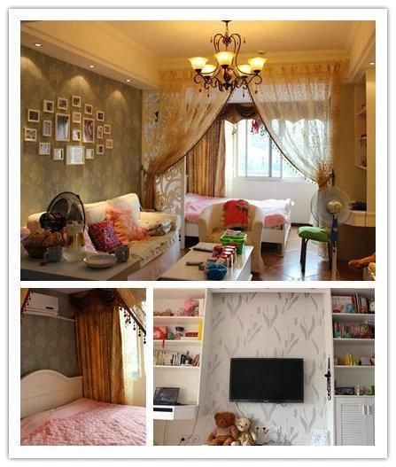

### [23岁，我买了人生的第一套房](http://www.jianshu.com/p/893bddc3fa2c)

>2012年6月手机拍摄照片，像素已有些模糊

#### 01
23岁那年，我大学毕业3年，在本地一家都市报做新闻记者，待遇1500元/月,没心没肺，存款为零。

但我却无数次想买套房子来结束被房东无穷无尽变相涨价，甚至骚扰的暗淡出租房生活。

知道我这个念头后，我妈连甩我三个成语：异想天开、天方夜谭、痴人说梦。

的确，以我当时的情况，买房有点异想天开。父母都在农村，供了三个大学生已属不易，基本帮不上忙。

可我就是倔强地认为梦想可以实现，哪怕是一无所有。

2011年7月，我竟然真的买了人生的第一套房——43平米的小公寓，南北通透，窗外是成片的樱花丛。

2012年的春天，结束了多年颠沛流离的出租屋生活，搬入新家。窗外的樱花开得正盛，我躺在白色的公主床上睡得特别安心。

美式田园风格，开放式厨房，两排大大的书架装满了这些年我买的书，订做了很多柜子，足以容纳我多年收纳的小物件。简约、纯净，一切，都是我想要的样子。

4年后的今天，我已在那套小小的房子里完成了人生的转折——告别单身。结婚生子后，我搬到了更大的房子。但那套小小的房子，一直是我心里最温暖的地方，那里留存着我最拼搏，最努力的时光。

如今，那套房子留给了刚刚大学毕业的弟弟，他也将在那里完成毕业到成家的过度。

我想，每个人的青春里，都需要有那么一个角落，来装放无处安放的青春。

#### 02
时隔多年，当初买房的模样依然清晰，趁着记忆未减退，来写写这段青葱的岁月，希望所有想买房的年轻人都能朝着想要的轨迹前进，因为地域时间都不同，可能不算有代表性，仅为草根代表的分享。

梦想还是要有，万一实现了呢？
我为什么想买房？

房租不断上涨，碰到好房东要靠运气，暂且不说周边居住环境差，连想买个心仪的家具还得考虑下次搬家的负担。

当时给自己算了一笔账，眼前房价处于上升期，再过几年可能面临存够了首付，房价涨了一倍的可能，当前每月的房租和还贷的金额相差不大，差的就是首付问题。

2010年下半年开始，一手房、二手房，大大小小的楼盘看了不少，喜欢的买不起，价格低的看不上，就这样兜兜转转就到了下半年。

2011年4月，日报一位同行给我发来消息：看到一套性价比不错的，佳境天城、43平米公寓、毛坯新房、售价14万元，可以去看看。

下午就约了卖主看房。交了首付办了贷款未收房，南北通透，新房、采光、位置、户型都还不错，第一眼就很喜欢。

卖主是同龄人，他说，看到地产形势好，便投资了几套房子，等候升值，但低估了还贷压力，只好抛售一套公寓。

了解大概情况后，我给我们俩算了一笔账，他是2009年买的，花了12万元，目前售楼部所售价格是15万元左右，过户费如果我全捡，那我不如到售楼部买划算，如果对半分，他也就能挣个1万元左右，且他必须先还清银行贷款才能交易。以他目前的资金情况，根本无法实现。

于是，我建议他在原价的基础上，稍微挣一点卖给我，我因为跑房产新闻多年，对房产政策和市场形势都比较了解，加上和开发商比较熟，可以找开发商重新签订一份购房合同，直接承接银行贷款，省去过户环节，他可以直接拿着首付款和挣的部分走人。

当天下午，他就采纳了我的建议，把房子以12.6万元的价格卖给了我，按照协议，我需一个月内支付他4.2万元。

那时能想到的唯一办法就是借。能不能借到，其实心里也没底。

这里需要插播一段的是，那时因为喜欢写东西，加上刚刚毕业，人傻时间多还不经夸，一听到别人说你稿子写得好，就屁颠屁颠写得更起劲了，也不管什么报酬不报酬，帮人做了不少免费活。加上在报社做了一档知名度还不错的专栏，或许积攒了一些好人缘。

借钱之路算是比较顺畅：一个做二手房的老总直接拿了2万块钱给我，并叮嘱不要有压力，不着急还，什么时候存够了再还。理由是一次采访，让他认可了我的能力和人品。

剩余的，这个朋友5000，那个1万，这个2000的，七拼八凑，房子总算是有了着落。

如果不逼自己一把，你永远不知道自己潜力有多大
一夜之间，背着4.2万元债务，接下来还要存契税、装修保证金、物业费等费用去拿钥匙，为了减少房租开支，还得想办法尽快装修入住。

除了会写点东西，别无特长，只能想着能否通过写作来挣点钱。

那时候因为系列采访稿，开始接触到很多本地企业家，起初是帮忙写写软文挣点稿费。慢慢发现本地的企业普遍存在一个现象：没有专业的企划人员，老板也不懂文字。这座小城，很多老板都是靠挖煤或做小本生意起家，对企业文化不懂，也没这个概念。随着企业的逐渐做大，开始有打造企业文化的意识，多个企业家在交谈中也透露想要招募此类人才的想法。

得知这信息后，我开始尝试着去兼职做企划，新闻专业毕业，在新闻单位呆了3年，对企业报纸及组稿应该是得心应手。

最早是帮一家酒店做了一份企业报，从版式、栏目到组稿，都是一个人摸索；再后来开始帮本地的门户网站做策划，写文章；然后是做企业内刊；最后还涉足了房地产文案。

稿费从几十块钱一篇到200、300元一篇，再到房地产文案2万元一年，慢慢开始有点积蓄。

2011年9月，去收了房，准备装修。

现在想来，装修那段时间可能是我这辈子最充实、最辛苦的半年，上班、兼职、工地监工，常常是刚到单位就被项目经理通知要去买这个买那个，每个月工资发下来就去买一样材料，这个月买个柜子，下个月买地板，请不起装修公司，就自己请施工队。

为了省钱，装修图纸是用稿子和设计公司交换的，衣柜是用稿子和家具店互换的，墙纸、沙发也是用稿子换的，连用来写稿的第一部二手笔记本电脑都是用稿子和一家眼镜店换的。

那段时间，每天白天都处于奔跑状态，要做好本职工作，要做好兼职，还要去建材市场买材料。舍不得打车，公交车不到的地方就走路，赶时间就奔跑，哪怕是大冬天都是大汗淋漓。有次坐公交车，甚至出现幻觉。

每天晚上就是不停地写稿。没有灵感的时候就大半夜跑到小区楼下去荡秋千。所有的商业文案都是靠浏览网站、逛论坛、看其他成功的文案自己总结摸索出来的，那段时间晚上12点之前没睡过觉。

半年后，装修完工，装修风格是自己喜欢的美式田园，所有物件都是自己精挑细选的，哪怕是那么穷，我也没对未来居住的家有过半分将就。

#### 03
2012年年初，我搬进了新家，所有的文艺、小资情结，都在这个小小的空间里得以释放。

同年，遇到了我现在的老公，因为“一个女孩子独自在这个城市打拼买房立足，能力肯定不错”得到家人认可，感情进展顺利。

2013年4月，举办完婚礼后，一个人的房间变成了二人世界。同年，我还清了所有的借款。

2015年，因为怀孕，我们搬离了公寓，开启三口之家的生活。同年下半年，还清了银行的贷款。

现在想来，当时一无所有成功买房不外乎以下几点：

> `不知者无畏的冒险精神。人生有时候就是这样`，瞻前顾后可能一事无成，当然盲目的冒险也可能摔得头破血流，但适当的冒险可能会提高成功率。

> `别给自己留后路`。有多少人一边喊着辞职，一边停滞不前；有多少人一边喊着挣钱，一边享受现世安稳？不过是因为还没到山穷水尽的地步，只要有后路可循，任何一丁点的挫折都可能成为放弃的理由。

>`一定要有一项立足的技能`。空有满腔鸡血是不行的，最终还得靠实力说话，靠能力立足。如果想在某个行业有所建树，或者想通过某个领域挣更多的钱，一定要成为那个领域的专家。
不将就就值得拥有更好的。哪怕是最困难的时候，我也没有想过要简陋装修下，哪怕是简短几年的过渡房，我也希望把它打造成可以盛放我梦想的地方，哪怕是慢一点，付出多一点。

>`把目标细化`。没有人能一口吃成大胖子，从首付、拿钥匙、装修、买家电到入住，我都是把目标细化到具体的小目标，然后一个一个去攻破。

最后，我想分享的是，努力真的累不死人。现在看来，觉得以前很疯狂，但当时是享受这个过程的，每一个小目标达成时，只有满满的成就感。所以，不要畏惧自己的梦想，不要剥夺梦想实现的权利，哪怕在别人看来是白日梦，只要你心里坚定，也可能有朝一日变成现实。

愿每一个有理想的人，都能如心所愿。

文／源本小姐（简书作者）
原文链接：http://www.jianshu.com/p/893bddc3fa2c
著作权归作者所有，转载请联系作者获得授权，并标注“简书作者”。
