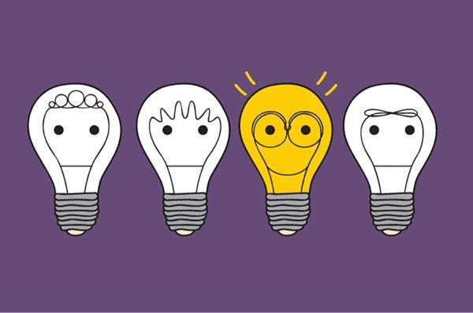
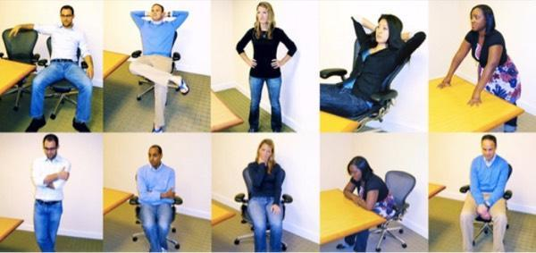
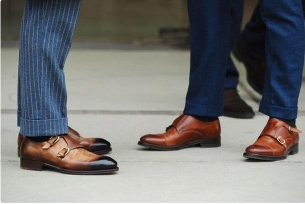
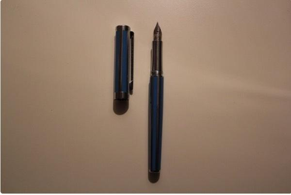
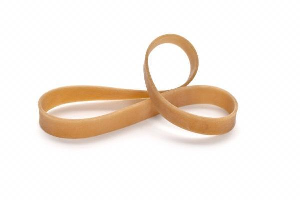
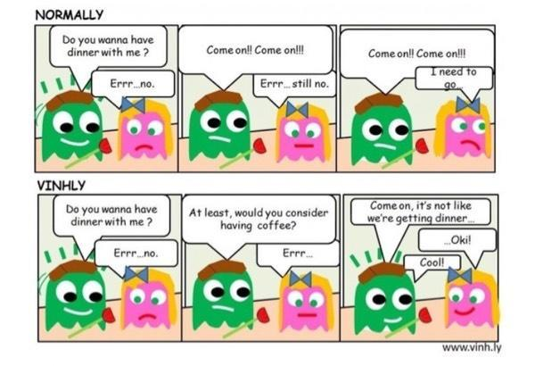
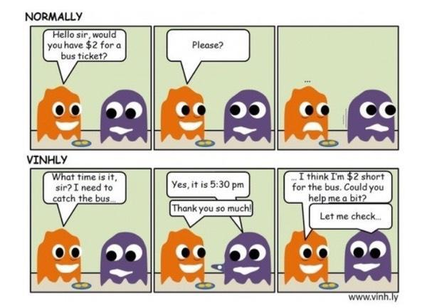

### [9个实用又有趣的心理学技巧！](http://www.jianshu.com/p/e1e1a5dd3158)

生活中难免会碰到一些不顺或者令人紧张的事，如何通过心理学技巧来自我调整，让自己的状态变得更好呢？接下来就为大家介绍9个非常实用且有趣的小技巧。

>9个实用心理学小技巧

#### 1.Be confident and reduce stress in 2 minutes.(如何在两分钟之内变得自信起来)
哈佛大学的Amy cuddy 教授最近做了项测试，通过检测我们体内激素水平的变化来观察肢体动作对我们情绪的影响。

>积极与消极肢体动作对比

研究发现，肢体动作积极的受试者在两分钟内，体内的荷尔蒙水平会提高20%，而肢体动作消极的受试者体内荷尔蒙水平会下降10%.

同时研究还发现，在积极的肢体动作下，人体内的皮质醇（cortisol）激素会下降25%，消极的肢体动作则会让皮质醇激素上升15%.而皮质醇激素含量的增加会使人变得紧张，焦虑。一系列的研究结果表明，积极的肢体动作能让我们变得更自信，感觉更强有力。所以下次当你感到萎靡不振的时候，不妨调整一下你的肢体动作。

#### 2.Watch the shoes.（通过脚步间距判断兴趣感）
怎样判断对方是否对自己讲的话题感兴趣呢？

>脚步间距

研究发现，当两个人站着面对面交流的时候，如果对方对你讲的动西不感兴趣的话，会不自觉把脚往后移。所以想要判断对方是否愿意听你讲，仔细看看你们两脚间的距离就可以了，如果距离越来越大，说明对方不是太喜欢你讲的内容，这时候你就知道该适可而止了。

#### 3.you will not lose your pen next time. (如何让自己的笔有借有还)
不知道你有没有过这样的经历，就是同学或者同事找你借笔，但是借完之后他们就不还你了。要么是弄丢了，要么是忘记还。可你又不好意思开口要，怎么办？这里有一个很好的心理学小技巧可以帮到你，据说100%有效。

下次有人找你借笔的时候，把笔帽取下来再借给他。你会发现他用完后立马会还给你，因为不会有人想要一支不完整的笔，不信的话，你可以试试。亲测有效！

#### 4.Chew gum in stress situation.（嚼口香糖能缓解紧张）

当我们要去上台演讲或者公众讲话的时候，大部分人都会很紧张，心跳开始加速。这时你可以通过嚼口香糖来缓解。因为当你嚼口香糖的时候，大脑接受的信号是你在吃东西，处于一个比较安全的环境，这能阻止像皮质醇类似激素这类引发紧张感的激素的释放。

同时，如果你怕忘词的话，你还可以带一瓶水在手上，当你忘词的时候就喝一口水，给自己时间去思考，几乎不会有人会注意到你是因为忘词而喝水。

#### 5.Let the other person speak .（如何让朋友说的更多）
你有没有遇到过这种情况，就是当你请教朋友一个问题的时候，他们只回答了一部分，而你却还想知道的更多一点。

下次遇到这种情况，你可以试试这样，问完问题后，你就立刻闭嘴，不过多插话，认真的看着他们的眼睛。你会发现他们会说的更多，因为没有人愿意陷入尴尬和冷场中。

#### 6.Overcome negtivae thoughts.（如何克服消极思维）

这有一个心理学小技巧可以帮助你克服消极思维。下次当你思维很消极的时候，绑一根橡皮筋在手上。当消极想法出现的时候，就用力拉开橡皮筋让它弹回去，通过把疼痛和消极思维联系在一起，你的潜意识会开始变得警觉起来，并阻止我们陷入消极思维当中。因为潜意识会保护人体不受伤害，当消极思维产生，我们就立马给它一个疼痛刺激，这会让潜意识立马阻止消极思维的蔓延。

#### 7.Door-in-the-face technique.（约会小技能）
据说这招以退为进法能让你约会成功几率更大。

都知道，女孩子一般比较矜持，你直接约她吃饭被拒绝的可能性很大，如果你继续强求，还是会被拒绝甚至反感。

这个时候你可以退一步，不要一直想着吃饭约会，你可以邀请她一起喝简单喝个饮料。说明一下，就是简单的朋友之间喝个东西，没有什么别的意思，这样对方接受的可能性会更大。当然，前提是你们都相互熟悉，如果是陌生人，成功的几率肯定是很小的。

#### 8.Foot-in-the-door technique.（如何让自己的请求被接受）

下次当你想让对方帮你一个大忙的时候，考虑到有可能被拒绝，你不妨先让对方先帮你一些轻而易举的小忙。当对方帮了你几个小忙之后，他们内心会有一种自我好感，这时候你再提出你的请求，如果是他们力所能及能办到的，那么他们拒绝你的可能性会更小。

举个简单的例子，假如你坐公交差两块钱，你直接找一个人借，很可能会被拒绝。你可以先问他现在几点了，当他告诉你时间后，对他表示感谢。然后再说明你的请求，坐公交没带零钱，问他愿不愿意借你两块钱，这样，你借钱成功的几率会更大。

#### 9.Exploit Dunchenne smile.（杜氏微笑情绪调整法）
所谓的杜式笑容是一种诚挚之笑，由内心发出，引动嘴角向上弯曲，眼角的鱼尾纹皱起，这种笑容若非由衷发出，极难伪装。

下次当你处于特别紧张或者压力特别大的状态的时候，不妨给自己一个杜式微笑。刚开始可能笑不出来，甚至会觉得自己笑的有点假，没关系，你可以借助一直铅笔，像上图这样。相信我，不出5秒，你就会不自觉的真心笑起来了。

以上就是今天要给大家介绍的9个小技能，最后想说一句，我们才是情绪的主人，除了被情绪影响之外，我们一直有能力进行自我调整！
