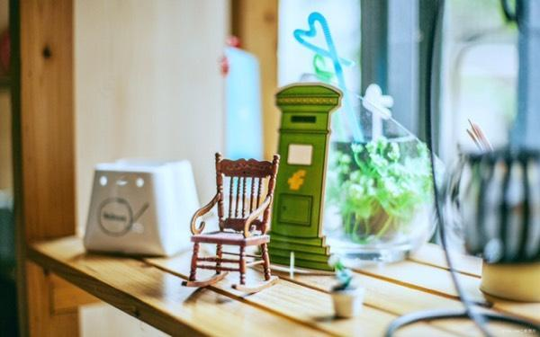
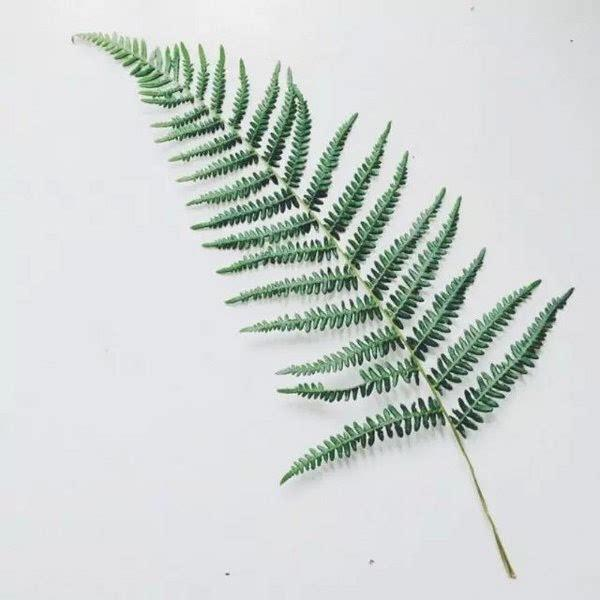
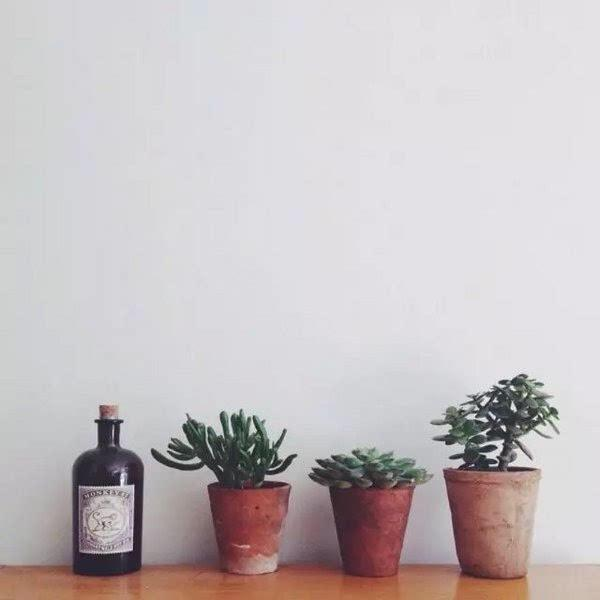

### [与其嫉妒，不如一起进步](http://www.jianshu.com/p/92cf5d2402d6)

文/舒小曼

1

有一期《奇葩说》的辩论题目是：“朋友圈到底该不该秀晒炫”。辩手们妙语连珠、能言善辩，提出了很多方面的观点。

有一个观点，让我印象深刻——不该在朋友圈里秀晒炫，因为这样会让其他人眼红嫉妒。

你晒出了与另一半的亲密合影，会让单身狗们嫉妒；

你晒出了昨天刚买的名牌大衣包包，会让买不起的朋友嫉妒；

你晒出了参加某个比赛获得的荣誉证书，会让落败的人嫉妒，等等。

那一名辩手最后说，其实除了至亲好友，很少人会真正为你的幸福或成功而感到高兴，大多数人甚至会希望身边的人过得没他好，所以即便他们在朋友圈里为你点赞，心里真实的想法也许只是不服和嫉妒。

听到这里，我刷了一下自己以前发的朋友圈。在我发的为数不多的朋友圈里，确实有过“秀晒炫”的行为，也获得了不少朋友点赞。难道，底下的那一颗颗小红心，背后隐藏的是嫉妒？

我不禁打了个寒颤，那些红心忽而就像一把把匕首，虽没有刀光剑影，却足以刺伤人心。

“嫉妒”，着实是一个会刺伤人的词。



2

嫉妒，是一种怎样的体验呢？

高中的时候，我曾远离家乡，独自一人去外市上学。班里有个女生，对我非常好，怕我适应不了新环境，主动带着我逛校园买日用品；见我不能常回家，于是经常从家里给我带好吃的，还邀请我去她家做客；看我学习成绩不大能跟上，就主动帮我补课，给我讲题。

在其他同学眼里，我和她的关系非常要好，形影不离。

可是，只有我自己知道，她活泼开朗、乐于助人的样子，让我心里不太舒服。

特别是在学习上，不管我怎么用功努力，成绩依然比不过她。每次学校考试的排名表一出来，看着她名列前茅，我心里就很不是滋味儿。

我向妈妈倾诉，说自己看不惯她轻轻松松就能考取好成绩，而我拼命学习，却还是落后于她。

妈妈笑了笑，只对我说了这样一句话：

“嫉妒对你有什么好处呢？与其嫉妒，不如一起进步。”

不知为何，这句简单的话有着一股难以名状的力量。我忽而明白了，原来我内心的不舒服是源自于“嫉妒”。

这样的嫉妒，蒙蔽了我的眼睛和内心，让我体会不到分享的快乐，无法真诚地对待友谊，而且陷入了自我迷失的泥淖。

不得不说，“嫉妒”的体验非常不好。

而当我试图放下这份嫉妒，以一颗平和真诚的心去看待她时，我才知道，原来她的好成绩来自于长期不懈的努力，她的专注和毅力，都是非常值得我学习的品质。

意识到这些之后，我彻底放下了对她的嫉妒，发自内心地感谢她为我做的一切，同时回报她最真诚的友谊。不仅如此，在她的帮助下，我的学习成绩也慢慢得到了提高。



3

写作以来，结识了不少文友。大家热爱写作，各有所长，经常会互相交流一些写作与运营的心得。

有一天，收到一位文友A君的私信，他非常坦诚地向我倾诉了他的苦恼。

大致内容是，他写作已有一段时间，自觉很努力，却不见起色，粉丝少，阅读量低，公众平台也尚未拿到原创。而与他几乎同期注册公号的写手B君，却粉丝众多，且文章总是能被大号转载。

A君酸溜溜地说：“真不知道他用什么运营手段，难道是买的僵尸粉？”

我一听，明白了A君的心理——其实，他多少有些嫉妒了。

于是，我转发了B君早期的一篇文章给他看。在那篇文章里，记录了B君近十年来在写作上下过的苦功夫，读了多少书，抄了多少本摘抄，写了多少读书笔记，是怎样一点一滴的积累，才成就了如今一篇篇10W+阅读量的爆文。

而当A君了解了B君一直以来的努力后，心里对他的佩服终究扑灭了嫉妒。他不仅肯定了B君的成绩，而且决心向B君学习，踏踏实实地提高自己的写作技巧，用实力去证明自己的才华。



4

莎士比亚说：“嫉妒是绿眼恶魔，谁做了它的俘虏，谁就要受到它的愚弄。”

确实是这样的，嫉妒会蒙蔽了你的眼睛和内心，让你只看到别人如今拥有的幸福或成功，而看不到他一路走来披荆斩棘所克服的种种困难。

他在朋友圈里秀晒炫，你只看到了他与伴侣的亲密合影，却看不到他们情感路上所克服的坎坷；你只看到了她晒出的名牌服饰，却看不到她在背后努力赚钱的艰辛；你只看到他秀出他的成就和荣誉，却看不到她因此付出了多少努力。

其实，在成长的过程中，比自己优秀的人还有很多很多。与其去嫉妒和眼红别人取得的成绩，不如学习别人身上拥有的优秀品质，反观自己有待提高和进步的地方，然后下足功夫去提升自我。

与其嫉妒对手，不如把对手变成自己的队友，携手一起进步。

毕竟，在我们人生的赛道里，挤满了各种各样的人，你的目光终要越过身前人的脊背，才能看到更远处的秀丽风光。

文／舒小曼（简书作者）
原文链接：http://www.jianshu.com/p/92cf5d2402d6
著作权归作者所有，转载请联系作者获得授权，并标注“简书作者”。
