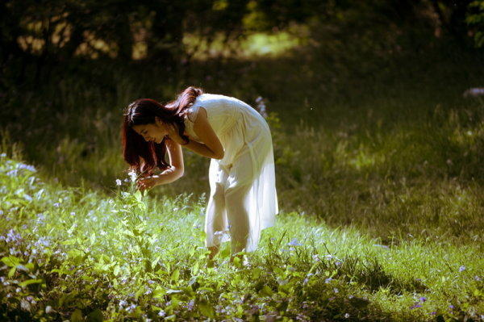
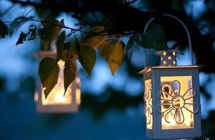
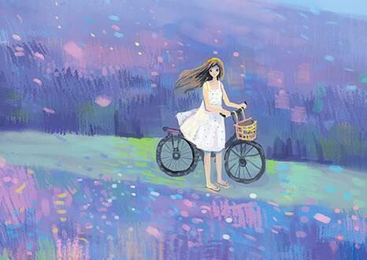

### [你不用多富有，我知足就好](http://www.jianshu.com/p/1fb48aaf6ad9)

>知足是一种为人处事的态度，常乐是一种幽幽释然的情怀

这几天因为工作上的事情一直有点小失落。

职场十几年的人，可能事后想想有点小玻璃心，但是当时当下却是莫名其妙感到深深委屈。

身为一名管理者或许不该有这样的反应。

可是不管是谁我们都会脆弱，都只是一个凡人，纵然我再坚强，也难免会受伤，难免会哭泣。

也许人类正因为是有血有肉有思想有自尊的组合，才会有更多的异于其他生物的感觉才会多了那么多的伤心和快乐。

为此下班后我坐在地铁上有点想哭，我一进家门就和周先生说了白天发生的事情，说了心中的各种委屈。

差一点觉得这一次我会放弃。

幸好周先生非常了解我，他想我之所以这样说定是什么事情刺激了我。十三年支持如他，除了安慰我外更多的是告诉我：“如果累了，就给自己放个假，不要为难自己，一切还有我！”

并且给我拿出一篮我最爱的杨梅，说：“吃掉了它们，保证你会开心。”

望着这一蓝鲜红欲滴的杨梅，再望望眼前单纯温暖的周先生，我心里一暖，心口的伤治愈了大半。

家永远是我最温暖的地方，也是我疗伤的港湾，而周先生和孩子就是我最好的疗伤药。

所以我又忽然充满了力量，忘记了放弃。



>你不用多富有，我满足就好

想起很多年前，周先生和我说过的一句话，他说：“如果我再富有一点就好了，那样你就不用出去工作，不用像个汉子一样在职场摸打滚爬，可以留在家里写你喜欢的文字，做你喜欢的事情，照顾下我们起居，多好！承诺了让你做个幸福的女人却一直让你在承担很多男人的压力。”

那些年周先生一直心疼我像个女汉子一样的在职场打拼，像个超级玛丽一样在生活中扮演多种角色。

每一天要出去工作，要出差，要接送孩子上下学，要辅导功课，要打点人情往来，还要看书写字，关照4个老人。他是真的觉得我挺辛苦，为此他深有愧欠。

可是于我来说都是心甘情愿的事情，我一直认为他就是一支绩优股，我认识他的时候他不富有，不代表永远都不会富有。

何况富有拿什么来衡量？我的心里他就是一个富有者啊，他正义、有责任心、上进、敢拼、爱家人、疼我和孩子，整个身心装的都是爱，那是多少金钱都不一定可以买来的优点不是吗？

所以我一直认为周先生不需要有多富有，我满足就好。

在他眼里，这些年我跟着他，从一无所有到现在还要受着委屈，他觉得是他的原因。

而我来看，我们从一无所有开始到如今，有房子有车子有孩子，有了努力后生活该会有的样子就是最美好的事情。

在他眼里，他觉得结婚的时候连个戒指都买不起，谈恋爱的时候根本没送过像样的礼物给我。

而我来说戒指只是一个戒指，礼物只是一个形式，若此情深厚，又何必在乎是否拥有一个戒指。

永恒这个事情靠的是两人之间的经营和爱，而情义从来无价，又怎么说是愧欠我什么。

在周先生眼里，我是那么的柔和，本该给我多一点柔和的环境，却不曾想这些年，在职场，在生活中把我的外表和内心锻炼的像个刀枪不入的汉子。

让我曾活生生被现实绑架做了房子和生活的奴隶。

可是我感到很充实很知足，因为这一路肩并肩奋斗而来，我拥有了太多的人生体验和共同进步的快乐。

别说今天我们想吃点什么就吃点什么，想买点什么就可以买点什么，就算还是一无所有，我仍然觉得很开心，我们也不可能在一无所有，因为我们至少有3个人了。

没有周先生，就没有我的小甜蜜；没有周先生，就不会有我们今天的三口之家；没有周先生我们的心也不会变得如此强大和温暖。

相比这些，富有真的不是一个名牌包包，一件卡地亚的饰品，不是开一辆好车，也不是需要住的多富丽堂皇，更不是给我做个全职太太就是幸福。

只要一家人在一起能够开开心心，平平安安的这就是我们最大的财富。

就算是这一次我还是受到了莫名奇妙的委屈，那也是我自己的原因，和周先生是否足够强大富有没有关系。

不富有我也可以留在家里，富有我也不一定留在家里就幸福。

因为如今社会，女人不一定是在家做个全职太太就是嫁得好的标准，每一个女人都有了自己的追求自己的奋斗目标。

对于幸福的概念也早就有了新的认知。

所以以前周先生这样说的时候我就逗他，说他思维狭隘，在富有不富有的问题上纠结。

他笑笑说：“还不是觉得你受了委屈，心里难受。”

可是我很满足这种生活啊，还想怎样的富有呢？有吃有喝，有工作，有一个好老公有一个懂事的孩子。



>幸福是多种多样的，知足就幸福

记得小时候家里穷，穿新衣服是过年才有的事情，那时候基本上我的衣服都是表姐穿下来的。

可是我穿的还是很开心，我觉得那时候衣服干净，整洁就好，如果还是一条表姐穿不着的裙子我就爱的不得了，管它是不是新的。

妈妈总是说：“姣啊，妈妈爸爸现在还很穷，不富有，难为你，不能给你买新的好看的裙子。你先穿表姐的衣服，以后我们富有了多买一些好看的新衣服，现在我们将就一些。”

那时7岁的我听着妈妈的话，觉得她说的时候很难受。可是妈妈真的没有关系，我一点也没关系。我觉得表姐穿过的给我穿，我也是第一次穿和新衣服没有多少区别。

穿着干净开心就好！

直到现在，我仍然觉得衣服只要合体，合场合能够穿出自己的品味，穿出自己的气质就好。并不是非要几万一件的衣服套在自己身上就是最美丽的。

而最美丽的应该只有那一颗心。心若美丽，散发出来的气质都是那么的美丽。

心若糟糕，就算外表在华丽也会尽显丑陋的本性。

上小学的儿子开始有了群体接触，平常也会回家交流一些同学们情况。

他回家说班级里谁说去过世界的哪里哪里，还有谁吃过很多美食，还有人有好多零花钱。她们问我去过几个地方？

他告诉同学们说他去的地方没他们多，也不用零花钱。同学说他们比我幸福一些。

那一天他问我：“妈妈，他们说这些的时候看上去很幸福，妈妈是不是去过很多地方，有很多零用钱，吃遍美食就是最幸福的样子？”

我说：“你幸福吗？这个问题你自己回答看看。”

小小的他想了很久，后来笑着说：“妈妈，你说过幸福是多种多样的，我觉得同学们是幸福的，吃遍美食是幸福的，走过很多地方也是幸福的，也许有钱花也是幸福的。”

“妈妈，我也是幸福的。我和爸爸妈妈每一天在一起很开心。我们吃爸爸做的菜，就是美食，爸爸妈妈带我出去玩，给我增加知识就是幸福，还有我想吃的想买的通过努力争取得到也是幸福。”

“妈妈我看过《童年》看过《山羊不吃天堂草》看过《夏洛的网》等等，我觉得我是个幸福的孩子。”

这番话让我很欣慰，小小的男人有了自己对幸福的理解，他在开始悄悄地成长。

他能理解幸福是多种多样的，也知道相比那些没有妈妈陪，没有幸福童年的孩子，自己是那么幸福。

会懂得满足大概就是最大的幸福，也是最珍贵的财富。

而这些不是给他去报一个昂贵的培训班或者给他和其他同学一样的物质条件就能让他懂得幸福的。

那需要自己思考后才会明白。

写到这里，我忽然心里豁然，对之前在工作中在老板面前受的那些委屈全部被岁月的美好所替代。

我开始想起曾经老板对我的照顾，同事给予的配合等等等等。感恩之心代替了伤害。

当心中充满光亮，那些打过的心结就显得没有力量，温暖像一股水流慢慢地清润了心田，结也舒展开来。

我明白这就是家的意义，爱的力量，满足于生活常态，满足于每一个晨昏，每一个四季。

你真的不用多富有，我有你们就很开心，家的港湾是我最温暖的地方。

文／端木婉清（简书作者）
原文链接：http://www.jianshu.com/p/1fb48aaf6ad9
著作权归作者所有，转载请联系作者获得授权，并标注“简书作者”。
