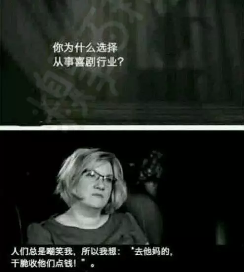

### [你幽默的样子真好看](http://mp.weixin.qq.com/s?__biz=MzA5MjY1MjQxOA==&mid=2668279331&idx=1&sn=6402627e64f84e44c4f6ef5c2a8e97bb&chksm=8a97c0cebde049d80afceac45e0e97860e385411fb93a93bf730cc0fe2821ee0f0345b2be22f&mpshare=1&scene=5&srcid=1122NDgo6dNYA7DOkbeNiQZ7#rd)

### 幽默不是一种技巧，而是一种生活态度。

幽默能让一个男人有多大魅力？

看看黄渤就知道。

女神林志玲曾多次说，黄渤是她的理想型。很多人不可思议，像林志玲这样的白富美，为什么会喜欢黄渤？在这个看脸的时代，黄渤毕竟不高也不帅。

因为黄渤恰恰是个幽默到不需要看脸的男人！男人的幽默，就像是女人的好身材，对异性是一种天然的吸引力。

### 01
#### 和具有幽默感的男人在一起，人生处处都是喜剧，生活充满情趣，时不时来个小确幸，幸福感满满。

昨天在公交车上遇见一对情侣，女生特别爱玩，当着全车人的面突然对男朋友说了一句：“葵花点穴手！” 当时所有人都在等那男生怎么反应，只见他僵在那里，特别尴尬地回道：“媳妇儿，快别闹了，这么多人看着呢，快给我解开。” 瞬间就被暖化，觉得那姑娘肯定特幸福。（知乎@雨疏）

想起有次下班，同事老公骑摩托车去地铁口接她，同事上车前问道：“到xx花园多少钱？”她老公说：“亲一下就免费带你去”。同事娇羞地亲了一下坐上车，看得周围拉客的摩托佬目瞪口呆。

倘若碰上一个没有幽默感的男人，估计只会劈头盖脸来一句：“闹什么闹！” 一个人的有趣变成了两个人的尴尬和郁闷，结局只会不欢而散。

### 02
#### 人和人相处小矛盾、小摩擦、小尴尬在所难免，但具有幽默感的人，往往一句话就可将它们轻松化解。

再幸福的婚姻也有100次想离婚的念头和50次想掐死对方的冲动，而老公很有幽默感的体验就是：每次吵架不超过10分钟。

吃饭时，我们正闹矛盾，只见他拿起一个大鸡腿，讨好地放在我面前：“喏，我把我的最爱给你。”我反问道：“你的最爱不是我么？”他故作高深：“我跟鸡腿说话呢，你说你插什么嘴。”听到这句话，当时就怒火全消。

那时我们异地，某天吵得很凶，我一直哭，他说给我买巧克力，吃甜食心情好。第二天早晨一个包裹扔到我桌子上：“签个字吧！”正纳闷这次快递小哥也太迅速了，一抬头看见他摘掉帽子傻傻地朝我笑，据说后来我是扑上去的......

有次我们正吵得不可开交，他突然一歪，倒在沙发上，双手抱头作痛苦状：“为什么，为什么，为什么我到现在还学不会和长得好看的人交流？”

有这样既有幽默感又有觉悟的老公，还没真的生气就已被他逗乐，哪儿还能吵得起来呢？

### 03
#### 幽默不仅是最轻松的调剂，也是最高级的防御，有幽默感的人总能不留痕迹地优雅拒绝，有力反驳。

某天，幽默大师萧伯纳正在一条狭窄的路上行走，遇到一个对他不满的同行，那人想侮辱他，对他说：“我从不给傻瓜让路的。”萧伯纳答道：“而我正好相反”，说完便让开路来。轻松一句话就让侮辱他的人哑口无言。

然鹅，这种防御力若出现在老爸身上真让人招架不住。

上学期突发奇想，想染一头橘红毛，跟我爸商量，谁知我爸来一句：“丑不丑先放一边，你怎么逃课呢？”我顿时语塞，无力反驳。（知乎@酸白糖）

刚刚给老爸发短息，说到最近临近放假，手头有点吃紧，快点派发1000大洋来赈灾。过一会儿，支付宝提醒到账100还附加一条留言：你说你都是读大学的人了，100都不会写，还多加个0，以后要记得好好学习......（知乎@戴小岗）

### 04
#### 幽默不仅能让人破涕为笑，真正的幽默亦能让人笑中带泪。

萧伯纳说：“幽默就像马车上的弹簧，没有它，一块小石子就让你很颠簸。”

生活中不如意十有八九，但幽默的人却能笑看不如意并将其拿来调侃一番。

有一次在商场，我妈说我爸那个那个同事有一件好几千的外套，劝我爸也买件贵的，我爸仰头说：“好几千？呵，我脱光了都值好几万！”
他有两个心脏支架，真不知道有毛好得瑟的…（知乎@酸白糖）

而幽默的最高境界是连死亡都可笑着面对：

十多年前，爷爷得了癌症，弥留之际他把我们全部叫到身边说了好多话，最后，爷爷呼吸急促，就死了。然而正在我们哭天抢地的时候，爷爷突然睁开眼，哈哈地对着我们乐：“逗你们呢，我就看看谁没哭。”说完这句话。爷爷就走了，再也没有回来。（知乎@皮皮鲁）

汶川地震，一个被掩埋者被俄罗斯救援队救出来时说：“老子被挖出来看到外国人还以为把老子震到外国去了”。（知乎@dreameng）

林语堂曾说：豁达的人生观，率真无伪的态度，加上炉火纯青的技巧，再以轻松愉快的方式表达出来，这便是幽默。

`幽默不是一种技巧，而是一种生活态度`。幽默的人能将生活的小郁闷和人生的大坎坷都拿来调侃一番，无论顺境逆境都能在其中发现生活的小情趣。

其实不用多风趣，不用多博学，只要真心热爱生活，乐观看待人生，不为小事斤斤计较，你的幽默也会自然流露。

#### 学着做个幽默的人，因为你幽默的样子真的很美。
