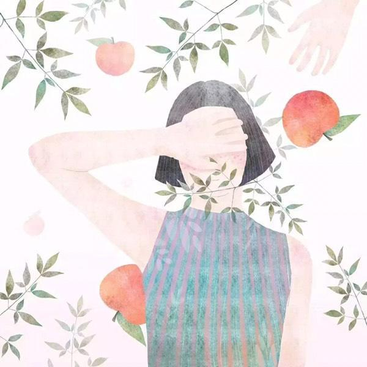

### [做一个被自己喜欢的姑娘](http://www.jianshu.com/p/0b5282192161)

>文： 沐儿

徐静蕾在微博上说：“为什么我们要被教育做一个讨人喜欢的姑娘，而不是一个被自己喜欢的人？”

因了这句话，我对老徐的爱，又加了几分。是啊，我们干嘛去讨好身边的人，而不去主动地爱自己？学会爱自己，做一个被自己喜欢的女子，想想都开心。

老徐一边谈着恋爱，一边任性地做着自己。她不恨嫁，但未雨绸缪地冷冻了卵子：万一以后想要孩子，这样就有了选择的机会，不给自己留下遗憾。她给自己放假，并无限期延长假期，记者想要采访她，却摸不着她的影儿。她迷上了手工，没日没夜地做了很多包包和首饰，或自己戴或送好友或做义卖，玩得不亦乐乎。她带上闺蜜满世界疯跑，镜头里的她时而很二时而邋遢时而优雅，但无一例外地嘴角上扬，眼角眉梢里都带着“世界真美好”的笑意。

她爱黄立行，她也爱自己。活成自己想要的样子，成为自己喜欢的人，特立独行不随波逐流。要是所有人都理解你，你得普通成什么样啊。


小时候，妈妈经常说：“你这样老师会不喜欢你的哦”，“叫阿姨，没有礼貌别人就不会喜欢你”。我们在这样的环境里长大，努力取得好成绩，让家长高兴老师欢喜；我们学着乖巧，让亲戚表扬邻居夸奖。

电影《谁的青春不迷茫》里，林天娇一直是妈妈的乖乖女，从小到大的“理想”就是妈妈的目标：考上清华金融系。爱上学渣高翔以后，她渐渐意识到，在自己一帆风顺的学业旅途中，她自己其实并不快乐。她像一个被牵着线的木偶，没有自己的方向。最终，她遵从自己的内心，成为了自己喜欢的那个女孩：学天文，走自己想走的路。

电影结束的时候，已经工作了几年的林天娇，那份对未来的笃定和对自己状态的满意，是她所有镜头里最美的部分。

辛弃疾有词云：“我见青山多妩媚，料青山见我应如是。”一个自我欣赏的人，感觉连青山都可以与他惺惺相惜互相爱怜，这境界，也实在是无可多得。

现实中，也不乏这种人。

暑假回国，见到了久已不见的初中同学小荷。素面朝天，棉裙布鞋。喜欢古诗古琴的她，一有时间，就去参加西周私塾的诗词班，常常一个月里，不露于市井。填词、推敲，研习茶道，品评琴瑟之音，过着“谈笑有鸿儒，往来无白丁”的生活。

她眼波流动心思单纯，一颦一笑，仍如初中时一样纯净。她的世界，简简单单，完全没有尘世纷扰的感觉。我们一起逛商场，即使周围都是妆容精致的女生，她清水芙蓉般的脸蛋儿，清汤挂面似的直发，毫无压力地从一群人中脱颖而出。

一个平和的人，感受到的多是别人的善意；一个懂得欣赏自己的人，眼里都是美好。我们谈着职场的黑暗，她浅笑吟吟，说她的工作虽然繁复，却也并不无趣。

我们完全猜不到，她的职业竟然是会计。一个整天和数字打交道的人，却能在业余时间全身心沉浸在诗词歌赋里，想想都佩服。但她说：这有何难。生活本就是多元的，去做自己喜欢的事，内心才丰盈充实。



事实上，只有你对自己满意，浑身散发着积极的正能量，别人才会被你的气场吸引。

我有个学生韩，身材高挑，相貌姣好，且弹得一手好钢琴。班上有好几个男生，都偷偷地喜欢她。可是初三的时候，她开始长青春痘。

一个原本意气风发的女孩，走路都要甩一甩头发，自从长了痘痘以后，上课都不愿意抬头。老师提问的时候，她也下意识地用手遮着脸，生怕同学们的目光落到她的脸上。

其实，大家并不怎么在意，因为这个年龄，长痘痘本属正常。加上她自带的光环效应，基本可以忽略不计。

但是，她却越来越讨厌自己那张脸，越来越不自信。后来学校举办红歌大赛，我让她当主持人，她死活不干：“老师，求你别让我上了。你看我这个样子，哪能见人啊。”即使我们告诉她，那几个痘痘真的无伤大雅，她最后还是放弃了这个机会。她自己也觉得可惜，但却拒绝得毅然决然。

越是在意，就越是想去拾掇。后来，别人的青春痘都消了，她脸上的痘痘却还固执地不肯离去。她变得越来越沉默，不参加任何活动，总是一种拒人千里之外的感觉，同学们也渐渐跟她疏远了。

自己都不喜欢自己，别人怎会喜欢你？


人有一种本能：远离消极负面的东西。若你对自己一万个不满意，全身上下都透着萎靡，别人自然也就会绕道而行了。

养老院里的老人，越是喋喋不休抱怨的，身边越是没有来探望的人。那些热情开朗对生活充满兴趣的，总会有人愿意跟他来往。

所以，从今天开始，让我们做一个自己喜欢的女子吧。

你可以像徐静蕾一样，独立而强大；可以像小荷一样，温暖而朴实。你可以做一个智慧的女子，收敛锋芒，虚怀若谷；也可以做一个淡然的女子，得之我幸，失之我命。

总之，只要是你自己喜欢的样子，都好。清淡如水亦或明媚如花，小鸟依人亦或浪迹天涯，全凭你的心意。

文／沐儿（简书签约作者）
原文链接：http://www.jianshu.com/p/0b5282192161
著作权归作者所有，转载请联系作者获得授权，并标注“简书签约作者”。
