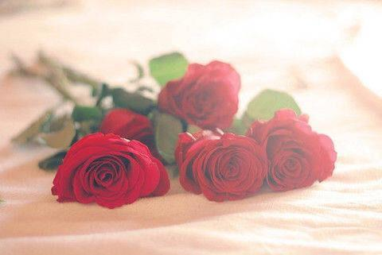

### [变质的从来不是婚姻，而是你的心](http://www.jianshu.com/p/f55bc8a9c9c2)

今天和一个朋友聊天，他说人真的是一种很奇怪的生物。

没有的时候拼命想拥有，拥有的时候又拼命想舍弃，明明不喜欢全世界的人来骗你，却又偏偏允许自己骗自己。

单身的时候想要结婚，结婚了的又到处伪装成单身，孤独的时候想着有人陪，有人陪的时候又觉得还不如孤独。

明明说是因为爱一个人所以才要和TA在一起，结果分开的时候你却又掷地有声地说着我们没有爱啊。

明明说认识她是最幸运的事情，许诺了要给她风平浪静的生活，可是后来给她大风大浪的就是你，这就算了，你还不忘正个名踩一脚说：我们的认识就是一场错误啊……

到底是过去瞎了眼，还是现在猪油蒙了心？

大概如人饮水冷暖自知吧。

他说婚姻怎么那么可怕，变起质来一点不心慈手软。

……

我问朋友为何忽出此言？如此感慨，一点也不像原本睿智有加，理智有余的他。

他无奈地笑笑。

02.

他说还不是因为最近身边的人离婚的离婚，出轨的出轨，分手的分手，闹腾的厉害。

让他一个结婚7年的男人感到了后脊椎上袭来的凉意，加上最近和妻子之间的关系逐渐降温，随时都能接近冰点，不免让人担忧，这样下去真怕轮到他自己啊……

何况又到了7年之痒的尴尬，不知道能不能幸免，也不知道自己还能不能一枝青莲独秀。

他想起当初那些参加过的婚礼，婚礼现场多少镁光灯下，红白玫瑰花团锦簇，大红喜字红彤彤，一双璧人三叩头,你说我愿意，他说他愿意，画面那么美丽。

他的婚礼也是如此，洞房花烛夜，红烛滴滴，求过天长地久。

可是这才多久，身边的兄弟们就离了好几拨，自己好像也进入了怪圈，开始闻到了婚姻发霉的味道。

03.

我噗嗤一笑，这男人多愁善感起来竟然也是这样的汹涌澎湃没完没了。

但是忽然一感，他身上一定还有事情。

果不其然，他说最近有一个女孩向他表白了，一把年纪竟然也感到了初恋般的甜蜜，可是自己是有家室的男人，尽管婚姻不如意，但是……

但是两难怕啊……

我问他究竟在怕什么？

他说：怕婚姻早已经变质，怕七年之痒，怕爱情太美丽，怕自己也难以幸免这个世界恣意传播的病毒，怕自己骗自己。

我懂了，不是婚姻变了质，而是你变了心。

其实这个世界哪有那么多恣意传播的病毒，如果有也一定是自己给了病毒侵袭的机会，免疫力低下才会被病毒有机可乘。

其实这个世界也没有那么多问题，有问题的往往是个人自己，就像你说人是奇怪的生物，但同时人也是伟大的生物。

怎么想怎么做还不是全凭自己的心态。

婚姻本身是不会变质的，变质的往往是你的心，七年之痒不可怕，可怕的是你信了有它的存在。

04.

一个人的心意若坚定，TA的行动也会跟着坚定，信仰也会无比执着；一个人的心意若有变，TA的思维才会乱了阵脚，行动也会跟着捣乱；为此信仰才有了怀疑，人心才会不安。

你若不变，谁又奈何的了你呢，你若想变，赖婚姻变了质又做什么？

很多时候放在冰箱里的食物，不是它无缘无故就变质了不能吃了，而是你一定将它遗忘在了某一个角落很久，你的心里没有它，疏忽了它的存在，才奇怪有一天发现时它怎么就长了霉斑，然后吃下去就会坏了胃，伤了身体，你只能选择丢弃。

丢弃的时候还在埋怨，现在的东西怎么那么容易变质啊。

可是当初把它买来也一定是因为新鲜美味可口诱人吧，放在冰箱也是想来保鲜吧，只是你的心后来遗忘了罢了。

因为早有其他食物代替着你对它的感观。

婚姻也是一样的，不是它无缘无故就会自己霉变，而是有一个漫长的过程，也不是7年了就会生病，自己先给自己下了咒语。

关键要看你的心意是如何对待婚姻的。

你若真爱，何必怕世界病毒恣意蒙了你的双眼，你若真爱，何必怕万物变化影响了你的笃定。

婚姻的路你自己分分钟可以拿捏。

你是因为爱而爱，你是因为情而坚，你是因为你是你自己呀。

别人的世界，别人的婚姻，别人的分离又和你有多少关联？

你怕的其实不是婚姻会变质，你怕的是你自己的心不够坚定。

所以才会徒增烦恼。

05.

记得有一个朋友，以前和我说过一个故事。

她说有一个人去山上砍柴，在沿途上遇见了一朵黄色的小花，他觉得很好看，就将它连根拔起放在身边。

想回去种在自己的院子里好好栽培。

结果他一直在砍柴砍柴，忘记了身上还有这颗花，一会儿被他踩在脚下，一会儿被他搁在腋下。

待到砍足了柴准备下山的时候，他看见有一个路人手里也拿着一朵紫色的花，看上去比他的好看。

于是他想起了自己的花，觉得逊色了。

花瓣耷拉下了脑袋，枝干也萎缩起来，无精打采，怎么看都觉得失去了第一次采摘的心情，花变了模样。

他一讨厌就把它给扔掉了，说这花真难看，枯萎的真快。

过几天他又去山上砍柴，在路上又看见了一朵黄色的花，觉得这花怎么开得如此漂亮，比那一天那个人手里的紫色的花强上一百倍。

其实花还是那朵花，人也还是那个人，只是心不一而已。

有时候这个世界上变的最快的永远是人心，而不是周遭的风景，坏的最快的也不是爱情和婚姻，而是你自己对待它的方式。

白居易《太行路》有言：太行之路能摧车，若比人心是坦途；巫峡之水能覆舟，若比人心是安流。

意思是说：太行山路险难行，能摧毁车辆，若比起君心啊，它多么平坦；巫峡里的水能颠覆船只，若比起君心啊，它多么平稳！

可见人心往往才是关键。

而行路难，不在水，不在山，只在人情反覆间。

婚姻之难也不在于七年之痒，不在于三年之痛，不在于婚姻的质变，是一颗心是否还能坚守，初心依然？

婚姻之路经营不易，山一程，水一程，扑所迷离，我们要做的永远是经营好自己，守护好初心。

于是一句且行且珍惜赠与你我共勉，愿我们都是被岁月温柔以待的人。

文／端木婉清（简书作者）
原文链接：http://www.jianshu.com/p/f55bc8a9c9c2
著作权归作者所有，转载请联系作者获得授权，并标注“简书作者”。
