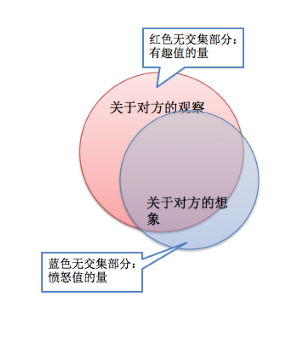
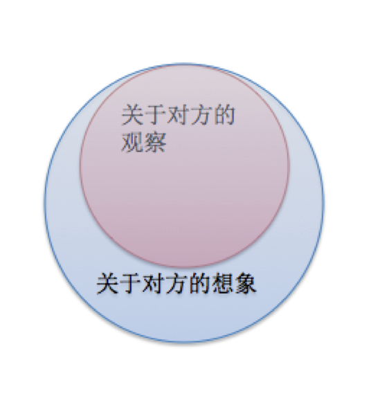
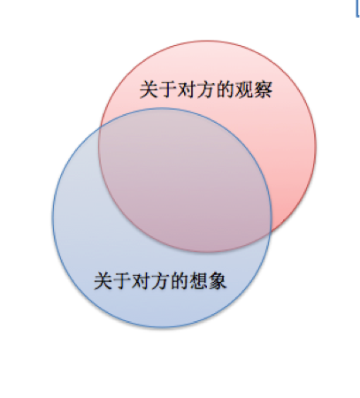
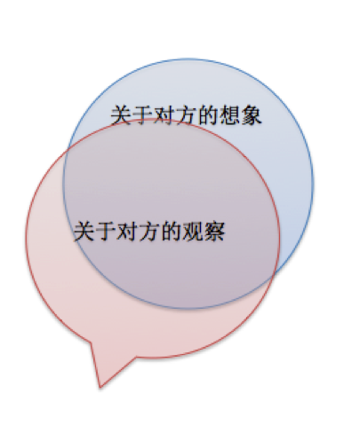

作者：王小圈
链接：https://www.zhihu.com/question/20770272/answer/37771285
来源：知乎
著作权归作者所有，转载请联系作者获得授权。

### 要说怎么有趣，先要知道什么是有趣。

我们能清晰判断一个人是否有趣，却很少能明确定义到底什么叫做有趣。

以妹子最多的红楼梦为例。
我们知道红楼梦里，公认黛玉湘云是有趣的，探春王熙凤是有趣的；相对的，迎春宝钗就不那么有趣一点。有趣的人里头，黛玉史湘云是有小脾气的，探春是有大脾气的，王熙凤是有暴脾气的，后两个都是没脾气的。前4个有趣的，是书里最讨老太太喜欢的——而老太太是书里第一人精。

我们仔细想想这4个人都有趣在哪儿了。

林黛玉：葬花，一般人想不出这个玩法。嘴贱，“携蝗大嚼图”之类的各种贫嘴贱舌。
史湘云：豪迈，喝醉酒大石头上就躺着睡着了，拿铁架子大块烤肉，被人说乞丐一样还理直气壮反驳

贾探春：玩具收藏癖，红泥做的小火炉什么，求宝玉给他买好玩的。贾贵妃也知道，生日都给她送玩具。脾气大，发怒了能一个大嘴巴呼上去。
王熙凤：会说笑话，嘴快人爽利。

这四个人有一个共同点，她们其实都算不上是符合时代标准的大家闺秀、公府小姐/媳妇的形象。而她们有趣的那个点，恰恰就是不符合她们身份的那个点。

本质上，“有趣”是一场愉悦的意外，是一种惊喜。
它首先是一种意外。他认为你本应该是这样的，而你不是。

我们对贵族小姐的想象是温柔贞静，从容绣花的。偏偏她们不是。她们吵架骂人还打人，她们烤肉喝酒还喝醉，她们也能挽了袖子，跐着门槛子一边挖耳朵一边吹过堂风。——啊，原来是这样啊，跟我想的不一样呢！这种欣喜让我感到了“有趣”。而那个温柔贞静，从容绣花的迎春二小姐，从不给我这样的机会。她的一举一动，都是读者意料之中的。

这种“意外感”大致可以分两种。
一种是带来愉快的意外感，让人觉得“有趣”；
一种是带来不快的意外感，让人觉得愤怒。（对的，愤怒是一场不快的意外，我有机会细说，先谈有趣）

带来愉快的“意外感”也可以分两种。
1，我不知道你原来是这样啊。
举例林黛玉：我不知道贵族小姐原来可以这么话多还嘴贱。
这种有趣是横向的，开拓了对方对我了解的广度。

### 2，我知道你原来是这样，但是我不知道你“这样”到这种程度。
还是举例林黛玉：我知道探花的女儿敏感细腻伤春悲秋，但是我真不知道你能伤春悲秋到这个程度。
这种有趣是纵向的，开拓了对方对我了解的深度。

其实男女都一样，我是女生我就用女性视角写吧。

蓝圈里是他对你的想象，他预期你是这样一个人。
红圈里是他对你的观察，他发现你是这样一个人。

观察和想象大多重叠的，这代表他了解的你和观察到的你大多一致，但是有一部分偏离。

纯蓝圈里是他以为你会，但是发现你不会的，会引发一些愤怒——比如，你长得很漂亮家里却这么乱！一个女孩子完全不会做饭！你怎么会有这样不着边际的想法！

纯红圈里，是他以为你不会，实际上你给她惊喜的——比如，你还会这个好厉害！你的想法好有意思，我怎么没想到！

上图为“无聊的人”，我观察的对方全线弱于我想象中对方
【案例】：高晓松离婚、光源氏计划

高晓松的离婚堪称自己作死。2007年，38岁的高晓松迎娶19岁的夕又米，后来他在接受媒体采访的时候对记者说：“她跟我一起的时候还很年轻，甚至还没进入社会，所以她的基本世界观都是我塑造的。相比之下，找一个年龄比较大的、被周围圈子的人塑造出来后你再去改的妻子，后者多累人啊，而且更容易产生分歧。我老婆对这个世界的看法，甚至听什么音乐、看什么电影，都是受我影响的，所以我们大部分的想法都很一致，我觉得这样很幸福。”

这段话基本可以让人确定他们非分不可。因为高首先是一个有追求的音乐人，不是求妻生子田舍汉，而他是以一个“世界观塑造者“的形式出现在夕又米的世界里，把夕又米量身定做成自己需要的那个人。

我曾经问过一个游戏开发者，打游戏很好玩是不是？他说是。那打自己设计的游戏好玩么？他痛苦地摇了摇头。游戏很大程度上模拟了我们的人生，出生升级打怪选服点技能等等都可以在人生中找到相对应的坐标。

游戏好玩，恰恰是因为在游戏中未来的进程是未知的。我好奇升级后的世界，所以我努力打怪，我好奇从未进过的副本，所以我进工会。candy crush六百多关，关关都不一样，就是为了激发你探索的乐趣。

而高晓松，亲手消灭了这种乐趣。夕又米是另一个高晓松，他在自己和自己谈恋爱。好比“光源氏计划”养出一个绝对符合要求的，听话的，三观完全一致的配偶。
左手和右手下棋，你觉得有意思吗？

上图为“有趣的人”，我观察的对方全线强于我想象中对方

【案例】：沈复&陈芸、钱钟书&杨绛

沈复陈芸的恩爱生活并不代表中国最传统的价值观，只能说符合知识分子的三观。

陈芸是个很有趣的女人。订婚后，某次沈复饿的不行，她偷偷藏了小菜点心给他吃，被自己堂兄撞见，在当时传为笑谈——这是极不符合闺门教化的例子，让沈复很意外。后来他才知道这只是惊喜的开端，这种惊喜将贯穿她短暂的一生。

她热衷书画，将残稿修订，她身体羸弱性子却豪迈，拔簪沽酒；她穿男子服装，元宵出游又忘了身份搭手在人家女眷肩上，差点被人打一顿。甚至她爱吃酱瓜臭豆腐，还逼着沈复吃，说的头头是道，沈复最后也喜欢上了。

陈芸这种种举动，都非寻常女子所为，沈复爱她爱的死去活来，但是陈芸不被公婆喜欢，两次被逐出门，于是沈复为了太太不惜忤逆双亲，每次逐出门都是一起跟着一起回来，这种感情，放当时放现在都算笃厚。

来一段：“家庭之內，或暗室相逢，窄途邂逅，必握手問曰：『何處去？』私心忒忒，如恐旁人見之者。實則同行並坐，初猶避人，久則不以為意。”`O(∩_∩)O好萌好腻`

钱钟书杨绛这对我不打算说杨绛，而说钱钟书。因为结婚那会儿杨追求者甚多，钱钟书爱她挺有道理。两人的一开始有点像沈从文张兆和，不过前者恩爱夫妻，后者乱世怨侣。

我以为这两对中，女孩子的品性家世都差不多，差别在于男生。钱钟书是大家出身，贵公子哥儿贪玩；沈从文湘西军人家庭，他10岁的时候就家道中落。

有趣是一种无功利心的闲情，闲的前提就是不穷。有趣的人必须有过一段衣食无忧的日子来培养诸如品味、格调之类的东西。手头太紧了，人就不有趣了。钱钟书比沈从文有趣太多。

杨绛说的：我们在牛津时，他午睡，我临帖，可是一个人写字困上来，便睡着了。他醒来见我睡了，就饱蘸浓墨想给我画个花脸，可是他刚落笔我就醒了。他没想到我的脸皮比宣纸还吃墨，洗净墨痕，脸皮像纸一样快洗破了。以后他不再恶作剧，只给我画了一幅肖像，上面再添上眼镜和胡子，聊以过瘾。回国后暑假回上海，大热天女儿熟睡（女儿还是娃娃呢），他在她肚子画一个大花脸，挨他母亲一顿训斥，他不敢再画了。

钱最著名的一段莫过于，他家猫和隔壁林徽因家的猫儿打架，钱拿着竹竿去给自己猫加油。
这种生活情调，沈从文是做不出来。

#### 恋爱初期

#### 老夫老妻

需要理解的是，这个图是动态的，随着他对你的预期和你的表现不断变化。日常中大多数人会这样从恋爱初期的上图1，转到老夫老妻时期的图2。如果需要一个人一直爱你，那你需要保证纯红色的那个月牙儿部分，要比纯蓝色的月牙儿部分要多。

（蓝色阴影部分和红色阴影部分，抱歉图很丑）

### 3、怎么有趣？

#### 1、广泛的知识面
这不能保证有趣，只能保证你不无聊。不无聊的意思就是什么都可以聊一天，而不是嗯嗯哦哦没话讲。知识面铺开才能保证有的扯。

“有趣”其实和“美丽”、“优雅”一样，是需要花钱来培养的。周游全球50国，从小出入厅堂的人，怎么都没办法无聊。普通人，一是保持好奇心，尽可能多的参与人生体验，没试过的都试试。小小年纪就开始追求“平淡是真”的，多半是因为见识太短；二是多阅读，因为阅读是获取知识面的最经济的办法，没有之一。

某一天我和某个朋友在学校里看到一块绿色的破布，中间有个红色的点，我说那个好像孟加拉国旗哦。他说，孟加拉国旗的红色图案不是在中间，你仔细看。我站在马路上现场查，发现果然不是，有一点点偏，真的是非常奇怪的国旗啊，偏那么一点，强迫症都要爆发了。

后来就聊到绿色代表穆斯林，聊到穆斯林娶四个老婆，聊到石油发现以前的沙特有多落后，他说沙特国王有几百个老婆。我就问他，不是教义说只能娶四个老婆吗？他说对呀，所以为了遵守教义，国王只好不停地离婚，车轮战，始终保持在线老婆只有四个。

这一切对话，只是源于一块绿色的脏兮兮的破布。如果他没有这些知识储备，路过破布也只是一块像孟加拉国旗的破布，哦一声完了。知识储备丰富的人，他眼里这个世界本身就是很有趣的，因为知识点多，点对点就可以联系起来。

#### 2、敏锐的感知力
我有个姑妈做菜一直很难吃，我非常难以理解做菜这种根本不算很难的事情，为何她可以做到几十年没长进。后来我发现，她不是不会做，而是小时候穷惯了，吃不出好坏。类似瞎子不能画画。

而这种感知力有时候也是一种富贵病，穷人要获得也不容易。饿死鬼只求吃饱，吃饱了才能细分出不同菜品的味道。但是穷人没钱有时间啊。没钱听音乐会，听mp3可以吧，没钱看电影，电脑上看可以吧。尽可能多的去感受生活中细微的差别，分辨这些小小的不同。

像兔子一眼机敏，把你全身的传感器都打开。走在路上，能看到其他妹子怎么穿衣打扮，顺便想想是否适合自己；秋天落叶了，多看一眼，有没有发现别样的美丽。品味什么一开始都是借鉴，借鉴的前提源于感知。

感知力还在于感知人的情绪和态度。她带了好几年的镯子今天怎么没带，刚刚说周末没时间的时候他为什么犹豫低头不敢看我？不去就不去，为什么平时话少的他叨叨叨了这么一大段不去的理由？

举个例子，红楼梦里老太太当着薛姨妈的面说：“姨太太说真的，我们一家四个女孩儿都比不上宝姑娘。”（大意）迟钝的人就会当老太太夸薛宝钗呢，沾沾自喜是不是？但是感知敏锐的人，能够细分出这句话里面的意思——贾府只有4个女孩儿，一个出嫁了是贵妃，三个还在闺阁中，难不成说你家宝姑娘敢比得上贵妃娘娘？当然不是，所以这四个女孩儿是三个闺阁中的小姐，加一个林黛玉。所以林黛玉是我们自家的姑娘，你不是。

有趣的人，能敏锐感知世界的变化，引起内心的涟漪。她必然先觉得这个世界有趣，自己方能有趣。

#### 3、足够的鉴赏能力和执行力

鉴赏力的差别，就是“折梅花插瓶”和“折梅花打猪”的差别。
首先，你要分得清高下，审美并不是铁板一块一条路，美的方式有很多种，但是美的程度的确有标杆。重蕾丝荷叶边洛丽塔可以绝美，黑白灰一片式也可以惊艳。如果你看着自己前几年的照片想抽死自己，恭喜，你的审美进化了。

受过一定教育的人基本审美可以保证，难点在于如果把这种审美执行。比如，我能欣赏巴黎时装秀的高级定制，我也觉得很美，但是我买不起。我看中汝窑那个碟子觉得很通透，但是我没办反摆出来。

如果纯有鉴赏力，没有执行力，不能把其展示出来，就像那个什么武功都懂但是毫无缚鸡之力的王语嫣——没有人会觉得她有真功夫。

再来一段陈芸的：余愛小飲，不喜多菜。芸為置一梅花盒，用二寸白磁深碟六隻，中置一隻，外置五隻，用灰漆就，其形如梅花。底蓋均起凹楞，蓋之上有柄如花蒂，置之案頭，如一朵墨梅覆桌；啟蓋視之，如菜裝于花瓣中，一盒六色，二三知己，可以隨意取食。食完再添。

沈复是个穷鬼，这里梅花盒，白瓷碟，都是很常见的东西，这么搭配很漂亮，吃饭都心情好。想起家里吃饭，妈妈觉得碗装菜好，因为放冰箱方便，桌上也可以放得多。爸爸觉得要用各种盘子，理由就是漂亮心情好。我觉得在这一点上，爸爸的生活态度比较有趣。

再一段：
當菜花黃時，苦無酒家小飲；
攜盒而往，對花冷飲，殊無意味，或議就近覓飲者，或議看花歸飲者，終不如對花熱飲為快，於是陳芸想出妙計，以百錢雇賣餛飩者挑其擔至南園，三五好友擇桃陰下團坐，先烹茗，然後煮酒烹肴，當時風和日麗，遍地黃金，青衫紅袖，越陌度阡，蝶蜂亂飛，令人不飲自醉，不久酒肴俱熟，坐地大嚼，遊人見之，莫不羨為奇想，杯盤狼藉，各已陶然，或坐或臥，或歌或嘯，直至夕陽西下，食粥果腹後盡興而歸。

是说沈复想来一个picnic或者bbq，一边赏菜花一边吃热酒，但是每次带食盒过去酒就冷了，不开心。陈芸花几百钱请了个馄饨担，煮茶烫酒现场烧菜，让沈复和他的基友们吃的痛快，看的痛快，想想就很棒。这种花小钱行大乐的技术非常了得。难就难在想不想得到。

生活中见过很多这样的人。几十块的白T，加一个复古的毛衣链；几块钱的果冻粉，买回家做一大锅鲜果果冻；一小瓶橄榄油一小瓶医用酒精，自己做玫瑰花精油。某公司，世界杯晚上同事看决赛，要了几大盆小龙虾，又预约了一个家政阿姨专门剥了一晚上龙虾，他们就这么看比赛喝啤酒吃小龙虾肉——花钱都不算多，重在会花，花到点子上。

#### 4、不随便，独特的个人标签，有明确的喜好

猫特别喜欢蹭人的头，因为它的留气味的腺体在耳朵后面，它在你身上留下自己的味道。
说难听点，人也需要这样给自己做标记。否则人家怎么记得住你？

一个点菜的时候总说“随便”的人，或许不讨人嫌，但是也不容易让人记住。人们更容易记住喜好明确的人，比如那个很喜欢吃肉的人，那个吃素的人，而不是那个说“随便”的人
。

很多无趣的人有一个共同点，没有喜好，不知道自己喜欢什么，没有爱好也没有特长，上班下班，两点一线。很多时候我会觉得上班只是一个赚钱的路子，我花时间换钱，下班后才是人生真正的开始，是我想要的时光。没有爱好的人生，万一工作不顺利，很容易觉得心如死灰了无生趣吧。

爱好是一个提升有趣值非常有效的办法，因为喜爱，你在所爱的东西上会投入更多时间，了解更多的知识，从而拓宽你的知识面。如果把一个人的只是面粗略比喻成一个圆圈的话，爱好就是圆圈上凸起的角。

类似这样

然后就会变成这样。

有没有发现红色无阴影部分增加了？恩，你的有趣值又上升了。

张岱说：“人无癖不可与交，以其无深情也。” “癖”这种东西，能见人情深之处
拥有一个或多个“癖”，可以让你有更多机会超越对方的期待，有更多惊喜，从而显得更有趣一点。

#### 5、有小缺陷，性情中人

张岱还说了一句话，“人无疵不可与交，以其无真气也”。人没个小缺陷，各种高大上的，显得太假，没人味。很多女生心中都会有个男神吧，你觉得男神什么时候是有趣的？是篮球命中还是奖学金第一，是升职加薪的时候，还是演唱会大卖？

都不是。男神有趣的时候，往往是他脱离神格，变成人的时候。
他在球场摔了一跤，他考试前夜通宵看球，他跟客户吵架一脸臭臭的时候，他明明是巨星偶尔还会羞涩的时候。

有趣不是完美，是真诚，真性情，高兴了笑，不喜了哭，有血有热。但这些真诚都是在无伤大雅的范畴内，不是高兴了癫狂不喜了撒泼。

有趣的人，他一定活得直抒胸臆；他就算算计人，那也是大喇喇的算计：我就是玩儿你了怎么着，你来咬我呀。

#### 6、 独立人格，有主见，会坚持，会反驳
据说在你反驳一个人的时候，会让人对你的注意力提高一大截，比赞美有效。所以总裁玛丽苏小言剧的那个思路是对的：反驳高富帅，吸引注意力。只是作者智商不够写不出高级一点的桥段。

如果不是——“小秘书反对总裁莫名其妙的欺负，坚称平民也有人格，或是一不小心弄乱文件倒洒咖啡博取注意力”，
而是——“小财务反对总裁对新一期企业债券定价过低，因为上头防风银根吃紧，老主顾的往来票据显示他们都没什么余粮却还死装，很有可能募集不足；而同时公司的一笔期权交易交割遥遥无望已面临多次保证金压力，一不小心就要强制交割， 财务主管为了推卸责任闭口不谈”

——如果这样写的话，总裁一定会对小财务印象深刻的，再搭配稚嫩的妆容，无畏的表情，焦虑却振振有词的语气，他真会觉得——这个新人，傻，但有意思。

反驳的前提，是有主见，我认为不是这样的我才反驳，而不是我看你不顺眼，为了反驳而反驳。而有主见这个，恰恰最难。需要你有知识，有逻辑，才能建立起自己完整的一整套世界观，并且在自己的世界观里“逻辑自洽”地游走，才能用这一套逻辑去反驳别人。

我先生曾问我对男友的最基本要求是什么。我说，起码能反驳我，并且说服我一次。因为被人说得心服口服，是一种非常愉快的体验——就是那种，新世界的大门被打开了。在我营造几十年的世界观里，我坚不可破的知识和逻辑架构，因你做出了调整，现在，我的世界观更完整更坚固了。

每个人有自己的感知世界。找到一个能反驳我的人，把他有的、但我没有的世界分享给我。我就拥有了更多的世界。

#### 7、自嘲的心态

自嘲的前提是——自信。非常自信，才能自嘲。
仔细看林黛玉和史湘云吵架，一个说“他原是公侯的小姐，我原是平民的丫头”，另一个说“他是主子姑娘，我是奴才丫头”，挺有意思，这两个人都是公侯千金，所以这自轻自贱的话说的可以这般坦荡磊落，因为她们都知道——我和我说的人，都不是我所说的那样。这话要是骂妙玉或者邢岫烟嘴里说出来，那就完全不是这个效果了。

一个有趣的人，往往有点儿幽默感，幽默感也有高级低级之分。某些的确觉得夫妇结婚闹洞房，或是给男方家长穿内衣画乌龟游街是一种幽默；某些相声小品取笑残疾人觉得是一种幽默；也有些人出言文雅，一听好笑，再听乐不可支，联想丰富，鞭辟入里。

自嘲是高级幽默的一种。因为自嘲一则显得谦逊，二则不会伤及无辜。自嘲最经典的类型莫过于英式黑色幽默。推荐伦敦奥运会入场式的bbc解说版，笑完了你能深深感觉到英式幽默的精髓。

#### 8、快速的反应能力

有趣往往和机敏、反应快联系在一起。因为很多场合的抖机灵机会是一瞬而过的，当时你不说这句话，过了3秒，可能就再也不能说了。跟人掐架的时候不说这句话，等你回头再想出来，却是再也没机会了。

而这种机敏，往往是和自信联系在一起。有时候，明明想到的，唯唯诺诺不敢说，怕说错，其实说错了又怎么样呢？越怕说错越不会说，最后干脆不说，自己觉得很安全了，不说总不错了吧，却从此被人套上木讷的标签难以翻身了。

这个我不清楚成年以后如何提升，多聊天多思考总不会错吧。但是对于孩子我很想说，这种木讷和机敏很多是青少年时期养成的。父母不耐烦，把孩子当做宠物而不是一个独立人格的人，缺乏平等对话和逻辑沟通的耐心（类似“你吃我的用我的怎么不听我话”这种），就会压抑孩子沟通和表达的欲望，最后渐渐变木了。见过很多这样木讷的小孩，也见过很多父母和气讲理的机敏小孩。

9、想象力创新和突破

我说有趣的本质是一场意外，一场惊喜。要产生意外的效果，最好就是为前人所不为。聊天聊八百年前的老段子，做事循规蹈矩不越雷池，难以让人有兴趣。创新的前提是丰富的想象力，或者说联想的能力。

很多时候我们认为想象力是独立的能力，天马行空本身是一种能力。但是无数史实告诉我们，想象力很大程度上基于我第一条说的知识面。

农夫想象中的皇宫生活是“皇帝用的一定是金扁担”，农妇想象中的生活是“西宫娘娘摊鸡蛋，东宫娘娘烙大饼”，早期的科幻小说，如凡尔纳那个系列的，对于未来生活的高科技描写大多基于机械革新，各种按键各种机器，因为那是机械时代的作品。

之后的科幻小说中的机械，大多是触屏全息屏很少有整排整排的按键出现了。为什么？因为我们的知识结构升级了，我们知道我们不需要那样键盘装的按钮出现在高科技的未来中了。或许将来我们对未来的想象还会新的提升。而这些想象，都是基于我们对现在世界的了解。

插播几张朝鲜人民对中国的想象，这想象力，这违和感。。跪

所以，我想说的是，想象力和创新的前提，是足够多的知识储备。
之后你把各种知识储备模仿、转移、嫁接、衔接、扭曲、组合、切割，即有可能就是一种创新。

### 总结

与人交流是一场探险。因为它是两个人两个世界观的碰撞，碰撞的结果可能是毁灭，也有可能是交融。发现一个有趣的人，就是发现一个新世界——是对旧世界的突破，对新世界的探索。而一个人是否有趣在于他分享你的新世界有多大。

但探险本身不是一件很舒适的事情，至少和蹲在家里比起来。探险的快感却必须在种种艰难险阻后才能享受到。

我的一个老前辈提醒过我，工作的时候，他最害怕的是舒适感。因为上坡的人不会觉得舒服，如果你觉得舒服，你就是静止的状态，你就危险。我谨遵他的教诲，努力在非常舒服的时候自己去找不适感，在非常舒服的岗位上找更难的事情，寻找让人忙碌、不安、焦虑、头疼等各种不适的事情做，当我战胜了不适感的挑战，就会感受到成功的喜悦。我知道，从此我的能力又提升了一步，能让我不适的事情，越来越少。

有趣的人往往不是那个给与“绝对舒适”感的人。
那些我可以轻松胜任毫不费力完成的工作。做完后，我会觉得不错，不会太开心。让我念念不忘的，却是那些艰难辛苦后完成的项目。

让人念念不忘的，也是这样的人。
有趣的人，他有自己的世界，他不是走进你的世界，而是为你打开一扇窗去参观他的世界。或许他的世界让你感到惊讶，甚至不认同。但经历一段时间的磨合以后，你开始理解欣赏他的世界，从此你与他彼此都拥有了两个世界。

所以，首先，你要有一个自己的世界。

我不喜欢被人调教，因为那人终会厌倦一个不能给他惊喜的我。
我也不喜欢操纵别人，能被我玩的团团转的人，无法拓宽我的世界。
我喜欢，互相玩。
