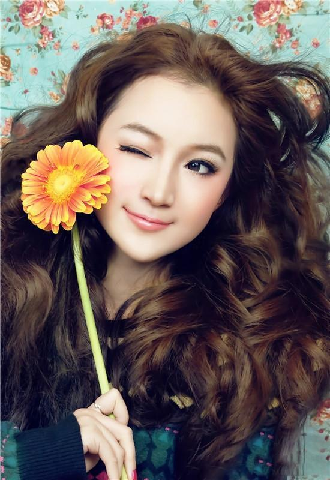

### [姑娘，最好的聘礼，是疼爱](http://www.jianshu.com/p/1a63cfcde147)

>文/端木婉清  图/网络

#### 1
云姐做HR，也做红娘，经她牵线搭桥的婚事数不胜数，那些我们眼里最繁琐的男婚女嫁之事，在她地方觉得很是简单。

一直以来成人之美，促人喜事是她此生最为开心的事情。

可是最近她却非常的不开心，甚至觉得自己有些背，有些懊恼，好好的一个“十一”长假，一个原本美美哒的婚礼筹备，出岔子了，而且非常糟糕！

事情是这样的：去年的时候有一个做同行的小学妹，因为平日里经常请教云姐一些问题，久而久之就成了无话不说的姐妹。

##### 姑娘26岁，没有男朋友，来自周边一个三线城市，刚巧云姐的邻居婶婶有个儿子27岁没有女朋友，于是她就巧手成事拉了线，结果这线拉的比较满意，男孩和女孩一见面就好感爆棚，互有眼缘，后来的相处也是顺风顺水，感情稳定。

去年年底见了双方父母，均很满意，所谓丈母娘看女婿越看越中意，婆婆看媳妇也是眼里看出了一朵花。

##### 婚房速速装修，家电蹭蹭买起，双方的酒宴啊，嫁妆啊都有了一个大致的筹备，两家父母，一对即将成婚的新人，和红娘云姐挑了个吉日坐到一起，把婚事做了安排，当时都谈的好好的，女方买点床上用品，准备辆20万的车过来，男方负责房子和装修以及两边亲戚的酒席，聘礼一事原本男方打算在给个6-8万，然后约定今年12月18号结婚。

当时皆大欢喜，谁知后来水逆难挡。

一个大逆袭，女方嫌聘礼少了，按照女孩当地的习俗，父母提出了68万的聘礼要求。这下使原本顺利进行的婚礼因为聘金问题戛然而止。

至少在我眼里这68万聘礼是个天文数字，云姐和男方父母亦然。

男方的金钱所剩无几，还要为婚礼当天的婚庆、拦门红包什么的准备，女方的家人坚持聘金如此，邻居家男孩很难受，女孩也很无奈。

云姐几番沟通没有效果，问女孩子自己的意思，也是见她两难的境地。意思是这聘礼是要的，可以还回来一部分的，嫁妆一部分的……父母剩下一部分……

一边是她喜欢的男人，一边是父母要的聘金，她陷入困惑中不可自拔。没有聘金她觉得爱不够到位，父母觉得诚意不够；婚事若没了，觉得可惜相识的缘分，以及平日里男孩对她的疼惜。

难怪云姐发愁，在我看来这简直就是有些作难的。

#### 2
>曾经有人说一个男人爱不爱你看是否能给你一个完美婚礼，但是我现在不得不说：姑娘，相比幸福，最好的聘礼，是疼爱！

没有疼爱，一切都是浮云。

如果你喜欢一个人，又能认定他就是你的归属，能给你想要的爱情和疼惜，那么婚前的这区区聘金真的不是衡量他是否爱你的标准，也不该成为步入美好婚姻的拦路虎。

回想身边，多少婚礼，多少金玉良缘，毁于繁琐的礼节，毁于风俗的执念，毁于聘金两个字里。

而忘记了一路走来，最初的芳心是为了什么？

>他若爱你，聘金的多少又有何实质的意义？

>他若不爱你，给你金山银山，充其量会说你嫁给了有钱人，而不会说你嫁给了一个爱你的人。
身为女孩，我们都渴望遇见一个对的人，一个三观相似，心意相投的男人，渴望一份美好的爱情，渴望一个完美的婚礼，或许终其一生也只是为了寻找一份笃定的安全感。

可是现实中又有多少男孩女孩输给了这作难的聘金，败给了 现实问题的残酷。

生活本该不如此作难，只要你是真心相爱，只要你要嫁的人真心疼爱你。可是往往当局者迷。

#### 3
记得三年前身边也有一个朋友，和大学时期的男友相爱5年，相隔两个城市，长达三年异地恋都没有将彼此分开，而却在最后谈婚论嫁的时刻，败给了彩礼聘金一事情，她觉得就差那么一点点也不会为她做是不爱她，他认为自己实在无力承担起这种原本可以协商的聘礼。

之前对爱情的执着，信誓旦旦，对美好婚姻的向往和婚后日子的寄寓都化为泡影，两家关系土崩瓦解，当时甚至都要决定老死不相往来。

>爱到这里不禁要问一句：这是真的爱过吗？

我们都明白很多时候都不是自己愿意看到的现象，明白错过一个对你好的人，合得来的人是多么可惜的事情，但是还是不由自主的在人世的世俗里忘记了自己最初想要的爱情和想要的人是什么模样？

其实嫁一个人最重要的是那个人会不会疼爱你，会不会理解你，会不会懂你的口是心非，会不会包容你的小任性，会不会怜惜你的所有不容易就够了，而这一点恰恰是任何金钱物质都比拟不上的。

我有一个远房表妹，当初结婚时就是嫁给了一无所有的表妹夫，没有房没有彩礼没有心中想要的梦幻般婚礼，但是唯一一点，表妹夫很疼爱她，什么事情都记着她，也愿意为她去奋斗，为她去改变自己的不足。

事到如今，表妹夫事业红火，房子、车子、儿女双全，我认为的人生赢家是属于她们这样的。

若当初她也计较聘金，婚礼、房子，而忘记了他的疼爱，错过了这样的人，那么之后将是多么漫长的悔不当初一生。

而我当初嫁给周先生也几乎是一穷二白，一万元聘礼象征性的意思一下就嫁了，但是我很庆幸我的父母没有干预，更庆幸我自己的认定，因为我嫁给了爱情和疼爱，才有了我后来的人生。

>恩格斯说：只有以爱情为基础的婚姻才是合乎道德的。

>列昂尼多娃也说：婚姻的基础是爱情，是依恋，是尊重。
而这一切的基础上我们都需要明白，嫁一个人，要看他是不是疼爱你，就像你穿鞋子一定要合适你才是第一，不合适再昂贵也只是装饰品。

张爱玲有一句话：我们于千万人之中遇见你要遇见的人，于千万年之中，时间的无涯荒原里，没有早一步也没有晚一步，刚巧遇上了，那么亲爱的姑娘，请嫁给爱情，忠于初心。

#### 记得最好的聘礼，是疼爱，最美的婚纱，是爱情！
#### 愿每一个姑娘都嫁给爱情，因为疼爱……

文／端木婉清（简书作者）
原文链接：http://www.jianshu.com/p/1a63cfcde147
著作权归作者所有，转载请联系作者获得授权，并标注“简书作者”。
