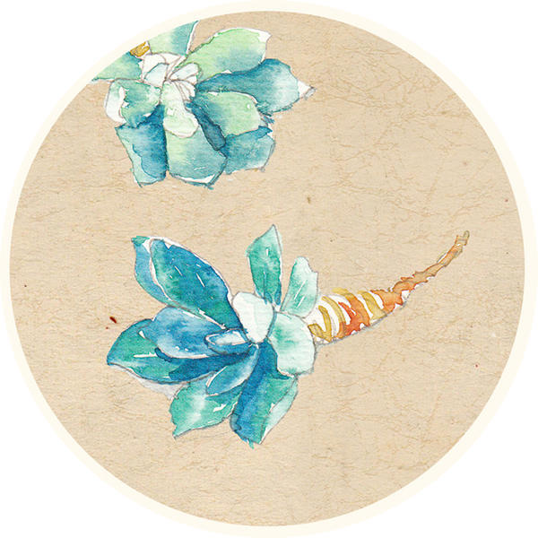

### [婚礼仪式中什么最重要？](http://www.jianshu.com/p/005ec5918466)

#### 1
从小到大，参加过几十次婚礼，印象最深的，除了自己的，就是以前一个领导家姑娘的。

那是个豪华的婚礼，在很知名的婚礼酒店举行，人数占满了大厅以及楼上的包间，来参加婚礼的人从政界到商界，来了很多的大人物，电视台知名的新闻节目当家花旦和小生来主持......

但是，并不是因为这些，最让人触动的，则是其余两件事：一，新娘用自己和老公从小到大的照片，做成了一个短片，片子里一个山西人，一个广东人，如何在大学走到一起，又经历了异国两地，两人一起旅行过的地方，那一道道风景，打在屏幕上的一句句话，则是最动人的存在，每个看了短片的人，无不被感动。

二，是新娘的父母，背着女儿，偷偷邀请广告公司录了一段视频，里面有对女儿的回忆、不舍、期望，但最多的，还是快要流淌出屏幕的满满的爱。

#### 2
仪式感和触动感，我觉得这是一场婚礼中最关键的因素。

村上春树说，仪式时一件很重要的事情。

《小王子》里则说，仪式是什么？它就是使某一天与其他日子不同，使某一时刻与其他时刻不同。

曾经的我认为，举办婚礼是一件超级俗的事。真正走过结婚这条路，才深刻的感受到，一个女生，从原来的家庭，进入另一个家庭，实在是太需要一个仪式，而且，这种仪式，不是我们经常看到的，千篇一律的，大家环节都一样的，走个过场的仪式，而是有感而发，有自己特色和态度，融合了自己的感情的一个极其重要的仪式。

anglelababy从小在上海长大，从小的梦想便是在"上海展览中心"举办自己的婚礼，所以，黄晓明选择了这个地点；《甄嬛传》里面崔槿夕的扮演者孙茜，则是特别喜欢旋转木马，老公蔡远航便偷偷的将其带到了现场.......

为什么说，婚礼中的仪式特别重要，其实，说明白了，婚礼是一场男人为自己的女人满足她的愿望的日子，这一天，是女人一生中最光彩耀眼的时刻，过去了，她要脱去曾经的稚嫩，和你一起，扛起家庭的担子，家务、孩子......，比起在父母羽翼下的生活，她要承担太多太多。

还有一点，对于普通家庭的女生来说，这一辈子能够穿上华丽的晚礼服，画上精致的妆容出现的场面并不多，甚至说根本没有。很多人都是拍婚纱照，或者结婚的时候，才穿上了礼服，真正地享受了一把梦幻中的生活。

正是因为，我们平时生活中，能够接触到的太少，而在心中又有着美丽的幻想，只有结婚这个契机，才能好好的满足自己一把。

有人说，婚礼办得越好，小两口的婚姻生活越幸福。当岁月中的平淡或者摩擦让人身心疲惫的时候，当面前的人不再那么有魅力，甚至有点嫌弃的时候，想起那天披上婚纱，曾经用心的举办过一场精彩的婚礼，那种温暖，可能会延绵一生。

反之，如果一个男人，连一个体面的婚礼都不愿意给你，在开始的时候，便以将就的态度走入婚姻，很难想象，他在婚姻里面能够有多好的表现。一个人付出的越多，越会珍惜，越容易得手的，往往越得不到重视。

所以，尤其在举办婚礼这件事上，要对自己更加好一点。

#### 3
触动感，我觉得比仪式感更会重要。

最近一个同事的婚礼短片让大家津津乐道，原因是他们在婚礼上跳了一段舞，两个新人以欢快、动感的舞蹈，表达着爱意，和对嘉宾们的欢迎，大家觉得好新鲜、刺激、有趣！

在许多年之后，这段舞蹈可能会被人们遗忘，但是对于他们来说，是永远的、一辈子的回忆，将来有了孩子，打开婚礼的视频，看着自己那活力四射的舞步，"当年老爸老妈这么时髦！"

婚礼上的创意，其实并非都是来自于策划公司，更多的要反应两个人的互动。在平时的生活中，这位同事就很文艺，很热爱生活的人，所以，婚礼上的表现，其实是她生活态度的表现。

那些对婚礼不重视的人，表面上是为对方考虑，就自身来说，对生活的要求都比较低，俗话说，好将就。

有人说，婚礼的好坏与钱的多少是成正比的，不然，有时恰恰相反，比如刚开始说的，领导家女儿做的小短片，是自己通过自学现卖的，花了一个月的时间做成，完全没有成本，还可以永久保存，关键是自己是否有一个为自己的婚礼尽力的心。

#### 4
年龄越大，我越不提倡在婚礼这件事上将就，反而，鼓励提高结婚的门槛，这种门槛不是指物质条件，而是指对方的心意。

心意是不能用金钱衡量的，也是可以不花费很多钱，就能达到自己的目标。一个男人，在结婚这件事上，不是心急火燎地把她娶回家，而是在她将和你共度人生的时候，尽自己所能，给对方一个用心走肾的婚礼，就为了，让她满意高兴地，当一天公主。让她在以后漫长的婚姻中，在某个失望甚至绝望的时候，想起嫁给你的这一天，会说"最起码，结婚当天，我很满意"。这何尝不是一种成功呢？

有的女生，在结婚的时候，往往为男方考虑，处处委屈自己，表面上很懂事，但是却为以后的生活，埋下了不好的伏笔。你会发现，当初的妥协和将就，只是自己的一厢情愿而已，再多的恩情，都抵不过岁月的流逝。

而真正能够抵挡住时光侵蚀的，都是美好、闪着光的东西，比如小时候收到的一份超级激动的礼物，男友的情书或者深夜窗边的弹唱，精心准备的一次生日.......

不要理睬那些，生活就该平平淡淡，否则太矫情的话。每个人，尤其是女生，都值得拥有一些美好的东西，只有见识过什么美，才能接触到、创造更多的美。

每个女生都值得拥有一个有触动感、仪式感的婚礼，这不仅仅是属于自己，更是属于你们的家庭，有一个美好的开端。
