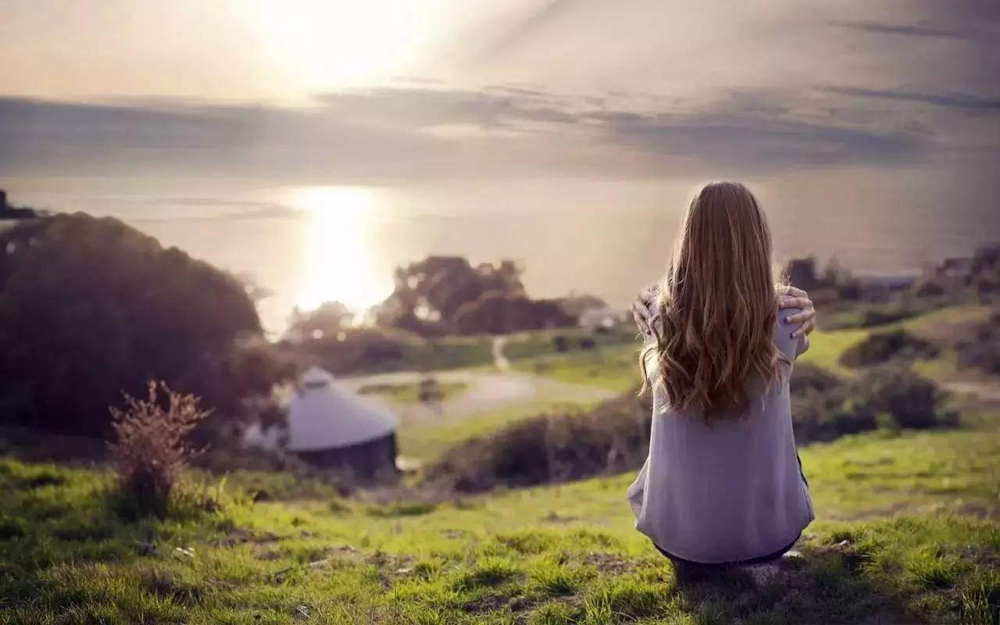
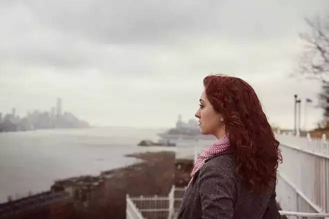
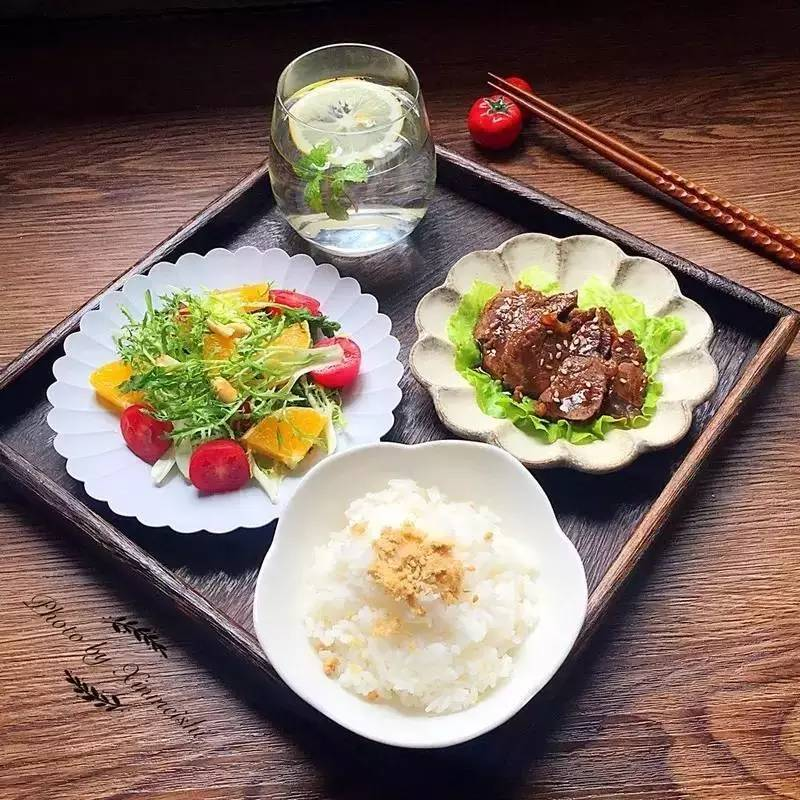

### 学会独处到底有多难？
#### 朋友说，“这是一个人生活的第三年，怕死了孤独。”

她失去爱情很久，活在远离人群的日子里。一个人坐地铁上下班，一个人在厨房里等待热水沸腾，一个人走在周末的商场里看三五成群的人擦肩而过，一个人看着天亮起来再暗下去…

她的声音静如水，有一点苍凉的绝望，“偶尔也去参与别人的热闹，回到家却愈觉得孤独，几年前开始独居时每周买百合回家的心情已经完全不在了。现在最怕一个人待在家中，呵，独处为什么这么难？”

#### 我是晚熟的女青年，二十三岁之后才理解孤独的滋味。

那一年一个人远走他乡，摔进充满新鲜感的生活里，一度低估了孤独的破坏性。

我忙着到未曾去过的海边散步，去家附近的公园里拍照，在商场中逛一家家店铺，和新朋友在咖啡馆里见面…我自大地以为，自己是坚强的大女生，永远能够从陌生的地方找到独享的喜悦，并不一定需要有谁在身旁和我一起见证生活的欢喜。

#### 孤独是一种狡猾的情绪，它是慢慢来的，在一个无所事事的夜晚悄然而至，从此在我的心里落了脚。

它突然出现在我一个人煮的咖喱里，和洋葱土豆胡萝卜一起翻滚在小小的锅中，雾气蒙住我的眼睛，让我觉得自己那一人食的米饭和唯一的一双筷子有点孤零零。

它突然降临在我和朋友的一通电话后，她推脱掉我们照例的聚会去陪男朋友吃晚餐，我打开一瓶红酒，独自看一部蹩脚的爱情剧，情节多么无聊，我却流了泪。

它突然在那些原本应该和家人相聚的节日里敲响我的门，在一旁看着我握紧电话对遥远的家人违心地说着“我很好”，等着我一个人趴在床上大哭的那一刻，然后紧紧抱住我。

孤独在我睡不着的夜里出现在天花板，在我被老板骂了的时候尾随在身后，在我生病的时候不请自来……我就这样一个人体会到了独处的痛苦。常常，黑夜里蜷在被子里，如一个安静的疯子，默默地流眼泪。

我尝试把生活安排得充实，打工，上学，拼命去认识新朋友，可是孤独还是我甩不开的包袱。

多少次我从热闹的生活里回到家，车停在家门口，却久久坐在里面，看着那扇门，不愿意走出去打开它。

我终于理解为什么有些男人在下班后，一定要在车里抽根烟再打开家门。对于他们，那扇门通向的是，父母妻子孩子所带来的琐事与压力。

#### 对于我，那扇门通向的，是孤独，是能看得见闻得着触得到的，无止境的孤独。

#### 克服孤独这件事，让我看到了一个人的自救能力有多么强大。

只要你决心去改变什么，就一定不会看到太过失望的结果。后来，与其说我适应了孤独，不如说我训练了自己独处的能力。

一个人若想学会独处，就必须学会直面自己。当你了解自己存在的意义，清楚自己的人生目标，才能够主动去享受孤独所带来的意义，才会知道独处是一种很好的能力，因为孤独是有价值的。

叔本华说过一句话，令我受益匪浅，“社交聚会要求人们做出牺牲，而一个人越具备独特的个性，那他就越难做出这样的牺牲。因此，一个人逃避，忍受抑或喜爱独处是和这一个人自身具备的价值恰成比例。因为在独处的时候，一个可怜虫就会感受到自己的全部可怜之处，而一个具有丰富思想的人只会感觉到自己丰富的思想。”

#### 我后来生活中80%的时光，都开始郑重地与自己度过。

一个确定人生目标的人，是不舍得虚度时光的。我发现人群中的热闹不再诱人了，独处的意义如此重大，我开始享受那扇门背后无止境的孤独。

我在那样的冷清里看到了属于自己的热闹，第一次静下心来思考人生，把一件件事写进梦想清单里，哪怕一些期待，那时看起来可笑又荒唐。

那一年，我读了二百余本书，写了几万个真诚又清醒的字，跑了一千几百公里的距离，完成了一些从前认定“不可能”的事，也让某些可笑又荒唐的愿望成了真。

独处让我意识到自己对于人生的选择权，我可以选择成为像李欣频那样每天看一本书看一部电影创意无穷的女人，也可以去成为隔壁那个衣着邋遢头发胡乱抓一把的愁眉苦脸的家庭主妇。

#### 独处的能力改变了我生活中的内容，也改变了我对人生的态度。

我依旧一个人煮一人食的饭，一个人喝红酒，一个人看电影，一个人过重大的节日，偶尔也有觉得寂寞的时候，叫上三五个可以谈心的朋友，如果没有，一个人喝酒看爱情剧，也不再会哭出来，而是觉得夜色真好，人生一定还有更多的惊喜，正在路上，等着我去遇见它。

#### 我想，自己在二十几岁时懂得的非常重要的一件事是，不是所有热闹都能够常存意义，但孤独却常常使人受益。

独处是一种非常重要的能力，它使人清醒冷静，思索人生的去向，决定生命的厚度和欢喜程度。

遇见很多优秀的朋友，在说起最令自己受益的习惯时，都说道这一点——一定要为自己保留独处的时间。

他们告诉我，“独处的时间，是人生的精华。一个人如何对待独处的时间，就决定他可以成为怎样的人。”

如果几年前你问我，“二十几岁的时候，应该用什么样的态度去生活？”

我会很不负责地回答，“开心就好。”

而现在，我却有了不同的见解，“`二十几岁，应该开始为人生负责，享受得了热闹，也担当得起孤独，在人群中保留自己的部分孤独，在孤独时也有属于自己的热闹，一个人浩浩荡荡地，朝着人生最积极的方向前进，做自己的热血英雄。`”
