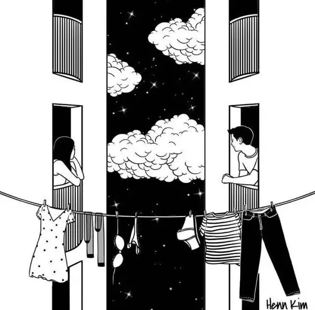

### [找个让你睡得舒服的人]

#### 因安全感而睡的舒服，因习惯而永远不分开。

#### 01
姗姗在朋友圈里晒了一张“床照”，她和K先生面对面相拥着睡觉的姿势。然后说：这世界上没有比睡觉更舒服的事了。

下面几个熟悉她和K先生的朋友很配合的排队：那得看和谁睡。

姗姗是我们这圈朋友里，条件最优质的女孩，端庄大气，标准S型身材。美帝传媒专业硕士毕业，找到工作后被派回国内，说话温柔，态度坚定。

而K先生，是一个生物公司的技术员。事业长相都非常普通，还没姗姗高。

当年追姗姗的人，光各种二代就能一周不重样。而她，各种看不上人家，空床空窗好几年。

最后把自己逛到迈入大龄女青年的年纪，开始恨嫁。

大家都劝她别太挑。她倒是振振有词：这些男人看过我就不想和他们睡啊！

真是没白在美国待那么多年。

“你怎么这么外貌协会，要结婚对你好就行了，要什么帅哥啊！”

“你们想什么呢！”她还埋怨起来，“两个人过一辈子呢，晚上总得愿意抱着睡而且睡得爽才行啊！”

想想确实有道理。睡觉可能是另一半和我们能一起做的最多和最长时间的事了。如果不愿意和他相拥入怀，或者同睡时各种不舒服，又如何过好接下来的几十年？

姗姗最后终于把自己嫁给了K先生，第一次见面我们都打趣她：“终于找到那个你愿意睡一辈子的男人了。”

姗姗脸上散发出来不可思议的柔和光芒。而我们发现，这个家里拖鞋都是高跟的姑娘，竟然穿了一身休闲服和球鞋就跑出来了。
他点她喜欢吃的东西；
吃饭前很自然地抽出两张餐巾纸叠好放在姗姗和自己的盘边；
饮料上来就像做了一百遍一样熟练地拿过来帮她打开；
夹的菜里有肉丝姗姗直接挑给他，而他又把自己盘里的蔬菜给姗姗；
吃完饭姗姗嘴角有颗残留的饭粒，他拿了张纸巾就开始帮她擦，而姗姗就这么仰着脸让他擦。

要知道，姗姗是那种，强势到挑剔的女孩，对自己的形象要求很高。之前她的历任男友，无论多帅，都不可以在公众场合碰她的脸，也不可能吃已经落入姗姗盘里的食物。

但是K先生这么普通到扔人堆里看不见的男人，不仅让她卸下累死人的高跟鞋和拘谨的套装，还让她整个人都放松下来。

这两个人就像一个人，没有交流，没有对视，却像有感应似的，无论什么场景，都很清楚对方要什么然后去配合。明明是两个陌生人，却熟悉到无需那么多废话就可以明白彼此在想什么。

他们并没有在一起多长时间，但是这种老夫老妻的状态，让我突然明白了姗姗为什么愿意和他睡。

他给她带来了足够踏实的感觉。他让她可以完全放松和舒服，他让一天中一半都在睡觉的时光，变成她每天最大的亮点。因为在这几小时里，她不用伪装，不用拘谨。这样舒服的感觉，才是两个人的生活中最重要的组成部分。

身体和心的反应是第一直觉。而想和他睡，和性无关，和安全感有关。

#### 02
睡觉这件事，日常到快被我们忽略。但是，它又是爱人之间交流的最好的方式。

我的同事小Q，平日里安静淡定的女孩，一出差就开始焦虑。无论多短的时间多近的差旅，都拿一个超大的箱子，恨不得把家都搬来。因为换了地方她睡不着。

有一次，我俩被分配在一个房间中，晚上睡觉时，她就像做一个仪式一样，沐浴更衣点香薰，把床重新铺好，戴上眼罩。

不停地翻了快一个小时。

实在不行，打了个电话给她老公开始抱怨，床挺软，枕头挺蓬松，被子也够厚，可是怎么调整姿势都不舒服，睡不着。

我不知道电话那头他说了什么。但是这边，倒是说着说着就睡着了。

第二天，我问她是不是太认床了。她说，我是认人。

她和她老公在一起快十年。每天睡觉必须枕着胳膊骑在他肚子上才能睡。这个姿势是她觉得最舒服的。

那你可以骑个枕头啊！我很不解。

她说，枕头是凉的。人是有温度的。更何况，她早就习惯了入睡之前躺在他怀里聊天，聊着聊着就都睡着了。

出差时，他不在身边，觉得好像缺了点什么，心里一大块都没了。

我理解小Q。

#### 毕竟睡觉时，是每个人最没有防备的时候。而那个深爱你的人，可以让你卸下心防和伪装，把最真实坦诚的自己，完全交给一个原本的陌生人。

这种舒服的感觉，也许就是人们要找另一半的原因吧。

其实，她给我描述的那个睡姿，对于被骑的人来说，并不会很舒服。而十年都保持这一个姿势，甚至形成了习惯，他一定很爱她。

我见过她老公，是一个五大三粗的糙汉子。带条金链子就是黑社会大哥。但是听到他们这种相处的小细节，突然有种猛虎嗅蔷薇的感觉。那种对妻子的呵护和细腻，让我对这个男人充满好感。

小Q因为这个工作老要出差，最后换了一份不出差的工作。哪怕工资少了一些，她也无所谓。

爱就是这样，无意识的，养成习惯的，自然成性的。就算爱的没那么明显，却已经融入彼此的血液中，其他的一切都得让道。

#### 03
我家有一对长辈，出了名的夫妻不和。结婚快50年了，没有一天不吵架的。而且吵架时特别喜欢上纲上线，动不动就会说，我不管你了！你自己过去！然后俩人就去不同的房间关上门不理对方。

他们的孩子也就是我姨妈，都非常想不明白：三观和日常生活没有一项是合拍的，这样的婚姻竟然保持了五十年。忍耐力真强。

后来姨妈将他们接到自己家中，主卧让出来，给老两口住。里面摆了两张单人床。

家里人都很不解，既然不同床了，又这么不和，干嘛不分房睡，又不是房间不够。

姨妈说，他俩都不愿意。现在老了，老太太睡觉轻，有点动静就醒。而爷爷怕睡在一张床上，自己翻身影响她睡眠。

但是还是得一间房，不然无论自己睡还是和孩子们睡都不踏实、不舒服。

我恍然大悟，他们的吵闹也许是另类的沟通方式，而能维持50年的婚姻，靠的却是这种融为一体的连接。

#### 只有你在我身边，才能让我安心的睡一觉。这种爱，说不出来，看不出来，却真实存在。而且是唯一属于两个人的，无法替代的东西。

而那些所有爱的举动，都变成一种潜意识的自我流露。不做作，不矫情，舒服像新鲜空气和午后的阳光：你需要它，却有感觉不到它的存在。

我们每个人，生下来和妈妈睡，长大了自己睡，恋爱了和别人睡。而如何睡才能让自己一辈子都舒服，不仅仅是一种习惯，更是一种本能。

#### 04
常有人说，我牵着她，就像左手摸右手。

以前看这句话，以为是激情退却后的一种吐槽。现在看，却是爱情的最高境界。

TA的手就是你的手，TA的体温就是你的体温。

#### 爱不就是这样，用生命在交换和供养吗？

爱情和婚姻，都是说不清楚的事。但是那些每个能享受到爱情带来蜜果的恋人，那些“执子之手，与子偕老”的平常夫妻们，在陪伴了一生之后，总会发生一些变化。

这种变化，是我变成了你，你变成了我。是每晚睡觉时，拥抱时交换的体温，和给对方的那种最安全舒服的呵护。

愿你早日遇到那个能让你睡得舒服的人，晚安
