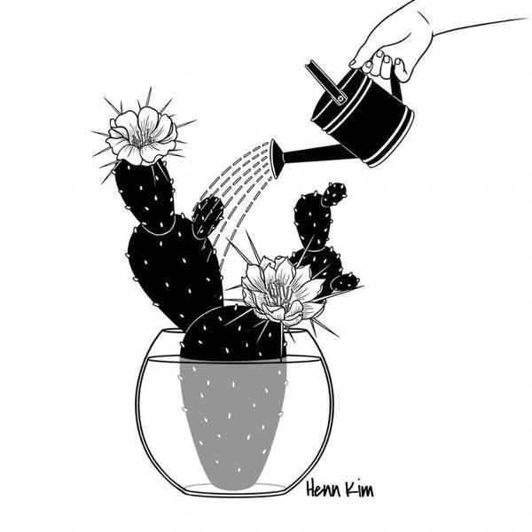

### [最好的爱情不是没你不行，而是有你更好。](http://www.jianshu.com/p/4028f522dcb3)

#### 01

过去一直觉得爱情是两个人一路走来互相搀扶磕磕绊绊，像两块各自有棱有角的石头，装在同一个袋子里，然后互相打磨，变成两块相似的石头，这样过完余生。

后来我才明白，打磨自己的不应该是另一块石头，而是在和天地自然万物相处生存的过程中，逐渐形成了你自己。然后你终于遇到和你相似的那块，你们互相欣赏互相赞美，你们共乘同一个跷跷板在摸索中找到其中的平衡点，而这时你也有足够的能力去找到这个点。你爱他，也爱自己。

可能有朋友想说，谈恋爱而已啊，喜欢就在一起，哪有那么多条条框框，怎么要想那么多。

其实我觉得啊，谈恋爱和寻找一个伴侣是有本质区别的，谈恋爱，第一个字就是谈，是两个人在逐渐的沟通，接触中慢慢了解对方，更多的是享受这种感觉，是全盘托出的喜爱一个人，是青春里瞅着他的眉眼笑岁月静好。第二个字恋，是恋恋不舍时刻牵挂，恨不得所到之处，全是你。

说的也没错，谈恋爱要的就是这种感觉，心动娇羞酸涩，每时每刻被心心念念的人牵动心情，为他悸动为他疯狂，在雪地里打滚儿，在路灯下接吻，一分一秒也离不开，分开一秒就好像鱼儿离开了水，没法呼吸。

不然怎么说，学生时代更适合谈恋爱，没有上班族的压力也没有加班加点的工作，你想想当你上班忙的像头牛时你还有时间抱着手机发"宝贝么么哒"吗。谈恋爱还是因为没什么顾虑吧，想爱就爱，不开心了就坐在地上鬼哭狼嚎的撒泼，看能不能嚎来一个包包宝宝抱抱。

而伴侣不一样，伴是陪伴，人字旁加一半的"半"，换句话说，这是你的另一半，你们组成一对，互相能成就更好的自己，在一起时你们是幸福的整体，分开时你们是各自独立的个体，而不会因为对方不在身边就觉得断了羽翼。

是你忙着写文案时我刚好要翻译一份文件，于是我们各忙各的，而不是你忙起来没空理我时，我就短信电话一顿炸，不把你炸死誓不罢休。



#### 02

前一阵认识一个学姐叫芥末，做事跟名字一样干脆爽快，大学时交了个男朋友K兄，跟很多情侣一样，爱情第一，学习第二。

芥末说他们俩一开始就有种相见恨晚的感觉，所以成天如胶似漆，后来干脆课也不上了，出去玩，去网吧啊或者酒吧什么的，反正就是不上课，也很少住学校，那段时间一直浪里个浪，该考的证一个没考，该挂的科一个不少。

像芥末和K兄这类形影不离的情侣感情一般都很不错，但弊端也显而易见。当你习惯身边一直有人的时候，就很难接受他不在的日子，联系不上的时候会胡思乱想，闲的发慌。

后来大二时K兄去了学生会，收敛了不少，不怎么带着芥末出去玩了。K兄有了自己的事忙，可芥末没有，她之前把所有精力都投在了K兄身上，没有其他的活动，所以K兄一忙起来，芥末自然感觉身体被掏空，手机就成了他们两人很多时候的沟通方式。

K兄越来越忙，芥末一天比一天闲，电话常常接不到，短信也来不及回，芥末挺生气的，也觉得自己挺悲哀。

其实有时候独处是个好事，能让人清醒，但也有时候也是件祸事，你不知道一个人的时候大脑细胞会给你分泌什么信号，可能你突然就联想到他可能不爱你，也可能突然就认为他不在乎你，隔阂摩肩接踵而至。没过多久芥末和K兄分手了。

写到这里想起之前看到的一段话，最好的关系不是随叫随到，每天都聊，而是我发了消息，你看到了自然会回复，我不会因为你没有回复而胡乱猜忌，你也不会因为没有及时回复而感到抱歉，彼此信任，彼此牵挂就够了。

我们是两个彼此独立的个体，并不是为了对方而存在的附属品，你可以走你的阳关道，我也能过我的独木桥，如果你走得快了就来接我，走得慢了我们就在终点汇合，再一起走下一段。



#### 03

张皓宸书里说，遇到一个喜欢的人其实不难，多少爱情都开始于喜欢，结束于了解。后来明白，所谓合适的人，没有定论，大概是三观相似。兴趣可以不同，但决不干涉对方，有话聊，相处和独处一样自然。这一路，你是你，我是我。不是没你不行，但有你更好。

我爱你，所以我不想和你谈恋爱，我不想让琐碎的种种给我们的关系套上难以摆脱的束缚，我只是想和你一起走这段路，还有下一段，下下段。

也许度过了很多个冥思苦想的夜晚后，才能明白人生的意义，有事做，有饭吃，内心强大至少能给自己撑起一片天，才有资格对另一个人负责。不然就像跌进了沼泽，你累，对方也累，因为你们把全身心都投入了看不到光线的主观的爱里，换句话说，你还找不到支撑的平衡点和投入的比例，最后出也出不来，两败俱伤。

芥末是很久以后明白这个道理的，她和K兄都有了自己的事业，不管是经济还是心态也都有了很大的提升，也就是说他们都变成了更好的自己。

他们重新相爱了。

芥末再也不是当初打滚儿任性的小女孩，K兄也变成了成熟稳重彬彬有礼的成功人士，很高兴他们最后以这样的样子又走到了彼此身边。

我之前有一篇文章提到过，爱情不是生活里的主菜，你可以当它是饭后甜点，也可以看做佐料，能锦上添花但不能填饱肚子，你吃也行，不吃也不会死。没你也行，但有你更好。

不在一起时，我们是两个完全独立的个体，在一起时，又是一个幸福的整体。只有两个完整的，健全的，独立的，能照顾好自己的人，才有可能开始一段美好的亲密关系。爱情和婚姻，说到底，都是个人的修行。



Fin.

很多时候生活就像打游戏，刚注册账号的时候只能和等级低的玩家在新手村跟着教程做任务，后来一点一点升级，攒装备，拼手速，才敢去打大怪。

新手期总要死很多次才能升级，就像爱情里总要碰很多壁才知道自己到底想要什么。玩到大神级别的时候会遇到技术相当的人，跟你并肩杀boss，同进同退，强强联手，可能就像...贝微微和肖奈那种吧...

早安啦，你和世界，最好的关系不是没你不行，而是有你更好，所以你愿意让我变得更好吗？
