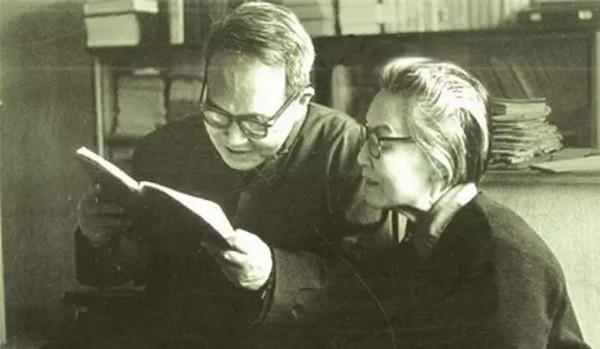

### [最好的爱情是势均力敌，共同成长](http://www.jianshu.com/p/3c0a1e7fce05)

`“我行过许多地方的桥，看过许多次数的云，喝过许多种类的酒，却只爱过一个正当最好年龄的人。”
`
这是沈从文写给张兆和的情书，读来很美很让人感动，说起沈从文写情书，也很有意思。

安徽有一个叫张吉友的富商，家境殷实，爱结交名流。而张家人尽皆知的是有四个才貌双全的女儿。叶圣陶曾说：“九如巷中张家的四个女儿，谁娶了他们都会幸福一辈子”。

这其中，张兆和是张家三小姐，尤为出色，身边的追求者更是多不胜数，沈从文便是其中之一。

不过聪明可爱、单纯任性的张小姐不喜欢这些人，把他们编成了“青蛙一号”、“青蛙二号”、“青蛙三号”。二姐张允和取笑自卑木讷的沈从文只能排为“癞蛤蟆十三号”。

但沈从文发扬不抛弃、不放弃的精神，整整写了四年情书，一天没落下。张兆和不知怎么拒绝沈从文，便一直保持沉默，最后弄得风言风语，说沈老师追不到张兆和就要自杀，张兆和没办法拿着沈从文全部的情书去找胡适理论。

张：“校长你看，老师对我这样子。”

胡：“他非常顽固地爱着你呀。”

张：“我很顽固地不爱他啊。”

胡：“我也是安徽人，我去找你爸爸说说，做个媒。”

张：“不要去讲，这个老师不应该这个样子。”

张兆和继续置之不理，沈从文继续马拉松式情书的轰炸模式。

后来，张兆和终于被感动，在日记里写到：“他到如此地步，还处处为我着想，我虽不觉得他可爱，但这一片心肠总是可怜可敬的了。”答应与沈从文订婚，沈从文那句“让我这个乡下人喝杯甜酒吧”的愿望达成了。

婚姻面对的是柴米油盐酱醋茶的琐事，在一起朝夕相处久了，缺点逐渐暴露，美好却逐步消逝。经过过短暂的甜蜜生活后，二人发现彼此性格有许多不合之处，张不喜欢沈的故作大方，还为什么那么爱收藏古董，沈从文浪漫文艺，张兆和理性务实，二人矛盾越来越深，以致刻意疏远。

不能否认沈从文一直深爱着张兆和，直至离世，只是他自己不明白为什么会出现这种感觉。张兆和在《从文家书》里写道：“从文同我相处，这一生，究竟是幸福还是不幸，得不到回答”。

爱不能勉强，两人从一开始就不在一个平等的位置上，他把她当作女神，她对他却毫无感觉，苦苦追来的爱情到底能保鲜多久，很难说。

天龙八部里，段誉为了追求王语嫣如痴如醉，仿佛入了魔道，她是女神，不可侵犯。想想即使结了婚，就好像家里多了一种保护动物，何谈幸福。

这样的爱一开始就相隔万里，怎么用力拉也很牵强。

好在在世纪修订版中，耄耋之年的金庸重修旧作，改变了段誉和王语嫣的结局，王语嫣变成了普通人，像所有女人一样害怕变老，也会耍性子，也会闹情绪，最终回到了表哥慕容复身边。段誉也看破心魔，不再痴恋王语嫣，娶了木婉清、钟灵、晓蕾。

所以，有时候真希望张兆和的我很顽固地不爱他啊，能够坚持到底，这样才子、佳人也许都会找到真正的心灵伴侣。

这点，一直很羡慕杨绛和钱钟书。杨绛当时的追求者多达七十多个人，但她清楚自己真正需要什么样的一生伴侣，直至钱钟书的出现。

两个人比赛读书，比赛做学问，一起郊游，他们的灵魂在一个平等的位置，一如彼此的爱情理想。

就像杨绛所说的：“夫妻间最重要的是朋友关系，即使不是知心朋友，至少也应该是能做伴侣的朋友或相互尊重的伴侣”。一如两人之间的爱情：“抱怨相随，但感激无尽”。

虽然爱情讲究个“门当户对”，但心灵上的契合更重要，我笔墨丹青你可配水墨，你仪态万方可陪我纵横捭阖。

罗伊·克里夫特在《爱》里写道：

“我爱你，

不光因为你的样子。

还因为，

和你在一起时，

我的样子。

我爱你，

不光因为你为我而做的事，

还因为，

为了你，

我能做成的事。

我爱你，

因为你能唤出，

我最真的那部分。

我爱你，

因为你穿越我心灵的狂野，

如同阳光穿透水晶般容易。

我的傻气，

我的弱点，

在你的目光里几乎不存在。

而我心里最美丽的地方，

却被你的光芒照得通亮。”

也许年轻的我们都有过爱，也许又不算爱，单恋的马拉松值得敬佩，飞蛾扑火的冲动令人动容，但最好的爱情是我们势均力敌，共同成长，一起把曾经年轻懵懂的欲说还休留在暗香浮动的美妙里。

即使事隔经年，若我会遇见她，或许像拜伦所说的只能以眼泪、以沉默和她打招呼。

但或许更应该说一声：“留下美好，各自珍重”！

文／青竹院（简书作者）
原文链接：http://www.jianshu.com/p/3c0a1e7fce05
著作权归作者所有，转载请联系作者获得授权，并标注“简书作者”。
