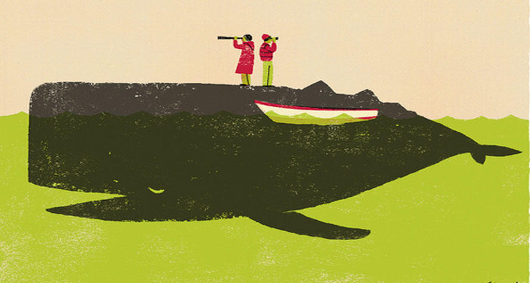

### [没主见的好男人，才是女人最大的敌人](http://www.jianshu.com/p/a0ae4ae70929)

#### 01

毋庸置疑，每个女人，无论姿色如何芳龄几许，也无论性情哪般家世怎样，都渴望着今生能得遇一位好男人。

但怎样的男人才堪称是绝种好男人呢？

如果一个人，模样长的温润如玉，一举一动恰似山颠月云中仙，待人彬彬有礼做事周到妥当，且孝顺和善，收入不菲，有着自己独立的事业。那么，他算不算是个好男人?

如果这个男人，对你一见倾心，对你嘘寒问暖，对你千依百顺，恨不得把你捧在手心含在嘴里，但凡有好吃的便干干净净的收好等你来吃，但凡你心情不顺便百般滑稽耍宝哄你重展笑颜。那么这样的男人，你是嫁还是不嫁呢？

我想，得遇良人如此，大概全天下的女子都会被感动的芳心摇曳眼泪汪汪，下一秒便奋不顾身毫不犹豫的奔向他的怀抱。

这样天生完美的男人，有颜值有事业，有爱情有面包，对世间女子而言，是可遇而不可求的邂逅，是只堪梦中寻不见今生影的惊喜。既然早已寤寐求之，一朝得遇，自然不能将这天赐良缘错过。

#### 但是，世间哪有什么华枝春满天心月圆，所谓的完美有时也不过是一场伪命题。美玉尚且有微瑕，太阳下尚且有阴影，你眼中的良人，自然也难逃缺憾的宿命。

也许你会说，“这没什么啊，我爱他，就会爱他的全部，包括他的闪光点和阴影。”

可是，如果你口中的阴影，是没有主见呢？这样的男人，你还会继续爱下去吗？

#### 02

这个问题，十年前的姐姐用实际行动给出了一个答案。继续爱！不仅要爱，还要嫁！

当年姐姐与姐夫是经由媒妁之言介绍而成的，一个是韶华佳人，一个是温润君子，两人一见倾心情投意合，没多久便定下了婚约。

姐夫是位中学教师，这个职业在当地被视为铁饭碗，备受羡慕。他人长得英俊，性情也温和，对姐姐体贴入微，两人婚后的感情非常好，是人们口中最恩爱的一对小夫妻。

可是好景不长，婚后半年，两个人的婚姻便出现了一丝不和谐的声音。而这个声音来自于姐夫的家庭。

姐姐是个开朗和善的女人，喜欢热闹，初来乍到便与很多当地的年轻人交了朋友，这些朋友里面有男有女，于是她的公婆不乐意了。

她的婆婆是个精明的老太太，公公也不是宽厚的人。这对老人经常在背后对姐姐指指点点，嫌她的性情嘻嘻哈哈大大咧咧，嫌她爱与左邻右舍开玩笑，并且撺掇着姐夫对她严加管教。甚至有一次村里放露天电影，她的公公一路跟踪她，目的就是为了监视她有没有跟其他的小伙子打情骂俏。

一来二去姐姐不高兴了，开始向姐夫抱怨。姐夫深知姐姐的性情，自然深信她的善良纯洁，但又碍于父母颜面，不敢出言制止，只能是暗地里更加温柔缠绵的劝慰姐姐。而姐姐也便不好再追究了。

可有时生活是个无底洞，怨念如决堤，一旦开了口，便再难以收拾。那对老人见姐姐并没有丝毫收敛，便更加变本加厉的试探、监视，渐渐的将姐姐的婚姻逼入了狭窄不堪的绝路。

但是当困境来临，姐姐仍不愿放弃这场婚姻，她常说的一句话是，“他是好人，我很爱他，他也很爱我，我舍不得他。”

而姐夫呢，确实真的很爱姐姐。但是他自始至终只是一直在无力的安慰她讨好她，试图平息她心中的怒火，却从来不敢去制止父母滑稽无聊的行为。因为他从小就是个没主见的孩子，多年以来习惯了听从父母的话，哪怕是错的，最多是置之不理，却从来不会用理智去反抗。

他是个好人，对父母孝顺，对妻子疼爱，但是他的好，最终却伤了自己，伤了爱人，也伤了一场失去便不再得的良缘。

最终，姐姐与姐夫还是在家庭的强行干扰下离婚了。烧成灰烬的心，无论春风拂过几何，都不会再起波澜，姐姐心灰意冷，最后只能选择放手。

#### 一个女人可以忍受生活的贫穷，可以忍受公婆的刁难，却万万不能忍受最爱的男人在自己受委屈时袖手旁观沉默不语。再好的男人，如果没有主见，最终也只能带给女人无尽的伤害。

#### 03

避免招惹一个渣男很容易，可远离一个披着完美外衣实则内心软弱无力的男人却很难。

抽烟喝酒多情约炮，时不时还会污言秽语扬手打女人的男人往往自带极其明显的渣男属性，遭遇这样的男人，女人自然望风而逃，不会受到半点伤害。

可偏偏有这样一种人，他颜值出众性情温润，事业有成风度翩翩，最关键他还对你情有独钟痴心一片，这样的男人，哪个怀春少女能够抵挡？

如果这个人又恰好是个懂人情负责任的真汉子，那你真是太幸运了。可如果在这美好外表掩饰下，他有颗永远长不大永远没主见的玻璃心，那你就真的太惨了。

而最惨的是，他不仅没主见，他还处处愚孝，半点不敢反抗强势父母的威严，半点不能维护你的颜面和幸福。这样的男人，即便再好再善良，也绝对绝对不能碰。

`倘若一个深爱着你的男人不能护你一时，便不要奢望他能拼尽全力爱你一世。`人的本性有时是天生的，根深蒂固的，轻易无法改变的，尤其是男人，往往会自带顽固体质，他某个小小的生活习惯尚且难以更改，何况是由原生家庭里长出的性情呢。

姐姐离婚那天，姐夫就神情黯然的呆在某个角落里默默流泪。他自小便没有主见，父母说什么他都听从，即便内心千万个不愿意离婚，也默认了这样的结局。他的无力感，是最伤人的地方。

然而可怜之人必有可恨之处，虽然他经历了这样一次失败的婚姻，却并没有真正认识到自身的性格缺陷，依然没有得到成长，以至于后来他的第二段婚姻，也是因着同样的理由宣告失败。他现在四十多岁，离异有孩，生活潦倒情绪不佳，早已然失去了曾经的风华。

而姐姐呢，离开他之后，嫁了一个其貌不扬却古道热肠的男人。这一次她终于扬眉吐气成了真正的女主人，如今儿女双全，甚是幸福。

#### 04

`没主见的好男人，不是女人的良人，而是女人的敌人。`因为他们往往伤人于无形，以爱之名铸就手中的利器，并在经年累月中为你挖下温柔的陷阱，只待一朝，你一个恍惚，便一脚踏空摔个粉身碎骨。

可是如此，你偏偏舍不得怪他，因为他是那样的无辜那样的温柔，你心中不断的跟自己说，“他是个好男人，他很爱我。”而这样的心理暗示如同魔咒，令你既沉迷又黯淡。

他是好男人又怎样？只没主见这一条，便足以抹杀他所有的好。他的犹豫不定，他的优柔寡断，他的偏听偏信，他的无能为力，会一点点的消耗你的爱意你的耐心以及你对美好的向往。

#### 爱情与婚姻里最好的关系是共同成长，而不是互相消磨。

虽然没主见的张无忌最终会被强势的赵敏收服，但我们都不是赵敏，我们都只是智商普通情商一般的姑娘，内心都渴望着一个颇有男子汉气质的人来托起自己的一生。

既然如此，倘若遭遇那些没主见的好男人，我们还是趁早逃离为妙。因为他们，才是女人通往幸福路上最大的敌人。
