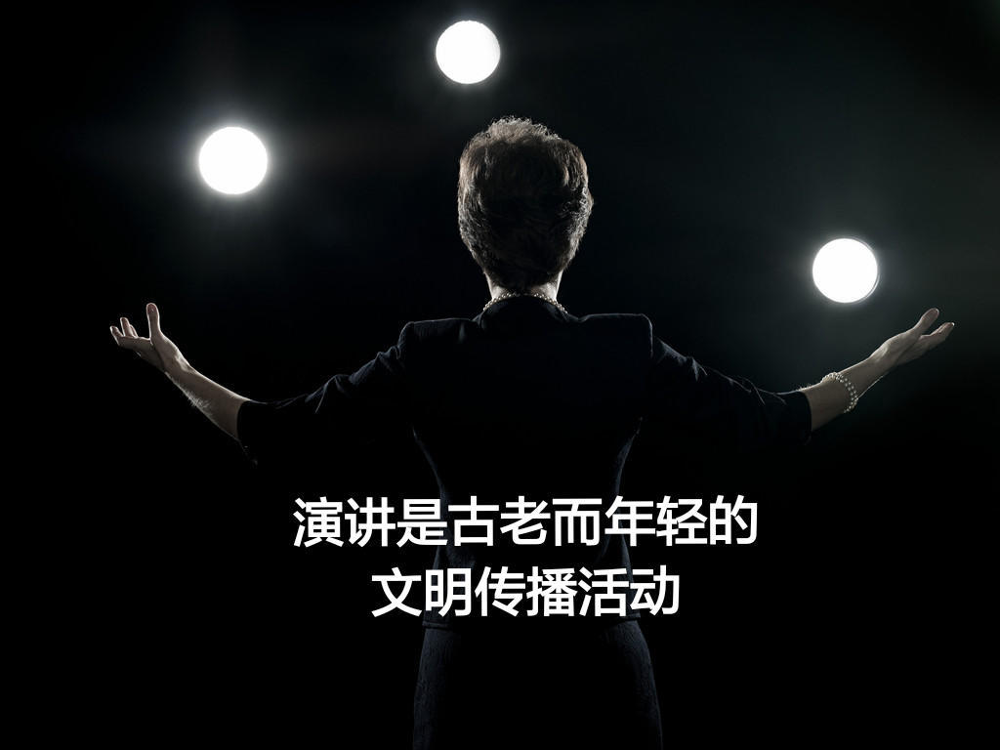

### [演讲的10条经典名言：让你从此爱上演讲](http://www.jianshu.com/p/04b3e7925332)

#### 演讲是一门古老而又年轻的文明传播活动。
说『她』古老，因为自有人类以来，演讲就必然存在。『便捷的口才将使得你雄辩滔滔，占尽上风』，这就是镌刻于3000年前，埃及古墓上的铭文。

说『她』年轻，是因为我们国人，受两千多年的封建传统禁锢，以含蓄为美，不擅口头表达。自从邓公南巡讲话后，解放了国人的思想。演讲这个时尚美女，才焕发出美丽的光芒。

演讲也因此成为当代人才的必备技能，不会演讲的人，总是处于下风。

在美国，二战时期，把『口才，金钱和原子弹』称为三大武器；在六十年代，把『口才，金钱和电脑』称为新三大武器。

到今天，『口才，金钱和手机』成为新世纪的必备套餐。这，一定没有人能够反对。

#### 口才，到底有多么重要？
还是让我们来看看古今中外的名人怎么说吧。我将用点评的形式来为名言『添枝加叶』。

>1，一人之辩，重于九鼎之宝；三寸之舌，强于百万之师。 ——『战国策』

评：来源于战国策中的『毛遂自荐』故事。毛遂用雄辩口才，为赵国与楚国合纵签约立下了汗马功劳。

这也说明，每个毛遂自荐的英雄，都要有优秀的演讲才能打底子。

>2，如果有一天神秘莫测的天意将我从这里把我的全部天赋和能力夺走，而只给我留下选择其中一样保留的机会，我将会毫不犹豫的要求将口才留下，如此一来我将能够快速恢复其余。 ——丹尼尔·韦伯斯特。

评：丹尼尔曾担任美国三届国务卿，美国『最伟大的五位参议员』之一。他擅长演讲，大学期间，就是学校辩论会的风云人物。

你们记得另外一个世界级名人的话吗？
人类有史以来最有钱的人——洛克菲勒说：『如果把我剥得一文不剩丢在沙漠的中央，只要一行驼队经过——我就可以重建整个王朝。』

两句话的意思有异曲同工之妙。前国务卿说，只要有了演讲，他可得到一切。

>3，如果让我重进大学，我将修好两门课：演讲和说服。——美国前总统-尼克松

评：美国总统都这样说，大学生们，你还有任何理由拒绝学好演讲吗？

>4，你能面对多少人，未来就有多大的成就。 ——前英国首相-丘吉尔

评：邱吉尔，二战期间，世界三大政治演讲人物（另外两个是罗斯福和希特勒）之一。希拉里和特普朗，面对全国观众演讲，所以，他们成为总统竞选人，甚至将成为总统。

二战期间，邱吉尔，发布了二战最鼓舞人心的演讲，最终力挽狂澜，带领英国，鼓励整个欧洲战胜了法西斯。

>5，演讲，不仅仅是一种职业，而且是一种事业，一种伟大的事业。演讲，不仅仅是一种科学，而且是一种艺术，一种卓越的艺术。——李燕杰

评：李燕杰，共和国四大演说家之一。

我想说，演讲不是我的职业，而是我的事业。演讲对于我来讲，既是科学化的培养流程，也有艺术化的发挥空间。

>6，要开化人的知识，感动人的思想，非演讲不可。  ——秋瑾

评：中国资产阶级第一位女革命家，1907年英勇就义。她就义本身，也是对革命的宣扬。

你们还记得革命战争时期，很多年轻战士，走上街头，说服群众，鼓励为革命，为人民，为幸福而战斗。

>7，『一言可以兴邦，一言可以丧邦』。  ——论语

评：正如人们常常说，『良言一句三冬暖，恶语伤人六月寒』一样，语言，尤其是公开演讲的语言，杀伤力是非同凡响，它可以祸国殃民，也能够强盛民族。

>8，口才是社交的需要，是事业的需要，一个不会说话的人，无疑是一个失败者。    ——林肯。

评：林肯，世界著名政治演讲家，被多家媒体评为美国最伟大的总统第一名。

他出名贫寒，但酷爱学习。没有任何家庭背景的林肯，靠公众演讲走上政治舞台。

在一场政治集会上，林肯第一次发表了政治演说。由于抨击黑奴制，提出一些有利于公众事业的建议，林肯在公众中有了影响，加上他具有杰出的人品，1834年他被选为州议员。

看到了吗？是一场演讲，推动他走上政治道路。

他还说了句关于演讲的真谛。『演说就是讲故事，就是通过吸引人的故事来说明观点。』

>9，有思想而不表达的人就等同于没有思想。——李开复

评：你有满腹才华，却如茶壶里的饺子，倒不出来。你的魅力也无从展示。

最优秀的思想，也需要最杰出的演说，向世有传播。

>10，说话和事业的进展有很大的关系，是一个人力量的主要体现。——富兰克林。

评：曾经碰到一个职场人，他非常痛苦地告诉我一件事情。

他和一个同事争取一个更高地职位。他兢兢业业，任劳任怨，典型的埋头苦干型人才。而他的同事则相反，工作也做，但特别喜欢在公开场合讲，尤其是争取每一个机会，在团队中分享，向上级汇报工作，向客户讲品牌与故事。

最终，在大家都认为他功劳最大时，他的竞争对手却上任了。

公司有句评语说：『我们需要专家，更需要吹喇叭的鼓手。』

是的，演讲的重要性勿须赘说。

上天给我们创造出一张嘴巴，它不应该只用来吃饭，更是用来分享价值，传播思想，影响众生。

沉默不是黄金椅，表达才是生产力。当马云还没成功时，他滔滔不绝的演讲，被认为是忽悠魔鬼，而当他功成名就时，大家都把他当成演讲大师顶礼膜拜。

别管人们怎么看，学好演讲路不难。我就是这样爱上演讲的，并将一直演讲下去。

文／楠天下的太阳花（简书作者）
原文链接：http://www.jianshu.com/p/04b3e7925332
著作权归作者所有，转载请联系作者获得授权，并标注“简书作者”。
