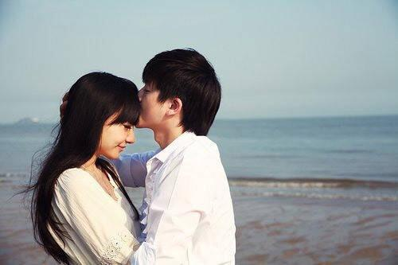

### [爱，就是这世上你最好看]()

>文/端木婉清  图/网络

年少的时候，我们喜欢一个人，就会喜欢她的全世界，喜欢她青春无敌的笑脸，也喜欢她委屈哭泣的眼，大概牵一次彼此的手都会是红着脸足以用来怀念一生的事情。

那时的我们不懂“情人眼里出西施”的感悟，只会以为爱情就是这样的，我喜欢你，你就是最好的。

我们眼里的色彩是单一的，非黑即白，你就是你，喜欢就是喜欢。

后来长大，我们喜欢一个人，她还是全世界，依然喜欢她明媚阳光的脸庞，和闪着金色的光环。

只是长大后的世界多了很多颜色，焕丽多彩，才发现要找一抹当初的简单，已经不再那么容易。

每一个人的身边不知道何时开始多了很多关于爱为何物的问题？也多了几分爱的不确定和胆怯迷茫。

就像曾经的我也一直会问自己：喜欢一个人到底是怎样的？爱一个人又怎样才算爱？除了那不变的悸动，微红的脸，狂热的心动外，还会有什么？

除了明媚的脸庞，耀眼的光环外，你会不会也喜欢那个有着缺点的她或他？除了一开始的悸动荷尔蒙飙升外，也会不会爱那个未来老去难看或者一世清贫的她或他。

直到有一天，你发现无论她盛装出席还是一身粗衣面你，你都不会心有所别；

直到有一天你面对大千的世界，看过万千山水，美女如云亦或帅哥成群都不再为所心动，

直到有一天你的眼里心里只有一个人，无论她或他是美的丑的，青春的，苍老的时候，都是最美的模样；

直到你和她或他在一起的时候无论是优秀的，还是不优秀的，无论是过去还是现在，你都可以毫无顾虑坚定未来的时候，在你眼里永远是最优秀的时候，

直到白发苍苍，捶打戏闹，咀嚼岁月时满满是喜欢温暖的时候，大概这就是爱了。

那么我豁然明白早在几千年前的那句：情人眼里出西施，是那样的正解，才明白真正的爱情是岁月无限年轮后的那句：爱，就是这世上你最好看。

这世上你最好看，眼神最让我心安，只有你跟我有关，其他我都不管，全世界你最温暖，肩膀最让我心安，答应我别再分散，一辈子恋着多喜欢……

于是在这样的雨夜里我忽然想起了那些温暖着人心的平凡挚爱故事，那点点滴滴都溢出，爱，就是这世上你最好看的温情。

记得小时候，在老家的村子里,有一对非常特别的夫妻。

我没见过他和她年少时候的模样，也没见过他们相爱最初的欣喜，因为那时我不知道自己还在宇宙的哪一个角落像尘埃漂浮。

但是在我后来的所有童年时光里，我见到的那对夫妻是人到中年，又身有残缺，却爱的最为动人的他们。

在他们的眼里彼此都是最好的，他是最勇敢可靠的，她是最美丽温柔的，两个人一辈子到死都是你侬我侬没有分开过，没有怨恨嫌弃过彼此一回。

那个丈夫40几岁，身高1.65米左右，严重驼背，但是每一次见到妻子就会露出笑脸张开双臂；那个妻子1.50左右，人长得非常瘦小带有一点小儿麻痹后遗症的轻微痴傻，但是每一次她的丈夫出现在视线里就会远远就咧着嘴巴笑，像个孩子一样跑到他的身边，挽着他的手臂，一蹦一跳地回家去。

他和她没有父母没有孩子，就是两个人相依为命。

全家的收入靠丈夫一个人打零工维持，家里还养了几头牛，空余的时候他们一起去山坡上放牛，有时候和牛说话，有时候两个人说话，有时候两个人就不说话看着晚霞，依偎在一起。

那时日子贫寒，但是再贫寒，我们都未参看见他们彼此抱怨过一回。

相反的是丈夫拿她当着宝贝，不舍得她吃苦，不舍得她难过，就算有一个馒头也要藏回去给她妻子吃。

相反的是神智时好时不清醒的她，见到他就没有一次不清醒过，脸上的笑容都不曾隐藏一分一毫。

他们同进同出，同甘共苦，他们彼此相爱，用最原始的情感，没有杂念没有嫌弃，在彼此的眼里最疼惜……

记得那时有一些人开他玩笑，你这么疼你家的老婆，你家老婆又不是最好看的，从未和人起过争执的丈夫第一次抡起拳头要揍人，在他矮小的身材下，暴露出来满是爱的力量。

他说：我眼里她就是这世上最好看的人。那就是爱，你是这世上最好看。

>再看《半暖时光》沈候爱颜晓晨时的心情，那眼里心里嘴里行动里都满是她的最好看，哪怕是生气的时候的样子，都会觉得是一种幸福。
我幸福，是因为能够看着你微笑、生气，我幸福是因为能够走进你的世界去感知你的快乐和悲伤，我幸福是因为无论你怎么样，在我心里就是那个西施，那个全世界都可以不管，我来爱的人。

忽然想起周先生与我，我不是那个最漂亮的人，但是在他眼里他几次说我是他最喜欢的人，是他喜欢的古典的美；我认识他的时候，我什么也不是，什么也没有，甚至还在为生活的温饱而愁苦努力。

但是他走进了我的心，用他最宽广的肩膀，用他最真诚的心意。直到后来，我们一路打拼一路相爱。

我的眼里，婚姻是延续爱情的温室，是爱情最有保障的地方，是我披头散发，一脸素妆，甚至他洗澡我还可以上厕所的自然和心安。

于我眼里他也是，是我认为那个最正义，最有担当，最有责任心的男人。

想起不知道是哪一个作家写过：今夜你不必盛装出席，不必在我面前坚强，不必在我面前小心，心中的柔软就这样蔓延了开来。

我爱，你是这世上最好看的你，我爱，你不必为我小心翼翼盛装出席，我爱，是你那个最真实的你，有优点有缺点，曾年轻，会老去……

>突然想起：《诗经》“邶风”里的《击鼓》篇，“死生契阔，与子成说；执子之手，与子偕老，大概也有了深远的坚定。

当我们趟着岁月的河，衔着时光的花蕾，怀着一份美好与快乐，浅语轻盈地走在四季的光阴里。眉头心上，盛满笑容，心底的芬芳如花儿香甜，全是因为你……

就像此刻，初冬的雨水下在城市钢筋水泥的丛林里，滴落万家灯火的霓虹外，滴答滴答，回头看着身边熟睡的人，是那种蓦然回首，辩驳时光里，你在就好！
w
