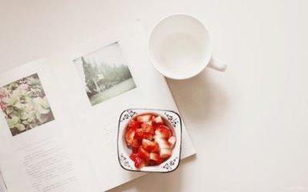

### [用对方需要的方式去爱他](http://www.jianshu.com/p/41e39ea126ae)

>文/舒小曼

当赵小聪打电话找我喝酒的时候，我就有预感，他又一次跟他的女神Nancy表白失败了。

这大概是…第五次失败了吧。

几乎每一次，赵小聪都是卯足了劲儿，搞足了花样，准备足了惊喜去找女神表白，可每一次，都是碰一鼻子灰回来。

赵小聪不解：“我对她那么好，为什么她就不能喜欢我一下？”

说起来，赵小聪对女神那是真的不错。

女神不吃早餐，赵小聪就每天变着花样地给她送，今天是豆浆油条，明天是肠粉，后天是包子，确保尽量不重样。

女神喜欢花，赵小聪就砸重本跟花店预订了半年的花，每周往她单位里送一大束精美的手捧花，简直羡煞旁人。

女神喜欢读书，赵小聪就买来了一台电子阅读器，外加上千元的电子书购书卡，让她爱读什么读什么。

女神喜欢旅行，赵小聪就做好攻略每周末带她自驾游，周边的几个城市，几乎都跑遍了。

每个人都羡慕女神，拥有一个二十四孝准男友，天天都像过情人节一样浪漫。

可偏偏，赵小聪做的这些，女神却一点也不感动。

面对赵小聪一次又一次的真情告白，女神总说：“谢谢你，但咱俩不合适。”

赵小聪不明白，到底哪里不合适了？

百般无奈下，只好找上了我这个救兵。我与Nancy在工作中有过交集，勉强算是朋友一场，赵小聪想通过我，去探探女神的口风。

坦白说，我向来不喜欢掺和人家感情的事儿。可兄弟叫到，只好硬着头皮上场，把女神约了出来。

嘘寒问暖了一番后，我奔向了主题：“那个，Nancy呀，你喜欢哪个类型的男生呢？你看我那兄弟赵小聪怎么样？”

Nancy一听，噗嗤一声笑了：“原来你是为了这个来找我。”

我说：“对呀，我看赵小聪不是对你挺好的吗？”

Nancy无奈地叹了口气，跟我道出了她内心的想法：“我跟你说句心里话吧，他对我确实很好，可这样的好，并不是我想要的。”

“他每天变着花样地给我送早餐，是挺感动，可是他有想过我是因为减肥才不吃早餐的吗？他每周给我送大捧大捧的花，确实是人人羡慕，可他却不知道我喜欢的是那种有生命的小盆栽；他给我买电子阅读器和购书卡，可我爱读的，是纸质书啊，纸书翻起来才有那种真实的质感；他带着我到处自驾游，拜托我每天工作忙得不得了，恨不得周末窝家里休息，可又不忍心拒绝他的热心…所以，他的喜欢，对我来说，其实是一种负担。”

Nancy说完后，长吁了一口气，仿佛把以往那份负担卸下来一般地轻松。她最后让我转告赵小聪：“谢谢他一直以来对我的好，只是他的方式，我真的不需要。”

听了Nancy的话，我终于明白，赵小聪的问题出在——他根本不懂Nancy需要什么，自然不懂得用对方需要的方式去爱她。

他所有的付出，对Nancy所有无微不至的好，全都是执着地在用他自己的方式——那些他一厢情愿的“我以为”。

我以为你需要早餐，我以为你想要包装精美的花束，我以为你需要电子阅读器，我以为你想要自驾游，我以为我对你非常好…

#### 殊不知，那些由天真的“我以为”所拼凑起来的爱，并不是对方所需要的爱。那些没有基于对方需求的付出，只会给对方造成压力和负担。

#### 就好像，我口渴的时候只需要一杯白开水，而你却双手奉上一杯香槟。你以为很浪漫，可却没想到，香槟不仅不能有效止渴，而且还会让对方感觉甜得发腻。

你总以为只要自己对她好，对方应该会为之感动。却不知道，到头来感动的仅仅只是你自己。

单位里有一对年轻人，谈恋爱已有两年了，最近听说已经把结婚提上了日程。

能找到一个彼此喜欢的人，谈一场以结婚为目的的恋爱，真替他们感到高兴呀。

有一次聊天，问男生平时是如何哄女朋友的。

本以为，他会高调地秀一番恩爱，让我们吃一嘴狗粮。没想到，谈及这段感情，他只淡淡地说了一句话：“真正的爱情，是用对方需要的方式去爱对方。”说罢，脸上露出了大大的笑容。

想起来，这对恋人组合平日里虽没有什么轰轰烈烈的“恋爱事迹”，但彼此在细节上的付出却很让人感动。

比如，女生喜欢吃隔壁街早餐店里的豆浆油条，男生两年来风雨不改地给她买；

比如，男生喜欢打羽毛球，女生即便不喜欢运动，也会抽时间陪他去打；

又比如，女生喜欢写作，开了个公众号自娱自乐，男生就在她每篇文章下面偷偷打赏；

……

这些小事，说起来似乎都琐碎得微不足道。然而，因为彼此懂得对方的需要，了解对方的需求，这些点点滴滴的付出，汇聚而成的，却是细水长流的爱情。

也就是说，他们懂得，用对方需要的方式去爱他。

听过这样一个故事。

一对老夫妻在金婚纪念日这一天，做了几个菜庆祝。老头习惯性地把鱼头夹到老太太碗里，老太太伤心地哭了：“我跟了你几十年，容易吗？今天这样的日子，你还把我最不愿意吃的鱼头给我，你这个人真是太自私了。”老头叹了一口气：“其实，我最爱吃的就是鱼头了，几十年都舍不得吃，一直让给你…”

故事让人唏嘘不已，彼此以为自己给予爱的方式很无私，没想到在对方眼里竟是自私。

其实，在很多亲密关系里，我们出于对对方的爱，会不断努力地付出，给对方所有自己认为最好的爱。甚至忍痛割爱，把自己最爱最喜欢的给对方。然而往往会忽略，对方真正需要的是什么。这样的爱，不仅无法让对方感动，还会造成一定的压力和负担。

这也是很多婚姻爱情里，彼此无法幸福的原因之一。

因此，我会告诉赵小聪，也想告诉世界上千千万万个“赵小聪”，喜欢一个人，付出并没有错。只是，在对对方好之前，我们都应该充分了解对方的需要，用心感受对方的需求，而不是从自己的理解和需要出发，一味盲目地付出。

#### 爱的关键，是要懂得，用对方需要的方式去爱。
