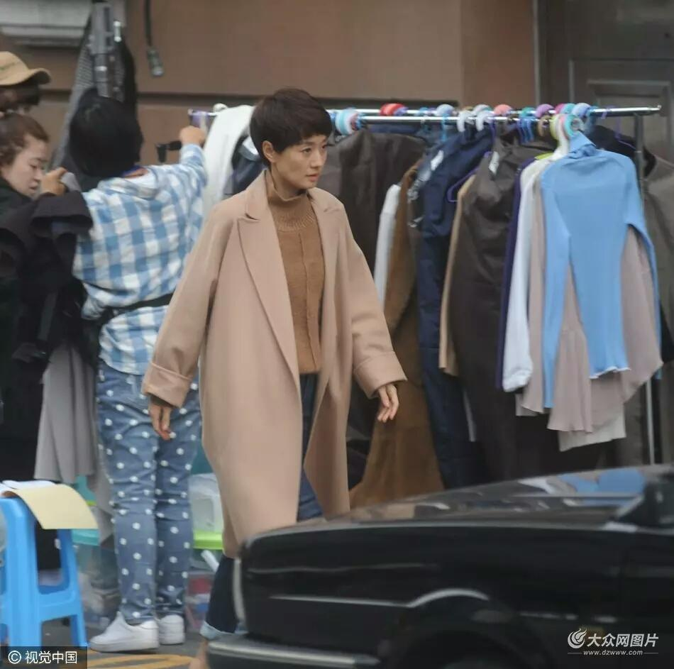
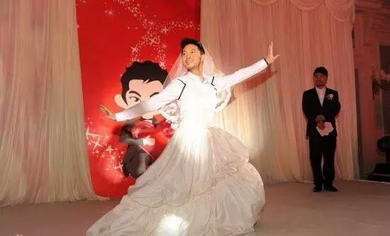

### [男人，别让你的女人那么冷…](http://www.jianshu.com/p/6143c9b6ad58)

#### 女人是一种怕冷的动物。

#### 冷漠、冷战、冷场，所有跟冷相关的词，我们统统都不喜欢。（知道为什么“暖男”那么受欢迎了吧？）

看电影时，经常有这样的桥段，天冷了，起风了，男主角脱下自己的外套，披在女人的肩膀上……画面看起来很温暖。

同事跟我讲过她恋爱的故事。

同事恋爱的时候，有一次上课，天下起大雪，男朋友来接她。同事粗心报错了下课时间，结果她男友就在大雪里等了两个小时。下课的时候，他全身都盖上了一层薄薄的雪。可看到同事出来，他不但没有责怪，还是下意识地先问她冷不冷，并把带来的大衣披在她身上。

那一刻，她就决定要嫁给他了。

#### 你看，女人就是这么好哄啊！

#### 可时间久了，在朝夕相对的岁月里，男人却渐渐失去了这份温存。

吵了架，他不再哄你。下了班了，也不会再来接你……

等待你的是冷场、冷战和冷漠……

回到家，你兴致勃勃地想跟他交流今天领导对你的评价，单位新来的大学生有多可爱，可却他毫无兴致地摆摆手，拿起手机用冷场来应对你。

吵架了，你心里难过，希望他能哄哄你，哪怕轻轻拥抱你一下，你便觉得心不那么寒了。

可是他却甩手出门，和兄弟们去痛饮潇洒；即使躺在一个床上，也只留给你一个冷漠的脊背，让你流着泪苦熬到天明；看着你流泪，他不耐烦地说：“别在我面前装可怜……”

叔叔和婶婶结婚多年了，夫妻两合开着一家小超市，靠着这家小超市，他们买上了大房子，小汽车，日子看起来过得红红火火。

我一直以为他们很幸福。直到有一天，婶婶实在忍不住，跟我说了她心里的苦楚。

婶婶说她觉得自己一点都不幸福。她说叔叔生性倔强，自尊心又强。每次吵架，叔叔一点都不让着她。吵完了，还会赌气地和她冷战，最长的一次，他们竟冷战了一个月。

每次冷战，都是婶婶绷不住先低头。

可婶婶也是有自尊心的人啊，日子久了，她觉得心里特别憋屈。

婶婶是个传统的人，她觉得孩子都上初中了，总不能因为这个就离婚啊？

于是，日子就这样貌合神离地将就着。

因为观念不一样，两人常常是一说就吵起来，可每次吵架都是她先低头。不想总是受那种屈辱，婶婶渐渐减少了和叔叔的沟通，除了跟生意有关的事情，她在家里几乎不说话。

那种感觉怎么说呢，就好像生活在冷宫里。

婶婶说，我的心都冷成灰了，说实话，就算哪天你叔叔出什么意外，人不在了，我也不会再为他流一滴眼泪。

看着婶婶漠然的表情，我心里说不出是什么滋味。

>爱是彼此温暖

读者小丽在后台给我讲过她的故事。（这也是我想写这篇文章的原因）

小丽说，每次和男人争执后，她都特别痛苦，夜里躺在床上，脑海里还一遍遍回放白天男人骂她的那些话。

她辗转反侧，愁肠百结，可旁边的男人早已鼾声四起，睡意香浓。

她心里的委屈郁愤无处可诉，白天上班还要装作没事人一般。人就这样一天天的消瘦了。

有一次，单位组织体检，婚前身体一向很健康的小丽竟然查出好几处囊肿。

小丽和男人说了，男人却依然不以为然：“你难受是你自己心眼小，不要赖到我头上。结婚过日子，我一个大男人还得天天哄着你？”

那一刻，小丽明白了，原来自己的心痛和难过都抵不过他的面子重要。

后来，小丽离了婚。

身边的人都不理解，因为她老公看起来是那么的完美：180的大高个子，优越的家庭出身，高收入又体面的职业。

可小丽却走得义无反顾。

她说自己和他在一起感受不到温暖，只有无尽的悲凉。

现在，小丽又结婚了，老公是个温和宽厚的人，虽然没有那么高的收入，却懂得体恤包容她。

婚后的她气色好了，囊肿竟也慢慢地消退了，连性情都变得柔软了。

她特别喜欢现在的自己。

#### 其实，看一个女人在婚姻里幸不幸福，看她和老公在一起的状态就可以。

#### 看她还是不是那个原来放松的小女人？她和老公能随意地开玩笑，自然地撒娇吗？还是两个人除了必要的对话，再没有别的交流？

#### 女人只有在能温暖她的男人面前，才能绽放小女人的娇柔。

>和沙溢在一起的胡可

前一段时间，媒体曝光了马伊琍的几张照片。不知怎的，虽然婚姻犹在，我却觉得她并不幸福。

>冰一般的眼神

#### 因为她浑身上下都散发出一种冰一般冷漠坚硬的气质。那不苟言笑的霸气背后，分明是害怕再次被伤害的防御。

受伤之后的女人，她的每一个眼神每一个动作都透出一种寒冷。

当你的女人在你面前变得越来越冷硬，越来越不像一个女人，也许那只能说明是你太不男人了。

可有些男人偏偏孜孜不倦地致力于用他的冷漠无情来把女人打磨成一个冰冷如机器、木纳如假人的男女不辨的奇怪物种。

与其说这是女人的悲哀，不如说男人的无能。

有个男人是单位一致风评的老好人，对谁都是“好好好”“是是是”。可这男人和自己的女人吵起架来却是伶牙俐齿，举一反三，寸土不留！他的老婆身为律师都自愧不如。

一次吵架，伤透心的女人哭着哀求：“你就不能让我一次吗？”男人却冷笑着说：“哼，男人让着女人，那是在偶像剧里！”

至此，女人心死，不但再也不和男人吵架，连话都不想和他多说一句。

你说这个男人是厉害呢，还是无能呢？

还有个女人，老公常年在外跑工程。女人一人在家里操持着全家老少的生活。可女人脸上却总是笑吟吟的。

为啥呢？因为她老公特别会哄她，打个电话都能把她逗得笑呵呵的。

这样的男人才是聪明的男人。

也许你会说，你们女人怎么那么麻烦？

#### 可上帝造的女人天生就是柔肠百转，敏感多情。你喜欢她的女人味，就得包容她的小女儿心啊。

况且，放下你的面子，哄一哄她，有那么难吗？

#### 一句温言，一个微笑，一个拥抱就能换来女人的任劳任怨死心塌地，换来家庭的和睦，这么简单的事情，你为什么就是不做呢？

所谓的面子真的那么重要？

我想起胡可和沙溢的故事。

胡可甘愿为沙溢放弃如日中天的事业，做一个居家女人。婚姻里，他们不是没有争吵，但每一次争执都是沙溢先低头。

>影视剧中美丽的胡可

沙溢说胡可经常贬损他，甚至把他的自信心都打碎了，可他笑称自己有一个本事就是能够迅速地自我重塑。

>独特的婚礼

#### 这样的男人才是真正强大的男人啊。

#### 因为那点可怜的自尊心便去伤害爱你的人，这样的男人不知道是情商低还是缺心眼？

#### 都说女人是调节家庭气氛的关键，可一个在男人的冷漠里苦苦挣扎的女人，她连自己都暖不过来，又哪里还有多余的温暖来散播给这个家呢？

#### 她强颜欢笑的背后，有多少辛酸和无奈？或许，在人前死撑一份婚姻的体面，就已经耗尽了她最后的心力了。

#### 其实，女人要的不是哄，而是她难过时你的心疼，是她心冷时，你的温暖。

#### 心疼和温暖才是对爱最好的注解。

男人，请别让你的女人那么冷……
