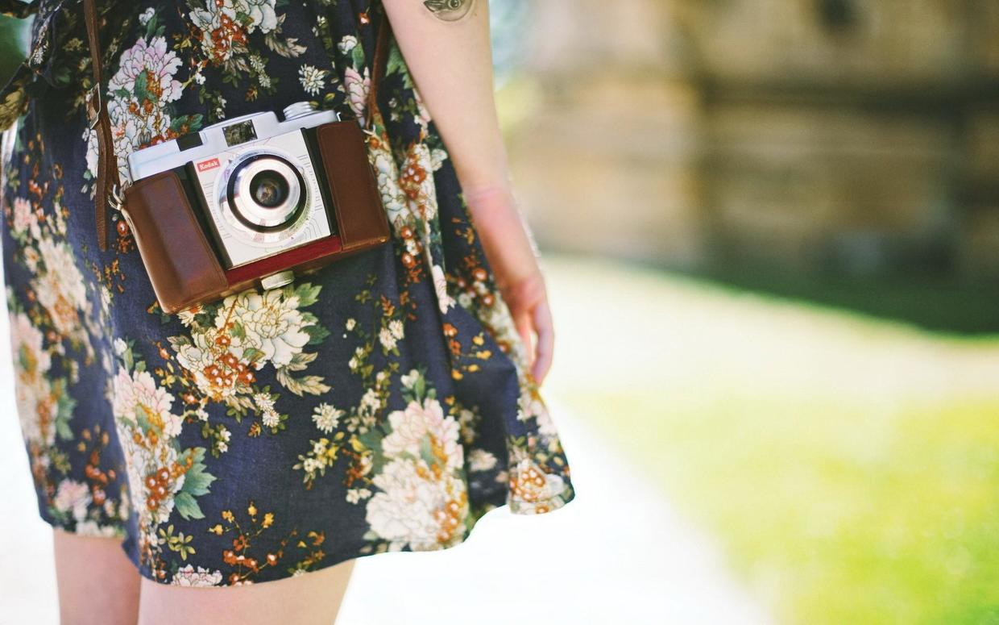

### [这才是与女人聊天的正确姿势](http://www.jianshu.com/p/b29d7da3efa8)

#### 01

我身边曾经有一位男性朋友，说话分分钟能将你气到爆炸的那种。

每次约着一起逛街，见面时他都会对着我穿着的衣服惊呼，“你这身麻袋片子是哪买的？！”或者“我发现你的品位是越来越差了！”

可是他不知道，爱美的我其实每次出门都是经过精心打扮的，而且天地良心，我觉得自己的品位还算不错。

我在朋友圈贴出一张八九岁时的照片，他积极的来评论，“你家真有钱，那么小就送你去非洲旅游。”

是，我承认，小时候的我皮肤黝黑如炭，但真能跟非洲群众媲美？

后来我开始写文章，他又闻讯前来，“听说你开始瞎写东西了？”

我答，“你读过？”

他来了一句“呵呵，没有。”

渐渐的，彼此之间的关系仿佛生疏了许多。好多年的朋友，不知为何，有点不愿意联系了。不是我小心眼，只是生活不易，世界的负能量已经太多，我不想再轻易为自己徒增烦忧。

#### 02

朋友、情人、夫妻之间，若要相处的舒服，需要用彼此的能量来不断充盈这段关系。但如果连最基本的聊天都聊不来，那彼此之间将如何继续下去呢?

#### 而聊天最重要的是什么？是赞美。

我的一位女性朋友经常向我抱怨，她老公是有些大男子主义的人，婚前还偶尔赞美她几句，婚后一年，她便彻底不知被赞美是何种感觉了。

无论是她浓妆彩衣，还是烹饪美味，他都熟视无睹，仿佛她做的都是再自然不过的事情，不值得引起他的半点关注。

她憋屈久了，便提出抗议，但他又觉得她是小题大做无理取闹。“不就是没夸你吗，告诉我，你想听什么，我说给你听！”

这样带着不耐烦的无奈，他觉得不爽，她听着更是伤心。

婚姻里的痼疾沉疴大概就是这样慢慢形成的吧，一个人心甘情愿的付出，不意味着不需要回应，发自内心的那句赞美，才是解开心结的金丹良药。

#### 03

大多数女人都是听觉动物，有时需要通过他人的认同来提升自身的信念和幸福度。

大学毕业后的一段时光，是我人生的低谷，那时候考研失利、爱情岌岌可危、梦想遥遥无期，状态很是低迷。

幸好当时遇到一位心灵相通的好朋友，他从不吝惜溢美之词，将全世界最美好的语言都赠送与我，才渐渐的令我重拾了对生活的信心。

他夸我眉目如画，夸我冰雪聪明，夸我善解人意，其实我心知肚明，自己并不如他所说的那般美好，但是因着他那样的真诚，我依然满怀感动，并愿意去努力，真正的成为他口中那样美好的姑娘。

#### 当你身边的朋友或者你爱的人，遭遇挫折失去信念，最希望得到的不是你条条是道的生硬分析，也不需要你大手一挥为她指出一条明路。

一句简单而真诚的赞美与鼓励，便足以将她拉出生活里那苦不堪言的深渊。

#### 04

有时，也许你会狐疑，自己并没有对女人恶语相向，为何她们依旧对你怨气冲天？

为何？还不是因为你没能及时表达出你内心的赞美？

她们穿着新衣端出一锅浓香的猪骨汤目光殷勤的望着你，等待着期盼着你的兴奋喜悦和赞美，你却对她们的热切熟视无睹，却还在她们明显沉下脸色之后莫名其妙的嘟嘟囔囔，觉得女人心事好难猜。

#### 其实任何一个年龄段的女人，都是需要被赞美的。

她的身份可以是母亲，也可以是女儿；可以是恋人，也可以是姐妹；可以是女性朋友，也可以是女邻居，甚至，她的身份有可能是你在菜市场讨价还价的商贩或者大街上偶遇的陌生人。

而作为一个具有绅士风度的男性，学会与各种不同角色的女性和睦相处，并时时口吐莲花真心赞美，是一种基本美德。

当母亲为你精心准备晚餐，你可以真诚的称赞她厨艺超群；当恋人穿上一件新衣服，你可以赞美她真的很漂亮；当女儿成绩单上涨了几分，你可以鼓励她棒棒的；当女性朋友勇敢的去追逐梦想，你可以给予她更多的信念和支撑。

#### 05

赞美女人，是需要技巧的。

她微胖，你便不要说什么珠圆玉润，她娇小，你便不要再提什么亭亭玉立，她笨手笨脚，你便不要总羡慕别家主妇能上得厅堂下得厨房。

每个女人都有值得被赞美的特质。颜值低的或许性格娇憨，风风火火的或许能赚钱，拘谨内向的或许心灵手巧，情商不高的或许善良真诚，若你有心，定能发现她们的美好之处。

赞美不等同于花言巧语，有时男人自诩实实在在，婚姻里觉得老夫老妻不需要过多语言亲密，但实则这只不过是他们不用心和敷衍的借口而已。

婚姻里，肯为女人花言巧语的男人必定比从来不肯多说一句赞美之词的男人，来的更幸福。

#### 赞美或许是这个世界上最一本万利的事情，因为它不仅零成本，却能令受赞美者喜悦，令施赞美者得到感激，从而两个人的关系更加深邃和谐，也更加真挚长久。

赞美女人，早已成为男性的最大美德。

都说良言一句三冬暖，恶语伤人六月寒。而你的一句称赞，可能会暖着别人的一辈子。
