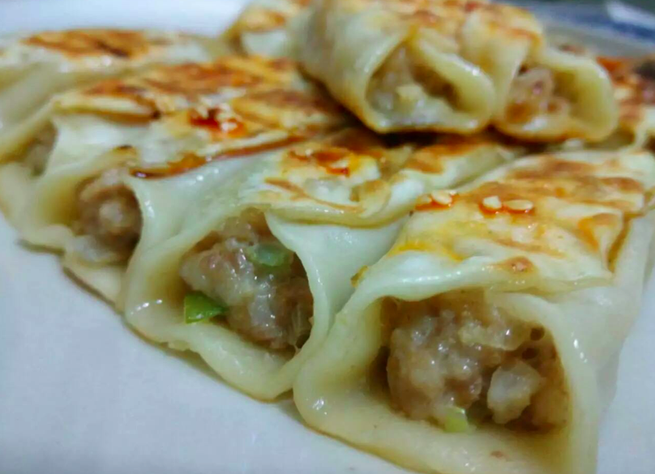

### [专业单身20年，如何利用充裕时间，成为更好的自己？](http://www.jianshu.com/p/928fadac081f)

睡觉前习惯听听喜马拉雅，【十点读书】上听到这样一篇文章，名字叫做《为什么有趣的姑娘都单身？》，其中有这样一段话：

`只为了摆脱寂寞而恋爱，本身就是一件寂寞到绝望的事。`

`有趣的人懂得自己找乐子，这种乐子要么自己一个人维护，要么找个同样高段位的恋爱，相互督促。`

要是随意找个不怎么契合的人，自己构建起的大好生活图景，就难免不被打破。
确实说到了我的心坎儿里，试问自己为何可以单身这么多年，大抵就是自己生活的太有趣，再者就是在生活圈子中择偶范围内，没能找到那个“高段位”的人。

感激那些一个人的时光，起码在学会爱别人之前，先学会了如何爱自己！做我想做的事情，过我想过的生活！成为更好的自己。

`1.遇见更好的自己·旅行`

纪念·我的旅伴
就像之前写的那篇《旅行，对一个人容貌的改变有多大》中提及的那样，它对我的影响很大，我之所以开始变得与众不同，大多数的原因源于那些以往的旅行经历。它让我对这个世界的认知由狭隘而变得狭长，也让我对这个世界有了更多的好奇，它告诉我，世界上比爱情更重要的事情其实还有很多……

喜欢凯鲁亚克《在路上》的那句“`永远年轻，永远热泪盈眶`”。更喜欢另一句

“`我一辈子都喜欢跟着让我感觉有兴趣的人，因为在我心目中，真正的人都是疯疯癫癫的，他们热爱生活、爱聊天，不露锋芒希望拥有一切，他们从不疲倦，从不讲那些平凡的东西。”`
其实，我们中的大多数人注定一辈子平凡，但是再平凡的人也可以去过不平凡的生活，如果你哪天有时间了，一定要去这世界的另一个角落看看。

`2.遇见更好的自己·读书`

大学的时候梦想可以把图书馆的 I 类图书看完，当然这想法只能是不切实际的天方夜谭。现在每天很忙，但依然保持着每周至少看完一本书的习惯，虽然很多都是没什么用的杂文，散文，或者是小说。

那是一个虚拟的江湖，那里也有各式各样的人和事儿，因为了解，所以才会变得更加包容。

最近开始看起了广告学之类的专业书籍，因为和人聊天的时候才发现自己所谓的博学在工作中毫无用武之地，活到老学到老，徜徉在书的海洋中，做更有内涵的自己。

毕竟，读书是提升自己最容易的方式。即使它无法使人大富大贵，也会驱使你将苦日子过得更加精致。

`3.遇见更好的自己 · DIY`

最近业余时间比较少，所以diy的时间也明显少了很多，可能平常动脑的时间太多，所以相比较而言，DIY真的是最愉快的放松方式。之前还匿名在某网站上做diy教程分享，积攒的粉丝竟然比看我小说的粉丝还多，莫名的感到忧伤，后来就弃号了。

现在偶尔也会做，权当陶冶情操，而且diy真的很练动手能力，也很培养耐心哦！

#### 4.遇见更好的自己·下厨

其实下面那张图片的鱼并不好吃，因为完全按照微博菜谱做的，放了番茄酱，偏甜口，不太符合北方人的口味。

因为老妈做饭很好吃，养成了刁钻的味蕾，所以对吃的还是蛮挑剔的，不过很少在外面吃，想吃的也会想办法自己学着做，自己会做饭很容易提升生活幸福感的，喜欢在无事的周末费上几小时只为做一顿饭给自己吃，享受的大抵只是那个做的过程吧！

毕竟，民以食为天，可以学学下厨，哪怕只为了满足自己的味蕾呢！

#### 5.遇见更好的自己·绘画

`生活从不缺少美，而是缺少发现美的眼睛。`

没人规定只有会画画的人才可以拿起画笔，也没人规定只能在纸张上画画，很多事情可能做起来毫无意义，权当它可以让你的生活变得更加多姿多彩吧！

#### 6.遇见更好的自己·花儿

估计姑娘们都很喜欢花儿，作为单身姑娘，我毫不介意自己给自己买花这件事情，最近养百合多一点，以前经常买勿忘我，薰衣草，小雏菊之类的，还偶尔买一些干花束用来做手掌花束。

虽然很讨厌香水的香气，但是却很喜欢花儿自然散发的香气，喜欢把薰衣草装进香囊里放到柜子中，自然散发的香气更加让人沁人心脾。

`很多事情，如果喜欢就去做吧！比如旅行，看电影，或者是买花，不要太在意别人的非议，做自己喜欢做的事情，过自己想要的生活。毕竟，人生是你自己的。`

一个人生活，还掌握了很多技能，像个汉子一样的扛东西，修水管，拿电钻；你会习惯走夜路，控制情绪，自己逗自己……

这些都没什么，一个人来到这个世界，再一个人从这个世界消亡，自然也要一个人经历些什么。

其实，我并不鼓励单身，只鼓励单身的你可以开心幸福的做更好的自己。

`恋爱这件事呢，毕竟是两个人配合才能完成的使命，所以错不在你，但如果没有把自己照顾好，那可就是你的错喽！`

我每天都要做好多事情，最近还想着要不要去学门乐器，并不是我太闲，只是不知道摆脱这些忙碌的我还能干什么，所以渐渐地习惯了忙碌。

我并不希望姑娘们都成为我，只愿你们无论处于人生哪个阶段都能够开心、幸福，这就足够了！
