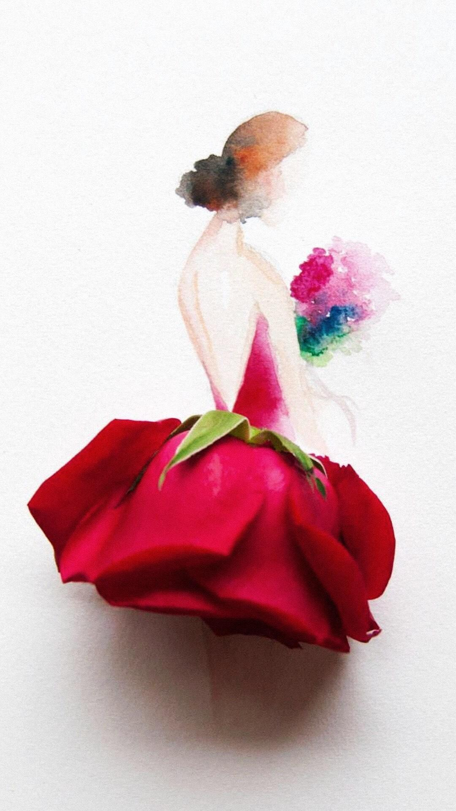
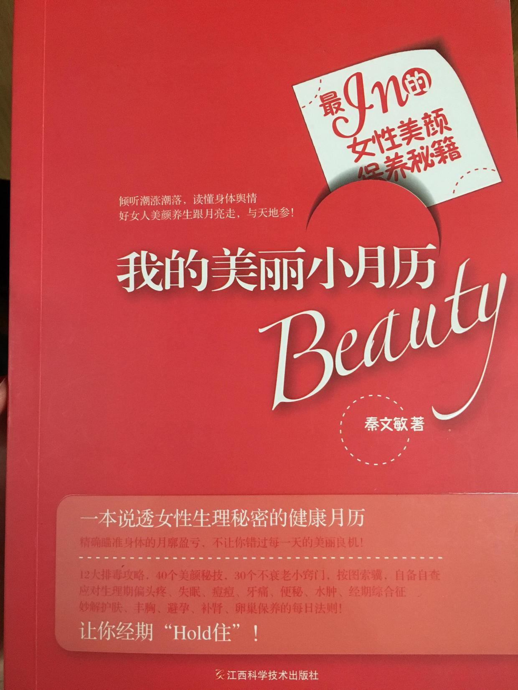
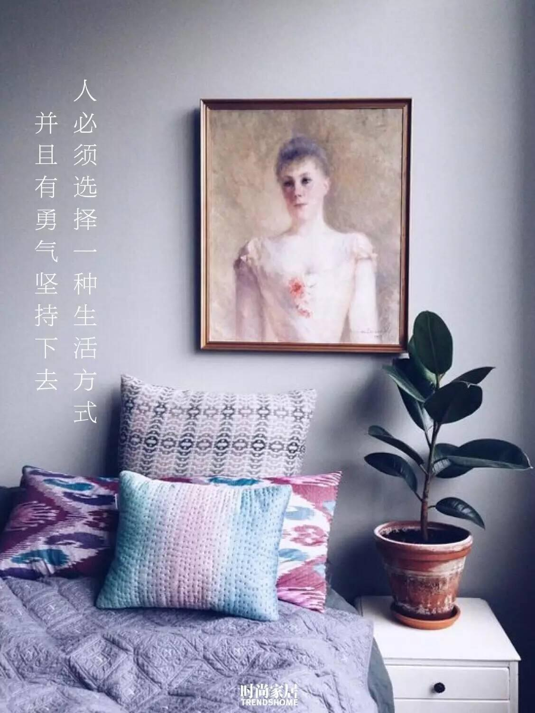
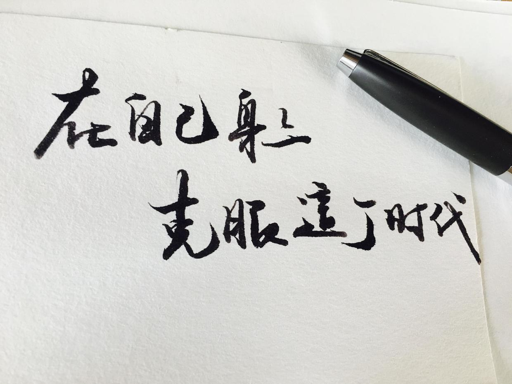

### [女子那些“变美”小秘密（二）——妹子们的私房话](http://www.jianshu.com/p/f74bd0ba46ee)

今天来聊一聊女生的那些私密话题。男生可以右上角点×，也可以转给你的女友爱人，或者为未来的女友爱人收藏。

我在保养和调理方面是很相信中医理论的，但我不喝中药。在学校蹭着上过两学期的中医课，自己家里也有《本草纲目》和《黄帝内经》之类的经典著作。再加上我有好朋友是学中医的，常常和她探讨请教。除了一些药食同源的食物比如枸杞、山药之类以外，那些稀奇古怪的东西，包括国外的那些所谓保健品，我都不吃。

不过这个见仁见智，比如那什么月见草颗粒，你要愿意吃也行，买正规货。

下面说正题

（一）关于经期

这是可能是女生最大的不方便，每个月总有那么几天伴随着头痛腰痛肚子痛。虽然广告上常常能看到月经不调之类的，好像吃吃药就可以了。但其实，`月经不调是需要高度重视的病`，它除了影响你的肤质，更多的还会影响你未来能不能正常受孕。

我外婆的一个学生每年来看她，现在30岁，怀不上孩子，试管婴儿两次胎死腹中，还经历了两次大出血。今年她准备全职备孕，可医生也说，希望很渺茫。为什么会这样呢？她在学生时代起就经期不正常，怀不上孩子到医院检查，发现有一侧输卵管糜烂，另一侧也有炎症。那意味着什么？卵细胞在一个正常的月经周期中经由卵巢生成，从输卵管排出。月经不正常，双侧输卵管都有问题，那你的受孕机会比正常的女生要少一大半。

`月经不调只要不是因为器质性病变，大多数是自己慢慢调理好的。`

`三点：饮食稳定，作息稳定，情绪稳定`
拿我自己来说，我上大学以后一直挺正常的，不痛不痒，顺利地来几天就结束，也不拖拉。反观我朋友，她平时不管不顾，冰淇淋什么的吃的很欢，劝了也不放在心上。每次来例假时都躺在床上等天亮，又疼又酸，白天还要恶心呕吐。有一次一起出去吃饭突然痛的浑身大汗虚脱，最后打120送急诊了。

多可怕，你真的应该学会如何和它和平共处，相亲相爱至少30年。

饮食稳定：

月经前怎么吃？

每个人都有自己的cycle，周期开始的前几天多多少少会有感觉，比如我就是胸部胀痛，小腹偶尔会有几下隐痛。`那时候你就要把饮食归于清淡，油炸的麻辣的冰凉的请远离餐桌。如果你是每次都会痛经的，不论有没有来例假，一年四季都不要吃凉的东西，没错，一年四季。`

中医的阴阳理论上说肚脐最阴，我们的子宫就在那个位置，本来就怕冷，再吃凉的哪里受得了。之前不是还有本书说，所有的病都是吃出来的，其实也不无道理。痛经的人在月经结束以后可以喝点姜糖茶和红枣汤，冬天多吃一些羊肉，注意不要上火和小腹保暖。平时多运动身体，促进血液循环。中医说的就是，不通则痛。

月经期间怎么吃？

总是听有妹子说，例假时候不会胖，体能消耗大，可以多吃点啦。于是就看着她们吃鸡排，吃火锅，啃着巧克力……我不知道该说什么。来月经是因为子宫内膜组织脱落，排出的确实是身体里的一些废血，但也不代表你可以乱吃啊。吃油炸的能补血吗？

正常情况下还是要以`清淡营养易消化为主`，猪蹄黄豆汤什么的都可以喝。但是像巧克力和咖啡这种含咖啡因和可可的，容易造成血液瘀滞，最好克制几天吧。

其实月经期间除了丰胸，还是护肤的大好时机。月经期间吃点酒酿元宵，木瓜牛奶之类的都挺好，适当做一些拉伸运动。月经第三天左右敷面膜对皮肤修复作用最好。

另外给大家推荐一本书，作者是广东中医药大学中医妇科博士，我觉得写的还是挺详细的。



作息稳定

老生常谈的早起早睡，按点吃饭，不要熬夜。人一旦陷入疲劳，身体的抵抗力就会差。本来月经期间点就是身体免疫防线较弱的时候，感冒最容易找上。血液里的白细胞水平降低，疲劳引起胆红素偏高，而胆红素主要就是衡量肝肾功能的，肝肾又是排毒的重要器官。我虽然不是学医的，但母亲生病了以后也懂了很多基本的医学常识，即使你自己的身体感觉良好，你的血液指标也会提醒你，该好好休养生息了。

但是要注意经期不要剧烈运动，除了防止像跑步这样容易导致痛经，像卷腹和仰卧起坐也最好不要做。之前给我上芭蕾课的老师就说过，因为这两项运动用力的都是下腹部和腰，而在月经期子宫需要排出血液，处于比较脆弱的状态。如果运动过强可能会引发大出血。经期只要做一些比较舒缓的运动就可以了，不要刺激腹部。适当的散步是最好的，保证血液通畅。

情绪稳定

大家应该都有这样的经历。在各种考试前，在高中特别是高考前那段黑暗的日子，例假基本都是不正常的。这就是由紧张和焦虑情绪导致的雌激素分泌异常。一般到了大学或者新学期，情绪正常了以后，都会慢慢恢复正常的周期。我也是这样的。

情绪稳定的重要性，我自己就是最好的例子。去年年底母亲查出重病，那几个月整个人都很混沌，日日以泪洗面。在医院和家里两头奔波，例假马上就不正常了。12月初开始断断续续来了一个月，每天只有一点点，特别折磨人。想了一个月关于生死的问题，看视频看知乎看各种宗教的书，也想开了。没有人能够陪我一辈子，只要尽自己的能力，好好陪伴好好告别，不留遗憾就好。毕竟宇宙万物生生不息，百年后谁又不是一缕烟尘呢？能活着的时候一定要好好活。你不知道有些人是多么珍惜“活着”这两个字。

回到学校后专心写论文，现在例假又重新恢复了正常状态。

这里有点扯开了，我也想劝慰大家，在生死面前，什么都是小事。在宇宙面前，什么都不是事儿。凡事一定要想得开，一定要内心强大。



（二）关于个人卫生

我遇到过很多女孩子都特别注意“卫生”，每天洗头洗澡，每天换内裤换内衣，用各种口碑爆的清洁剂清洗私处。但是换下的东西往往都堆在那里，放上几天甚至一周，然后勤奋地洗上半天一天，还觉得自己很辛苦。

但实际上，而关于个人卫生请做到以下几点：

`1.每日换洗内裤，不要积累到第二天。`

内衣内裤尤其是内裤，所有医生都知道要每日换洗，什么叫换洗，换了的也要洗掉。因为即使你第二天就洗掉，放了一晚上以后，也会滋生非常多的细菌。

`2.内衣内裤需要经常“开光”`

最贴身的衣物需要最整洁，在有条件的情况下，多拿出去晾晒吧。

`3.慎用私处清洁剂`

女生私处本身就存在菌群来调解内环境的平衡。这些细菌变异速度也很快，理论上就像产生耐药性一样，很可能越洗越不干净。如果有妇科炎症，还是去正规医院接受治疗，不要自己乱买东西涂抹。

`4.清洗私处时，用温开水`

这一点很容易忽视。大家都是凉水兑开水的吧。但是我之前书中看到的，包括一些妇科医生很多都说用开水变温以后来清洗，不要兑自来水。因为自来水相比于开水，里面有很多细菌和消毒水成分。

`5.勤换卫生棉`

例假多的时候，两小时一换。少的时候，3-4小时一换，不要再久了，不然都是细菌。

`6.洗澡不需要每天`

洗头洗澡也不应该过于频繁，身上的角质层有限，总是清洗反而会让皮肤的屏障变薄，再多的护肤品也是徒然的。如果运动健身出汗了，冲一下可以，就不要天天用沐浴露和搓澡巾了吧。想以前那些美人，不说远的就说那些TVB美人，那时哪有那么多护肤品，不也一个个白的亮眼美的仙气十足。

`7.内裤三月一换，内衣六月一换`

这个应该很多人都知道，我也不赘述了。长时间的使用后，贴身衣物都会慢慢变黄，关键是污垢的积累。反正内衣内裤也不贵，多备几套就是。



真的很喜欢这句话！

（三）关于性生活和怀孕

这个我没有发言权哈哈。只知道妹子们都要保护好自己呀。记住两点

`1.不要吃药`

`2.不要人流`

妇科医生都知道这两个的伤害有多大，而2>>1。如果谁让你做了上面两件事，请手动再见。爸妈把你养这么大，不是为了让你受委屈的。自尊自爱，远离渣男。

（四）女生要做的那些检查！！！

（这是我最想说的）

1.妇科b超

看子宫和附件，如果你月经异常，不要犹豫了赶紧去医院吧。

2.乳腺B超/钼靶

没结婚没哺乳过的妹子乳腺增生的比例很高，我自己也是。这个没什么办法，医生都说很多哺乳以后就会好的。但是30岁以后最好每年或者隔一年做钼靶，有问题也可以及早诊治。

3.宫颈癌hpv筛查

今年HPV疫苗可以在中国大陆打了，但是最好是没有过性行为的妹子效果比较好，5-12岁是最佳接种期。25周岁前也可以，我也打算去打一枚。

但是这个疫苗并不是100%的保证你不会得cancer，也不能代替婚后的一年一次的宫颈癌筛查。

4.肿瘤标记物检查

现在体检里面一般都会包括。如果你单位没有体检，那就一年至少去查一次肿瘤标记物。肿瘤标记物是男女有别的，女性相关的主要是ca125，卵巢疾病的特异性比较好，通常结合cea一起看。但是很多良性卵巢囊肿也会导致升高，如果超过正常范围也不要过于惊慌，最终还是以影像学的ct和核磁检查结果为准。

天哪，我写了将近3小时啊。感觉不会再爱了。昨天大家热情的支持给了我好大的动力。简书是一个励志的存在啊！

谢谢你们的喜欢。

我不是医学生，都是基于自己各方面的了解。如果有不当之处，欢迎各位指正。希望大家都能越来越健康，然后再越来越美。今天看到了一句话很喜欢，分享一下。



接下来几天停更，回家去看望母上大人。大家新的一周加油！

下次暂定更新《女神的进阶——自我提升篇》

各位，相见不晚，欢如平生。
