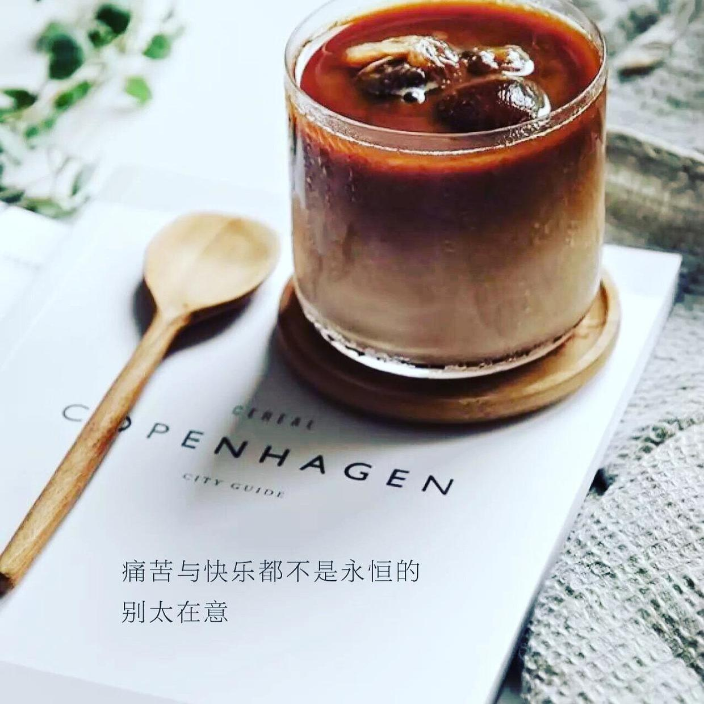
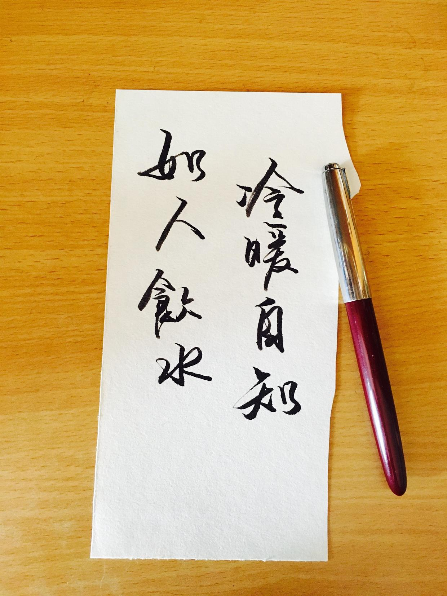

### [女子那些“变美”的小秘密（一）](http://www.jianshu.com/p/054888d6c21f)

`“女子是水做的骨肉，我看了便觉清爽。”`

柔情似水、顾盼生姿，这样美丽的词语都用在女子身上，不错，如果给我一个选择，来世我仍愿做一个女子，岁月静好、现世安稳。

我认为形容女子最好的词语，是优雅。Elegance



最欣赏最敬佩的女子：郑念
优雅与年龄无关。那意味着对生活的讲究，对自我的约束，对世事善而不愁，更与金钱无关。

我们已经过了“女子无才便是德”的时代，现在的女子早已不是闺阁中与世隔绝的小姐，她们穿越在人群里，自信地与男子一起拼搏，利落的高跟鞋和气势逼人的口红都让她们显得能干而独立。生活的盛大总是让人不停地追逐欲望。


但其实很多人的生活背面，是这样的：早上从一堆衣服中挑选今天的行头，在开车上班的路上化妆抹粉，周末就在床上睡到地老天荒，健身卡在角落里静等过期。月复一月，年复一年。人前的她们是女神，人后的她们仍然是一个不会收拾的小女孩。很多人都把美定义为无暇的妆容。一边喝着高热量饮料一边喊着腿粗腰粗，却从来没有重新审视一下自己的生活态度。

姑娘，想要变美，不要将就。

美是一种态度，不仅仅是精致的脸蛋。



我是一名即将进入社会的人，之前也在一些公司实习过，其中会计师事务所和房地产公司都是非常忙碌的单位。甚至常常加班到深夜。但即使在时间紧缺的时候，也请一定要保持自己对生活的态度，保持自己良好的生活习惯。我不是什么美女，但是对自己生活的要求比较高，得益于各种优良的习惯，自己的外形、健康、事业和感情，都在渐入佳境。

下面与你分享几个方面的习惯，欢迎大家补充建议。

亲爱的，你准备好变美了吗？

关于日常健康篇

1.坚持早起

早起对我来说不是很困难，因为我是那种会强迫自己的人。在公司实习的时候正是夏天，我睡前都是不拉厚布窗帘遮挡日光。那时候太阳升起的很早，我都是6点前就醒了，即使我晚上十一点多才睡。起床后先烧水凉一杯白开，然后洗漱洗脸。公司九点才上班，我有足够的时间清清爽爽开始新的一天。

2.勤打扫卫生

我是处女座，虽然没有到洁癖的程度，但是对环境的整洁度还是要求很高的。合租的房子隔壁间是一家人，孩子白天在家玩耍经常把客厅弄得乱糟糟。我早上起得早，洗漱完后就会把自己的房间和客厅拖一遍。晚上睡觉前再拖一遍。这样早上起来就会觉得稍微干净一些，心情也好。（我和隔壁的关系非常好，她孩子很喜欢来我房间玩，如果一个姑娘的房间乱糟糟脏兮兮的我觉得很丢脸啊。）

3.提前准备

我都会在前一天晚上睡觉前准备好第二天需要穿的衣物。夏天还好，如果碰上冬天早上起来满柜子翻衣服的感觉真的很糟糕。同时这样心里也可以有数，注意衣服搭配的频率。感觉现在的公司里，夏天每天衣服都不重样啊。（我去会计师事务所的时候是冬天，超级冷，但还是两件大衣换着穿。有时候聚餐后衣服上会留下很大的味道，我随时保证身边有柠檬水，喷几下然后晾出去，吹一晚就好了。）

4.认真洗脸

卸妆的重要性已经谈了很多了，这里我不赘述。我是一个每天只抹化妆水就出门的女汉子。兜里也常备化妆水。因为这样我随时可以在上厕所的时候，顺便洗一把脸，去除一些辐射的灰尘。当然我知道淡妆还是必要的，我只是想表达每天用电子产品对皮肤伤害很大，能多洗总是好的。但又不能洗一次涂一次隔离。现在还没找到又不影响妆容，又能多洗脸的办法。

5.早点睡觉

真的十点半以后不要碰手机了好吗？虽然睡眠能塑造美肌好像是一个无法证伪的命题，但是你要相信多休息肯定有好处。一天工作忙碌如果想早起，那唯一的办法就是早睡啦。记得装一个记录睡眠的APP，它会提醒你什么时候该睡了，什么时候该起床了。我用的是pillow。（不是广告，是我自己试验了好几款后选择的，主要颜值高操作简单）

6.每周保持3次运动

我所谓的3次运动是跑步啊去健身房之类的。我自己的公司加班也挺多，健身房不现实。我都是每天回去以后，8点多去小区里跑十分钟，现在小区都是人车分流的，安全性高。而且方便不用找场地。但即使运动了也最好每天保持至少6000步的走动，不要让自己陷入“静态生活”。

7.多吃蔬果多喝水

每天几杯水什么的都是标准数据，每个人情况不同。我其实也不知道自己一天喝多少水，但至少有2000ml。我喝水多的另一个目的是让自己多走动，促进身体代谢。倒水上厕所都要走动，也让身体能动静结合。

我的早餐里就有蔬果。在外实习都是自己准备早餐的。菜包煎蛋豆浆麦片，然后吃几颗葡萄或者一个苹果，饱饱地去上班。中餐在单位解决，晚餐同事们都是去外面吃，我一般晚上吃的很少，也不喜欢油腻。经常是水果配麦片、清汤面条或者粥，不加重肠胃负担。（麦片通便真的超级灵光，有一段时间晚上早上都有吃麦片，整个人非常通畅）

8.每日排便

很重要！我妈妈的病就是几年前一直大便不通畅，但是又自己不重视，平时很爱吃甜食，性格又内向，多种因素结合拖成了大病。排便最好定时，每个人不一样，有人一起床就可以上大号，好像这样最好。但我是早饭以后大概9点前可以排便。虽然有点不好意思，但是请观察自己的大便是否成形，是否黏稠，是否带血。不成形黏马桶就是湿气重，带血就要更加重视了，及时去医院。

今天先说这么多，明天更新（二）《妹子们的私房话》，都是和女生身体健康相关的。

么么哒谢谢大家的喜欢

附字一副

