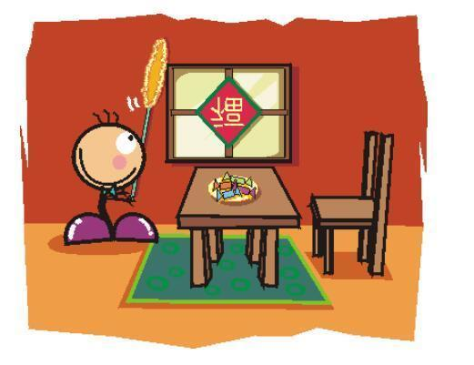

### [干净的房间里藏着你的福气](http://www.jianshu.com/p/e033a5d5720a)

近些年，有两个词很火，一个是断舍离，一个是扫除力。

顾名思义，断舍离是抛弃繁杂旧物、远离执着诱惑、追寻自由真我的行为，扫除力乃清扫杂尘、洗涤心灵、照亮崭新人生的行动力。

无论是断舍离或是扫除力，其实都是人们对于美好洁净、简约积极的一种追求。而这种人生追求，在我们民族，早有历史渊源。

《朱子家训》开篇便是“黎明即起，洒扫庭除”，古人也常讲“一屋不扫何以扫天下”，而逢年过节，我们也是定要遵循旧俗仪式，欢天喜地来一场彻彻底底的大扫除。

一个窗明几净满室飘香的房间和一个尘埃满地旧物堆陈的房间，相信所有人都会倾心于前者。在国内几档知名度很高的真人秀节目里，很多明星都曾经面临过这样的选择，而最终，在游戏中胜出的才会得享整洁明亮的屋子，而失利的便只能自己动手扫去柴房的蜘蛛网，强颜欢笑的忍上一晚。

人类的天性便是追逐美好远离灰暗。睡在干净的房间里，望着星空闻着花香，你会情不自禁的心生愉悦，而躺在垃圾成堆的屋子里，你会不由自主的担心着床下是否有蟑螂角落是否有老鼠。

02

干净简洁的房间往往自带阳光磁场，它能改变主人的精神面貌、身体健康，亦能影响到一个家庭的风水和运势。

在我的朋友里，有一对恩爱夫妻，平日里，无论何时去他家做客，大家都会由衷的发出赞叹。他们的家，地板永远一尘不染，茶几永远摆放整洁，连厨房里的调料盒都洁白如初，透着优雅的光亮。

大家都夸赞女主人贤惠，而女主人却把功劳推给男主人。据说每日清晨，趁着她做早餐的时间，他总会将房间收拾干净，因为不想令她在辛苦准备早餐走出厨房之后，一眼看到的是凌乱的沙发和污渍汪汪的地板，唯恐会影响她一天的好心情。

而她呢，偶尔在厨房侧身瞄向客厅，看到的是他赤裸上身穿着家常睡裤，手拿抹布擦亮桌面或是背对着她，认真郑重拖地的模样，心里便觉得甚是温暖。

一个爱妻子、喜干净、愿意做家务的男人定是拥有大智慧的。在那样一个温馨的早晨，在那样洁净明亮的家里，相爱的人彼此凝视互相微笑，然后拥抱着浅吻分别，各自奔向前程，又各自怀着期盼，在夜晚踏着月色，早早回家。

一个干净整洁的家有着抵挡世事风霜的魔力，它滋养着爱情，滋养着婚姻，令围城里的男女心思澄明彼此守望，亦吸引着世间的福气纷至沓来。

03

君子居陋室而一尘不染，我们大多数人无法拥有广厦三间，甚至买一所属于自己的房子已经竭尽全力，但我们可以令三尺容身之地洁净明亮，如阳光几缕，照亮路遥远方。

因为干净的房间里藏着生活的福气。它不仅滋养婚姻，也会滋养每个人的身体健康。

我见过很多家庭，杂物乱堆、污渍满墙，尚未学会走路的孩子从客厅到阳台，要越过若干塑料玩具、爬过爸爸的单只拖鞋、啃几口脏兮兮的沙发犄角，障碍重重翻山越岭，最后双手还要沾上妈妈的一丝长发。

小孩子最娇贵，久居如此脏乱差的屋子，身体素质难免会受到影响。同样娇贵的还有老人。风烛之躯最是难抵细菌的侵蚀，因此对于洁净的居所更为渴盼。

每逢佳节，人们总会争先恐后的发朋友圈，言称打扫房间迎财神，言称财神最喜欢干净明亮的家。其实，福禄寿喜财，童少青壮老，哪个不喜欢住在干净的房间里呢？

我们的天气总是雾沉沉灰蒙蒙，并逐日暗淡，家里动辄便落下一层厚厚的尘土，稍不留意便成为蟑螂鼠蚁的生长地，今时今景，保持房间干净已然成为重要之事。

人前光鲜亮丽，人后也要洁净如初，自己的家要勤打扫，租来的房子也要珍惜，毕竟生活不是租来的，身体永远是自己的。

04

打扫其实是一个反复选择、剔除和去杂除尘、迎来光明的过程，而一场酣畅淋漓挥汗如雨的大扫除不仅能令心情愉悦，有时亦能令全身的每一个毛孔都透着舒畅。

雪寒风冷的冬天里，我患了感冒，整日恹恹，懒于收拾房间。但眼望着沙发堆起的杂志和日渐打蔫的绿萝，也不得不打起精神来，准备简单的收拾一下便再去休息。

但等我将地板沙发收拾干净，又为植物浇完水，望着整洁芳香的屋子，便又忍不住的想，索性让玻璃也明亮起来吧。

待到一番辛苦窗明几净之后，我望着油烟重地——厨房那早已泛黄的防油纸和油烟机，又蠢蠢欲动，作为女主人，怎能容忍这个活色生香的战场满目尘埃？

可待到打扫完厨房、房顶、家里所有的旮旯角落之后，我仍心有不甘，索性买来整理箱，打开凌乱的衣柜，将所有的衣服、饰物分门别类各归各主，归置的整整齐齐，摆放的井井有条。

有些多余的陈年旧物尚且完好，便打包好捐赠出去；不便赠送也不忍抛弃的便开动脑筋，旧衣服做成地垫、旧瓶子用来插花、泡沫箱子用来种植生菜；实在没有利用价值的废品便卖掉，虽然所获不过几块钱，但扔进零钱罐时，心里也满满的都是有底气的得意。

原来打扫房间是会上瘾的。而洁净与美好是人们心底永恒的追求，它透着难抵的诱惑力。若你见过了明亮，便会一心追寻明亮，若你久居干净的房间，便再难忍污浊隐晦的氛围。

而更可喜的是，经过这一番挥汗如雨的打扫，我的房间明亮，心情舒畅，连感冒都不知不觉被治愈了。

久居兰室不闻其香，久居鲍市不闻其臭，一间干净的安身立命之所是心灵的栖息滋养之地，在这里女人愈加滋润，男人愈加成熟，全家人都可免受污垢的侵扰。

中国人最讲究风水，其实何须远求呢，干净的房间里便藏着福禄寿喜财。身处窗明几净之所，心怀光明，行事洁净，便是这世间的最佳风水了。
