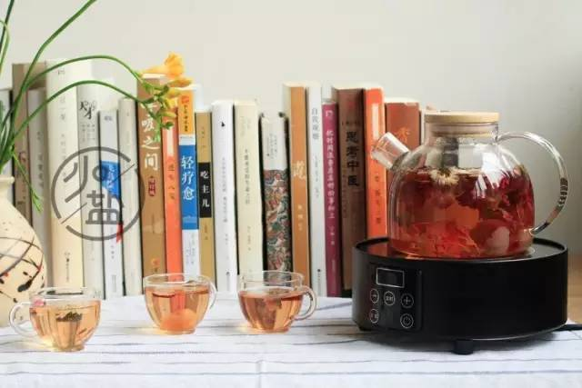
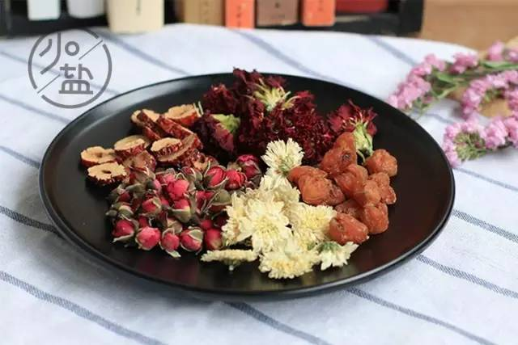

### [春分 | 春气最旺，宜降火清淤，充盈气血](http://www.jianshu.com/p/3c3b6856b3eb)

春分来了，倒春寒总算是要结束了。春分就像是一个人的小分头，寒在左，暖在右。然后越梳越右……天气也会越来越暖了。

春分这一天太阳不偏不倚，白天和黑夜一样长，天地间达到了一种阴阳相半的状态。《春秋繁露》说：“春分者，阴阳相半也，故昼夜均而寒暑平。”`春分一来，春天已经过去了一半，春气也到了最旺盛的时候。`

因此，春分还是全年最有朝气的一个节气，小时候听老人讲，在这一天能把鸡蛋给竖起来。据说是和地轴还有太阳公转有关系，但我认为是土地里源源不断的春气在往外冒，才出现了这种有趣的事情。

`春分，开启大地气运的新模式▼`

五运六气一共有六个气，从春分开始，我们就进入了2017年丁酉年的二之气。很多朋友可能觉得五运六气有点神秘，但我觉得大家可以把五运六气看成是，每一年对天气变化的一个推算，由天及人，天气的变化会影响着我们的身体。

从春分到小满这六十多天时间，主气少阴君火，客气少阳相火。君火主要指心火，相火主要指胆火。`从春分开始，到小满的这六十多天时间，心火和胆火气势汹汹，两火旺。`

春分是春气最为旺盛的时期，春气主生发，在春天时，人体中的肝气会帮助阳气生发。今年大地的生发之气不足，肝气容易生发不畅，再遇上两火旺，就会导致肝气郁滞，本身就有些血淤痛经或容易上火的朋友，接下来很可能会出现心情烦躁，爱发脾气，月经推迟，脸上长痘痘等情况。

而对于阳虚怕冷体质的人，便可借助此时天气之间旺盛的火气，为身体充盈气血。

节气的存在，就是在提醒我们，这样的天气儿与地气儿在变换着，要学会在当下的节气里，了解身体，好好呵护它。在这期间，便是要给身体降降火，祛除一下体内的血淤了，再进一步提升气血。

降肝火，祛血淤，按摩身上2个穴位▼

如果想要给身体打通经络或者祛瘀，可以选择用按揉穴位的方式来刺激身体，达到自愈的效果。经常按揉太冲穴和血海穴，能帮助我们降降肝火，推动祛瘀。

#### 血海穴

血海穴，一听这个名字，就知道这是一个和气血息息相关的穴位。经常按摩血海穴，能帮助我们活血补血，疏通身体里的血淤，对于痛经和贫血都有一定的效果。

找到血海穴的方法：想要找到血海穴，可以先坐在椅子上，将腿绷直，我们的膝盖内侧会出现一个凹陷的地方，在凹陷的上方有一块隆起的肌肉，肌肉的顶端就是血海穴。

#### 太冲穴

太冲穴能够调控肝经的总体气血，像是人在生气的时候，肝会受到影响，太冲穴也会有反应，摸起来会有点酸胀疼痛。`坚持按揉太冲穴，有助于帮助我们排出体内旺盛的火气，缓解失眠的情况。`

找到太冲穴的方法：太冲穴在我们的脚背上，大拇趾和二趾上的两根骨头会有一个结合点，在结合点上面一点的凹陷处就是太冲穴。

这两个穴位，每天按揉10分钟左右就可以了。我一般会在每天晚上休息的时候，坐在沙发上一边看电视，一边按揉穴位，10分钟一会儿就过去了~

`疏肝气的同时还可补气血的方法▼`

我很喜欢在春天的时候喝花茶，闻花香。除了贪图清香的味道，还因为大凡疏肝理气之品，都有芳香的气味，而芳香能打开人体气的通道。春天是百花盛开的季节，即使最寻常的城市路边，也会有一棵棵饱满的花树盛开。而每一种花又带有各自的品性，能互相搭配着帮助我们调理身体。

`在春天的时候，学着给自己亲手配一款花茶，是一件很美好的事情。`

在今年的春天配制花茶的时候，我会考虑到以清淤降火，补养气血为重点。

根据这三点，得出了一个小方子：`挑选活血化瘀的金边玫瑰，清肝降火的贡菊，滋补肝肾的康乃馨。但如果单是这几味花，稍微有点寒凉，所以又配了性温热的红枣和桂圆来中和凉性，养护脾胃，这样相互搭配，茶性温和，美其名曰气血美人茶~`

`泡花茶，也会有一些小讲究`。往杯中放入花茶之后，冲入90℃以上的热水，一定要让热水浇注到每一朵花上，冲水至8分满，最好能用盖子盖上，把花香全部收拢于杯中。

热水冲好之后，静静等待5分钟，让水能一点一点地浸润花瓣。最爱看这个时候了，花茶在水中飘舞、沉浮、舒展花型，然后慢慢地开始渗出颜色。`那是花瓣上的花青素，在热水的浸润下，开始流出极温柔的淡粉色。`

5分钟之后，把盖子打开，闻着氤氲上升的茶香，心情也变得酥软起来。等待杯中的水稍凉了一会儿，就可以小口小口的喝了。

花茶一入口，有很明显的一股甘甜。这股甘甜并不单薄，而是由多种花香和果香在嘴里形成一种极富有层次感的味道：先是桂圆令人夺目的甜，紧接着是玫瑰的恬美，贡菊的清冷……唇舌努力想要分辨其中的味道，又多饮了几口。不知不觉，杯里的茶水已饮尽，连说话吐气都带着清新甜蜜的味道。

如何挑选花茶▼

现在市场上大多数的花茶，会要求在短时间内干燥，存在工业熏硫的问题。被二氧化硫熏过的花茶，花朵颜色普遍更加艳丽，保存的时间也更长。然而用来冲泡时，花香的味道就很清淡了，不耐冲，喝了几次就寡淡无味，另外也把花朵上残留的二氧化硫也一起喝进了身体。

想要挑选到没有被熏硫的花茶，一般会从3个地方来注意：颜色、香味还有味道。

1.没有被硫熏过的花茶，颜色一般不会特别均匀，像是玫瑰花，花蕾的颜色明显会更深一些（花青素含量高）。

2.闻闻味道，会不会有刺鼻性的气味发出，那是二氧化硫熏制过后残留的味道。

3.最后是泡水喝一喝，看后味有没有酸涩感。天然的花茶冲泡过后是一种持续的清甜味，后味悠长，不会有这种酸涩感。

tips:如果你挑选到了没有被硫熏过的花茶，注意及时放在冰箱中冷藏保存，以免招虫。

—END—

`希望大家有空多出去走走、看看花、喝喝茶，才不负这明媚春光...`
