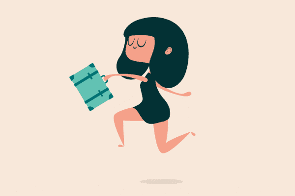
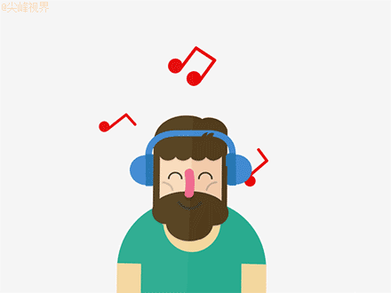

### [每天5点起床的人生，我真的赚翻了]()

今早和同事共进早餐，我精神已经很抖擞了，她还睡眼惺忪地没胃口，感觉我俩之间隔着时差。

她一身起床气地嘟囔着总也睡不够，问我一般几点起床，我回答，05:00am.

看她长大的嘴巴，我知道她彻底醒了。

我早起的习惯，惊动了很多细心的读者，有人还到我的微博下留言，起那么早不困吗？晚上几点睡呀？怎么坚持早起呢？

我这个神秘的天蝎座决定不再神秘地讲讲自己晨型人设的养成术。

#### 我读中学时，早起的习惯被迫彩排。

作文格写错了，练习簿涂改了，我就撕掉重写，追求完美是内心脚本，导致我完不成作业时，只能定好次日闹钟早起狼狈猛赶。那时为了避免早起的痛苦，誓死戒除作业强迫症。

#### 我读大学后，早起的习惯正式剪彩。

一是东部地区天亮早，对光线敏感的我自动早醒；二是同寝室有个学霸起床很早，她报名中级口译后，每天早起朗读英语。

我喊着“老学霸带带我”尾随她早睡早起，那时我俩清早轻手轻脚地洗漱完毕，找个风景优美的校园一角便开始学习。

尝到进步大、状态好的甜头后，从此早起固化成我的生活习惯。后来工作了，结婚了，我每天早上5点左右依然自然醒。

#### 叫醒我的不是闹钟，而是美好生活体验
我醒后不会赖在床上胡思乱想或翻来覆去，而是做两个平板支撑后迅速起床，`因为有几个爱妃在等我翻牌：看书、写文、锻炼或做早餐。`

我喜欢在5-7点之间阅读，手机哑巴了，配偶还在睡，没有搅扰，静谧温馨，这是我和作者的私人约会时间。

#### 作者在书中分享经验或表达观点，而我以共振共鸣或不同看法来回应作者，我边看书，边做笔记，过脑且走心，高效且专注。

灵感出没时，我就写文章。在这个时段里，思绪最易厘清，心情最能沉淀，我常常敲击键盘都敲出节奏感，写到该出门上班了还意犹未尽。

#### 当身体疏于照顾时，心生内疚的我不惜用清晨时间来弥补。

感觉缺乏运动了，就会铺开瑜伽垫，小声地放着舒缓音乐，让自己在一呼一吸间吐纳，在一拉一伸中强韧；

感觉缺营养了，或煮杂粮粥，或榨豆浆，或泡花茶，用食补来增强体质。

每天早上的两个小时，让我远离一切信息熵，可以淡定从容、有条不紊地去做自己喜欢的事，这种体验真美好。

#### 长期坚持早起，会活出升级版的自我
你一定听过科比·布莱恩特的名言，“你知道洛杉矶凌晨四点钟是什么样子吗？”

他说，“每天洛杉矶早上四点仍然在黑暗中，我就起床行走在黑暗的洛杉矶街道上。一天过去了，洛杉矶的黑暗没有丝毫改变；两天过去了，黑暗依然没有半点改变；

十多年过去了，洛杉矶街道早上四点的黑暗仍然没有改变，但我却已变成了肌肉强健，有体能、有力量，有着很高投篮命中率的运动员。”

我的大学学霸舍友，大学四年坚持早起学习，中级和高级口译都过了，后来去了她梦寐以求的名校读研究生。

我以前有位做外贸的朋友，负责南美市场，她告诉我她四点半起床发邮件，这是她和国外客户同频交流的时段，她的业绩也是扛把子级别的。

很多高产作家早上四五点钟起来写作，村上春树凌晨四点左右起床写小说，灵魂有香气的李筱懿也是四点多起来写文章。

#### 每份坚持，都是伴随着痛苦和收获，把早起的时间充值到改变人生的一万小时定律中去，最后化作更强健的肌肉，更优秀的成绩，更出色的业绩，以及更多产的成果，他们都变成了升级版的自己。

#### 晨型人的早起配方大公开，如何不痛苦的早起并保持高效？
#### 1.早起倒逼自己养成早睡的好习惯

晚上刷手机睡不着的人早上闹钟叫醒不来，而很多早起的人都能早睡，这是睡眠守恒定律。

有个标题叫“晚睡，是想和自己多呆一会“，我多想说早起也能啊，而且从科学的角度上更健康，夜猫子的身体素质哪能PK过晨型人？

我的学霸室友晚上十点睡觉，早上五点起床，几乎每天夜跑，我羡慕死她的好状态了，从皮肤到气色，从身材到成绩。

我现在11点不睡，就觉得眼皮上被抹了胶水。睡眠质量奇好，一碰枕头就能不省人事，夜里雷雨交加我一概不知，上下班路上也要见缝插针地眯一会。

#### 2.早醒后找到迅速进入状态的方式

《大方》杂志采访村上春树时，村宝说“写长篇小说时，基本都是凌晨四点左右起床，从来不用闹钟，泡咖啡，吃点心，就立即开始工作。重点是，要马上进入工作，不能拖拖拉拉。”

我的经验是，醒来还在床上翻来覆去，容易一整天都头晕脑胀；早起后拖着不干正事，我会因为浪费时间精华而深感沮丧。

而如果我醒来后做两三个平板，出卧室后干搓脸半分钟，头脑清晰后，马上投入到看书、写文、锻炼或做早餐中去，那开了个好头的一天就有好彩头。

#### 3.思考性事项>操作性事项>不重要事项

早上精力充沛，状态上佳，适合学习和思考。比如用来深入阅读、练习外语、听公开课、建立知识体系等，比如平时被推着走的自己，可以静下心来想想人生的轻重缓急。

操作性事项如果不急，没必要用这个时段来做，回复邮件会让人觉得工作超长待机，用来做家务处理杂事更是把早晨大材小用。

还有些不太重要的事，像是上朋友圈商学院，刷微博热门八卦，如果把这些琐事前置到一天之计，那真是把早晨暴殄天物了。

#### 4.不妨从早起半小时开始试试

前几天，编辑群里的小易问我，她忙于钻业务、写稿子、提升自己，强烈感觉时间紧张，她也看上早起这块肥肉，但是试着早起后反而更没精力。

没有早起习惯的人突然早起一两个小时，大多会把一整天的状态搞得很夹生，还高喊”早起毁一天“，错误的方法白瞎了一颗想自我突围的心。

我建议不妨从早起半小时开始试试，甚至一刻钟，循序渐进，配合早睡，慢慢调整生物钟，起床后做你最感兴趣的事，然后摸索出最适合自己的早起方案。

相信我，早起也是会上瘾的。

早起于我如同夏至，因为那天太阳到达北回归线，白天最长夜晚最短。它拉长了我的白天，让我更有生机，更感光明。

我想到熊培云的诗句，“你是你的沧海一粟，你是你的万千可能之一种”，早一点起床做自己喜欢做的事，成为更好自己的可能性也会更大一点。

文／Queen主义（简书作者）
原文链接：http://www.jianshu.com/p/fe2156b5db0b
著作权归作者所有，转载请联系作者获得授权，并标注“简书作者”。
