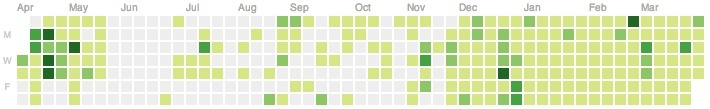

### [jQuery之父：每天都写点代码](http://blog.jobbole.com/66227/)

【伯乐在线导读】：John Resig 是 jQuery 的创造者和主程，2011年5月 John Resig 从 Mozilla 离职，随后加入在线教育组织 Khan Academy。2012年国外一位艺术妹纸 Jennifer Dewalt 在180天做了180个“网站”，Jennifer 的坚持鼓舞和启发了很多技术人员。John Resig 也深受启发，结合自身情况写了这篇博文。感谢 AvisBlume 的热心翻译。如果其他朋友也有不错的原创或译文，可以尝试加入伯乐在线专栏作者。

去年秋天，我的“兼职编程项目”遇到了一些问题：要不是从 Khan Academy 的项目里挪出时间来的话，我根本没办法将不理想的进度弥补上。

这些项目遇到了一些严重的问题。之前的工作我主要是在周末，有时是工作日的晚上做。但最终证明，这样的工作安排并不适合我。为了在周末尽可能地尝试完成高质量的工作，我压力巨大（如果我做不到的话，会有很深的挫败感）。这样安排的问题在于周末并不一定都有空–而我也不想周末两天都在写代码（要牺牲掉所有的休闲和乐趣）。

另外一个问题就是隔了一周这么长的时间之后，很容易会忘掉上个周末在做什么、还有什么没做（即使做了备忘也会这样）。更不用说万一某个周末什么代码都没写，那就要隔两周了。间隔太长的话对于项目来说是致命的（我有好多兼职项目就这么挂掉了）。

Jennifer Dewalt 去年完成了一项创举，她在180天里完成了180个网站。我深受启发，因此我强迫自己采用类似的策略：那就是每一天都要花时间在兼职项目上。

于是我为自己定了一些规矩：

    >我必须每天都写点代码。我可以写文档、博文或者其它的东西，但必须是在写了一些代码的基础上。
    写的代码必须是有用的。不调整代码缩进，不转换格式，如果可能的话绝不重构代码。（这些事情都是允许的，但不能作为当天仅有的工作。）
    所有的代码都必须在午夜前完成。
    代码必须是开源的并且放在Github上。

部分规矩执行起来并不是那么严格要求的。并不是说只能在午夜前才能写代码，只是不想熬夜然后写出来的代码却马马虎虎的。代码也并不是一定要开源或者放在Github上。这么做只是为了让我对自己写的代码印象更深刻（以便于重用代码、为之前写的代码创建模块）。

至今为止效果非常好，我已经连续坚持了20个星期了。我写代码的习惯得到了彻底改变，我的生活质量和精神状态也得到了很大的提升，因此我想把这段经历写下来。

#### 习惯的改变带来了以下不少有意思的影响：

`最小量的可行代码` 每天我都强迫自己至少要写30分钟的代码（时间太少的话真的很难写出有意义的代码，尤其是在花时间记起前一天是在哪里停止的之后）。有些工作日我会多写点时间（通常不超过1小时），而周末的话有时能写一整天。

`让编码成为习惯 `值得一提的是我并不特别在意上面这张Github工作记录表会给别人什么样的印象。我觉得最重要的一点是：你做出这样的改变是为了你自己的生活，而不是为了让别人对你的工作感到满意。这个道理对于减肥或者健身也适用：如果你不是以提升自己为目的的话，你是不会成功的。

`与焦虑做斗争` 在作此尝试之前，我经常会很焦虑，总觉得做的工作“不够多”，完成的进度“不够多”（其实这两者都是无法衡量的，因为我的兼职项目都没有特定的最后期限）。我意识到要做出进展的感觉其实和做出实际进展是同样重要的。这让我豁然开朗。自从我每天持续不断地做出进展之后，焦虑感也渐渐消失了。看着每天都有完成工作量，内心感到很平静。再也不会忧心重重地觉得还要完成更多的量才行。

`周末` 在周末完成工作对于推动工作进度来说曾是十分重要的（那时周末是我唯一能够很好的完成编码工作的时间）。现在情况发生了改变–好的改变。制定好周末必须要完成哪些工作的做法除了最后让我感到失望之外别无他用。我几乎就没完成过周末计划表上的事情，而为此我还不得不拒绝其它我喜欢的周末活动（吃点心、参观博物馆、逛公园、陪妻子等等），就只是为了能完成更多的工作。我深深地觉得，就算兼职项目真的很重要，它们也不应该成为生活的唯一。

`后台运行` 每天写点兼职项目代码会带来一个有趣的副作用，它让你觉得这些工作都是在大脑的后台运行的。因此，当我在散步、洗澡或者做其它不需要耗费脑力的事情时，我就会在考虑之后我要写什么代码、要怎么解决遇到的问题。这种情况在我一周写一次代码或者隔周写一次代码的时候是没有发生过的。那时时间都被消耗在思考其它事情上，通常是在为还没完成工作而感到焦虑。

`上下文交换` 中断后又继续开始兼职项目的时候总是会有上下文交换时那样的损耗发生。很不幸的是做了一周其它工作之后再回到之前的项目上来总是会非常困难。而持续的每天工作对减少这种损耗就很有帮助，因为时间间隔要短得多，要记起前一天在做什么很轻松。

`工作的平衡 `这种改变带来的最重要的一点就是让我学会了如何更好地平衡本职工作、生活和兼职项目。知道我要每一天都花时间在兼职项目上，我就必须更好地平衡分配时间。如果我计划晚上出去并且要很晚才回来，那我就需要在当天早些时候做兼职部分的工作，而将主要的Khan Academy的工作放到后面再做。另外如果我还没完成工作而又在晚些的时候出去了，那我就得赶紧回家做完它（而不是又错过一天）。我要指出一点，一直以来我都发现能花在业余爱好（譬如雕版印刷）上的时间变少了，但是这对于维持生计来说是很合理的交易。

`给别人的印象` 这是我要说的改变带来的最重要的一个好处。我妻子理解我每天都得完成一些工作，因而有时活动安排要围绕着这些工作展开。当能够对她说“是的，我们可以出去看电影什么的。但我之后必须要写代码。”，而她也表示理解并且安排时间时会将写代码的事考虑进去，这让我感到非常舒服。

`之前写了多少代码？` 我不知道过去的几个月里一共写了多少代码。我创建了几个网站、重写了一些架构、写了一堆新的节点模块。写的代码太多了我有时会不记得写了什么–几周前写的东西看起来确实非常遥远了。我对已完成的工作量相当地满足。

我将这种习惯上的改变视为很大的成功，希望我能日复一日地坚持下去。同时我也会尽力向其他想做很多兼职项目人推荐这种策略。不管这对你有没有帮助，都请联系我，我很想听听你们的故事。
