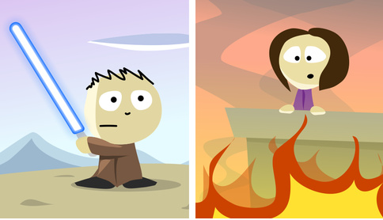
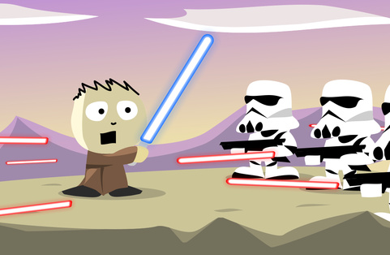
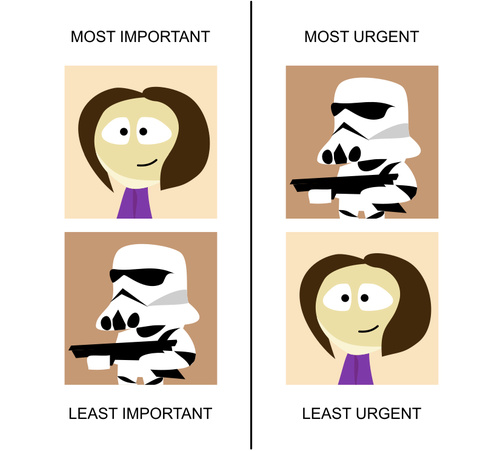

### [时间管理很简单，看看绝地武士的招数](http://blog.jobbole.com/84577/)
（译者注：绝地武士是电影《星球大战》中的虚幻角色，可以使用原力，手持光剑，使命是保护共和国和宇宙的安定）

设想你是一个名叫Bob的绝地大师（你的父母显然不像熟练掌握原力那样会起名字）。你的此生挚爱——Lucia公主被困在一幢烈火熊熊的大楼中，而你正在赶过去救她的途中。

Lucia可以看作是现实生活你的梦想和志向的化身，对你而言，她最重要。

不幸的是，在你前去的路上有一队暴风部队（stormtroopers，《星球大战》中的虚幻角色）向你开火。你必须小心射向你的激光，如果你没有躲过去你就会挂掉。你可以把这些暴风部队看作是营救公主之路上最紧急的阻碍。

我们都清楚男主应该如何摆脱困境。如果他忽视了自己的最终目标，也就是他的公主，那么他的其他努力也就会付诸东流。当然他可以搞定这些暴风部队，他可以轻易地把他们打爆，但是这些暴风部队是无穷无尽的，而他们此时的目的就是为了分散男主的注意力。时间拖得足够久，公主就会死去。

你的现实生活也是如此：`最重要的事和最紧急的事永远交织在一起。`

而管理时间的秘诀就是`确保最紧急的事情是可控的，同时专注于最重要的事。`人类天生就会专注于需要立刻回复的事情，比如说接电话；而将最重要的事情推迟，比如说去锻炼。正确的处理方式是颠倒这个顺序，与你的大脑以及人类社会的惯例相反。

现在回顾一下你每天做的事吧。我敢保证，其中的大多数都是别人要求你做的，而不是你自己的主动选择。年轻的学徒们，现在让我们来看看应该如何解决这些问题：

- `学会拒绝。`大多数人在社交中都遵守一个潜在的约定，就是别人要求你做一些事时总是会接受。这可能看起来很高尚，但是请别忘了，你还有一个濒死的公主等着你去救她，而现在你却因为答应了别人的请求而放慢了脚步。为了拯救公主，你可能需要牺牲一些社交生活的舒适感（相应的奖励是，人们会本能的尊敬那些敢于拒绝别人的人）。
- `关掉电视。`我已经有7年没看过电视了，按美国人均每周在电视机前花34个小时的时间来算，我比他们多出来12,376个小时。我确实会看一些节目——通常只在吃晚饭的一个小时——而且只看我选择和购买了的节目。有了多出来的12000个小时你能做很多事情，同时还能追《广告狂人》（Mad Men，一部美剧）。
- `停掉通知栏。`现代科技：Email、Facebook、Twitter、Quora等等总是努力分散你的注意力。幸运的是，这些都好解决：关掉所有的通知栏。当你能匀出时间来的时候再来处理这些——比如说午饭后休息的时候——然后一次性的把他们解决来节省时间。

- `安排事物的主次。`人类总是这样可笑。要是去见一个朋友的话，你就能提前安排出时间。但要是其他真正无比重要的事情——比如说写一本书或者去锻炼——你就安排不出时间了。你只会“抽空”去做这些。你应当像赶飞机一样去对待优先级最高的事：提前为它安排好时间，并且拒绝任何可能导致你误机的事情。
- `最重要的事先做。`只选一件最重要的事（非最紧迫）你会选哪件？今天就开始行动吧，牢记可能有无数分散你注意力的暴风部队——不要用“如果我先做别的事情的话我也可以”来自我欺骗。绝地武士绝不生活在借口中。
- `花更多的时间，做更少的事。`人可能会常常同时在做许多事情。这一条准则要求你一天最多只能选取1-3件事，并且坚持不懈地去追求它们。你的大脑不会喜欢这个限制，其他人也不会喜欢这个限制，但无论如何你都要坚持去做。专注于一件事情会比同时做许多事情有效率得多，并且会让你的工作更加出色。
- `学会忽略。`忽略别人会显得无礼，不够职业，但经常是必要的。总有些人是你不愿意匀出时间来回复的。总用些请求你要允许自己忽视。像整理房间，付账单或者拆邮件这些事情你可以晚点再做，没有你世界并不会停止转动。而你得到的回报是你有时间去完成更要紧的事。

来自绝地武士的最后一门课：绝地武士都是传奇人物。

传奇人物总是鼓舞着我们：他们言必行，行必果。但我们也因为其它的理由热爱我们所喜爱的传奇。因为在我们内心深知，有一种力量驱使着我们自己成为传奇。
