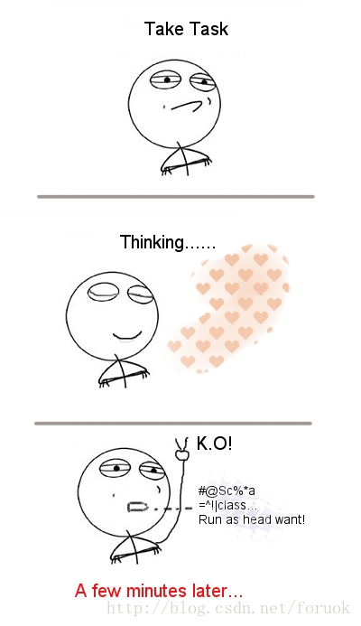
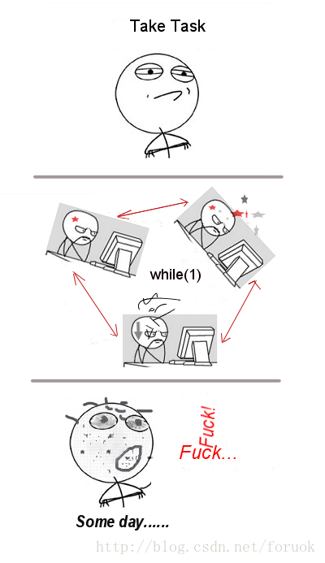

### [漫谈程序员系列：看看你离优秀有多远](http://blog.csdn.net/foruok/article/details/40075201)

前段时间（大概是8月份吧）我终于拿到了驾照，科目一、科目二、科目三、科目四都是一次性过的，没有给教练塞钱也没有给教练递烟。考科目三（路考）时，有个女生没能通过还被陪考员讽刺，伤心地哭了，梨花带雨让人心疼。同行的还有两个学员考了三次都没过。媳妇的同事听说我什么致礼的事儿都没干居然一次性过了，对我表示了一些些敬仰之情。好吧，我承认这让我有点儿沾沾自喜。可是我们在谈程序员啊，和驾校有两毛钱关系没有？别急，兄弟姐妹们，有的，这个真的有。

#### 软件开发的未来世界
    有一次我在上海Qt开发群（企鹅号279906625）和人讨论软件开发与炒菜大妈的可比性，当时我说将来的软件开发会很简单，成为像英语、驾驶一样的基本社会能力，你能学会炒菜就能学会编程，可以根据自己的需要从半成品软件商店里购买组件，按自己的需求加工成成品软件。我相信不久之后这个就会实现，用户可以用自己的需求和智慧，借助一个平台，像搭积木一样生产软件。虽然实际上他们不懂我们现在谈论的所谓编程、开发，但确确实实，他们可以按需开发出自己的软件来，而且很可能他们都不需要懂计算机，只要在手机之类的移动设备上搞两下就好啦。

    其实现在硬件已经在往这个方向发展了，什么面包板，什么模块化，什么什么什么呀，看看这个文章：Make!Sense 动手好伴侣，带你轻松做实验。摘要：

“

    简单来说，Make!Sense 可以看作是一套传感器连接系统，它自带通用接口，可以快速便捷地将不同类型的传感器连接到电脑或智能手机。作为一个有趣的学习互动平台，Make!Sense 最大的亮点就是操作简单，小盆友们可以用它感受身边物体细微的运动、空气中的水分、光线、温度甚至心跳，好奇什么，就感受什么。

”

    配图：

    

    一下子又跑偏了，下笔千言，离题万里……

#### 驾校教给我们什么
    要说司机就得说驾校，我还想说出租车、快的、滴滴、易到用车……因为我是个真诚的喷子，想到哪里喷哪里，不会掩饰，我打星际争霸时最喜欢的是口水虫，编上个七八队，哇喔，喷的那个叫壮观，瞬间平地变湖泊……现在社会上有些资源被某些谋取私利的官、商占据了，所以产生了很多问题。就比方说驾校，为什么那些无牌驾驶十几年的老黑司机也要到驾校来花个钱呢？这不扯淡吗……应该有自考的途径啊。

    我们还是回归正题，看看驾校能教会我们什么。

    驾校会教我们控制汽车，比如怎么把握方向盘，怎么使用离合、油门、刹车，怎么半联动，怎么起步，怎么半坡起步，怎么过S弯，当然还有调整后视镜、侧方、倒库等等，对于新手来讲，这些其实也是比较伤脑筋的。但是所有这些都是相对简单的事情，大部分学员通过练习都能掌握，不会有太大的问题。多练习一下，科二、科三不成问题，至于科一、科四，到驾校一点通做两遍题，对于上过初中的朋友们也没太大问题，我的堂兄弟小学文化水平也过了，去年春节回家他开车接的我。

    当你花上五块钱买了个实习的黄牌子贴到车屁股上准备上路时，真正难受的经历才正式开始。这时才是真正学习开车的时刻！虽然控制汽车是成为好司机的非常非常重要的前提条件，但远远不够，很远很远，比你爱一个人那个人却在搞基还要远。只有你看淡了风云，能够预料和避免大多数意外的情况时才能成为一个好司机。不幸的是，驾校不可能教给你这些技巧，你会漂移的朋友也不可能教会你，神仙姐姐来了也教不会你反倒会让你分心YY。

    总之一句话：拿到了驾照，实际你会不会开车，只能听天由命了。哦不，我要传递正能量，靠人不如靠己，此时此刻，只有你能对自己的生命负责，所以你必须Fighting，学会应对所有的紧急状况，你必须亲自经历过很多驾驶危险并且要幸存下来才能拥有教练们企图通过说教、演示来教给你的那些应急反应能力。这是少林寺的十八铜人巷，要下山必须得通过。什么，你想启用飞行模式？抱歉，待你长发及腰，肋生双翅再说吧。

    舒马赫，阿隆索，汉密尔顿，阿兰琼斯，普罗斯特……这些名字你可能知道。好吧，也许，韩寒这个全民岳父你更熟悉……这些知名的赛车手，还有在《头文字D》中送豆腐却能在山道神漂移的周董，与刚走出驾校拿到驾照的学员们，到底有多大差别？到底哪些新手司机可以成为未来的神司机？

    这是一个问题，很大的问题。

#### 优秀是有门槛的
    在《漫谈程序员系列：程序员零门槛？》中我说软件开发门槛为零，在本文开始也45度角仰望星空畅想了404也能开发软件的悲惨未来。亲们，不要怕，这里我要做一点点修正，所谓失之毫厘谬以千里，我这点微不足道的修正，会大大改变本系列文章关于软件开发门槛这一话题的未来走向。

    所谓的没有门槛，是指：成为新手程序员没有门槛。也许之前你已经笑话过我图样图森破，我这么一改，哈哈，Bug没了吧。

    现在要goto到驾校了。

    如果你想成为程序员，或者被逼迫必须成为程序员，那可以去达内、北大青鸟、黑马、野马等等培训机构学几个月，也可以自己到软件开发4S店当几天学徒，基本上就可以掌握一门编程语言，能够控制某个IDE，让它Run出一个Hello World或者别的什么。此时此刻，你满怀激情地成了4B青年，可是“金樽清酒斗十千，玉盘珍羞直万钱”，买个房子贷难还，娶个媳妇岳母嫌，压力不是一般的大啊，于是你停杯投箸不能食，拔剑四顾心茫然，最后只能辗转反侧寤寐思服……那么，你想什么呢？

    终于可以连连看了，此时你就相当于刚从驾校出来的新手司机，站在钢筋水泥的丛林里，面对着人潮拥挤又车来车往的十字路口，眺望堵到霾云深处的车流，开始了事关将来的深度思考：什么时候我才能成为一个神乎其技的好司机，穿越这神鬼难破的堵局？

    其实作为程序员，你也要想这个问题：我来了，面对那么多的大拿、怪咖、呆萌，我的路在何方？怎样找到那条通往优秀程序员的羊肠小道？

    入门不难，优秀很难！上有六龙回日之高标，下有冲波逆折之回川。黄鹤之飞尚不得过，猿猱欲度愁攀援。肿么办？肿么办？

    不是每个人都能成为舒马赫，也不是每个程序员都要成为王江民。

    摆在你面前的有很多选择：蹩脚的程序员、合格的程序员、优秀的程序员、卓越的程序员，还有在职退休的好汉……

    你要做哪一个？你能做哪一个？怎样成为你想做的那个？

    Big Problem ! 你需要看《自我发现，找到适合自己的职位》，step into ，或者F11，进去看看吧。不过这篇文章目标太大，说的都是一般之理，没有针对“程序员”这个与“农民工”、“保洁员”一样响当当的称谓所代表的社会群体投去特别的温暖与关注。因此，我会在漫谈程序员系列文章中来讲这个问题，稍微详细一些的来唠一唠它，不过不是现在……

#### 优秀与普通的差别
    现在我们要看看优秀程序员与普通程序员之间的差别。

    有个哥们儿（叫他GG吧）考科三，起步、百米加减档、超车都O了，快结束时，陪考员说，减速停车，这哥们一听暗暗吐了一口长气，心想终于通过了，然后右脚猛踩油门，陪考员反应挺快猛踩副驾的刹车，结果呢这哥们挂了……

    你说GG能否成为舒马赫？

    其实我的神经好错乱的是吧……

    还是看看优秀程序员的表现：

    

    普通程序员的循环：

    

    当然普通程序员和优秀程序员可能不像两幅图里的区别那么明显，但他们之间确实有一条鸿沟……

    有哥们儿已经红眼了，愤怒了：博主，丫到底敢不敢说明白！到底差别在哪里？

    咦，你真关心这个呀……其实我不是马路边的贾半仙，很难一言半语说明白，但是，姑且从以下三方面喷喷吧。

才干
行为
结果
#### 才干上的差别
    请先阅读《漫谈选人与培训》了解知识、技能、才干的差别。这里咱搞个摘要：

“

    才干就是你那些贯穿始终的思维、感觉和行为方式，它基本上是与生俱来的。任何可以产生效益的贯穿始终的行为模式都是才干。多数时候我们并没有意识到它们的存在，只要你有意识的识别出它们并发扬光大，就可以有所成就。因为，取得出色成绩的关键在于使你的才干与工作相匹配。

”

    举例来讲，精确、好学、好强、严谨、秩序、乐观、开朗、专心等等都是才干。

    理解了才干这个说法，我是再也不迷信“勤能补拙”、“扬长补短”这些个看似励志的说法啦。假如你要干好一件事情，必须要改变你的才干和个性，只有当你非你时才可以干好它，那这件事情压根儿就不适合你。换句话说，它不是你的菜。

    上小学时老师总是批评有的小朋友马虎，是马虎虫……马虎可以改变吗？对于有些人可以，对于有些人不可以，因为马虎是他的天性。有的人小学马虎，中学照样，成家立业了还是粗心大意丢三落四马马虎虎……你让他改什么？马虎就是他的天性啊。请表逆天，亲。

    还有些项目经理对团队里的程序员不满意，说P1要是多想想，用心一些，就不会写出臭虫乱爬的程序；说P2要是责任心强一些，就不会天天上班打游戏……其实，哥呀，有的人就是不认真，不用心，天生就那样；而有的人就是不负责任；这些都是教不会的，改变不了的……你寄望于改变那些无法改变的东西来提高某人的工作效率和产出，那可真是痴人说梦话缘木求鱼……

    那造就优秀程序员的，是哪些才干呢？

学习能力
学习欲望
好奇心
成就欲望
执著
追求完美
抽象思维
    这些都是……必然还有别的，请脑补下。

#### 行为上的差别
    因为才干不太能直接看得出来，但它会决定你有什么样的行为。所以，从行为上，其实也可以看出普通和优秀的差别来。

    优秀程序员的一些行为：

拿到任务，就开始仰望星空或天花板上那盏高悬的电灯棒，状如老僧入定
忽而皱眉，忽而展颜一笑，忽而手舞足蹈，忽而在纸上指指戳戳，忽而口中念念有词，忽而长吁……感觉有点神经病啊
桌子上摆的是代码大全、设计模式、敏捷实践之类的书籍，并且没有灰尘
chrome或firefox的书签栏里分门别类，类别多于10个，8个以上是技术相关的
容不得破窗户，看见别人的烂代码就想改过来
随手就能在白板上画出软件的流程图或者时序图……
项目做完了，别人在打游戏、看视频、忙着回复QQ、向剁手族前进，他在想：这样重构好呢，还是那样……
你发现他总能说出些你不知道的技术来……
看这厮的代码比看你自己的还好懂……
老得你叫他吃饭……
    普通程序员的行为：

拿到任务就开始噼里啪啦敲键盘，一天写了好几千行代码
没事儿就被测试MM叫过去沟通……
都早上10点多了还想着昨晚的球赛，10点半就琢磨中午要吃拉面、扯面、刀削面、牛肉面、旗花面、臊子面、窝窝面还是炒细面……
过了一阵子，看到自己的代码，感到很惊奇，认为是别人写的……
回家就看电视、打游戏、看球赛
周一上班不知道要干啥，迟迟进入不了角色
哇，能Run啦，搞定啦
这谁写的代码，这么烂……算了，管它
问别人问题的时候多，别人请教你的时候少
世界上最遥远的距离不是生与死，而是你亲手制造的 BUG 就在你眼前，你却怎么都找不到她……
    当然还有其它的……这个列表可以很长很长

#### 结果上的差别
    最重要的差别在这里：

    因为普通程序员老是和测试MM沟通，告别单身的几率比优秀程序员大100倍。
