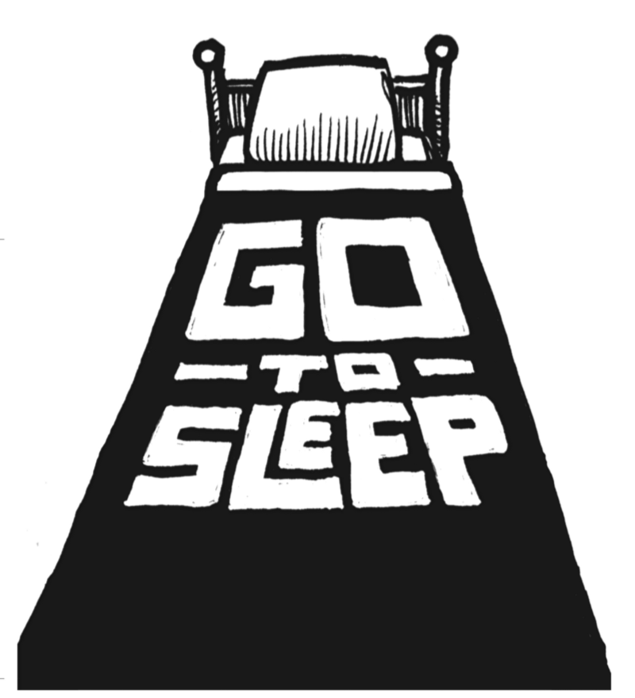

### [熬夜并不值得程序员炫耀](http://www.oschina.net/news/72066/sleep-deprivation-is-not-a-badge-of-honor)

放弃睡眠就像是高利贷借款。没错，看上去你是得到了额外的时间，但你想得太乐观了，你知道代价是什么吗？放高利贷的会回来讨债，到时如果你不能支付的话，他就会夺走你的创造力和你的士气。

现在我们偶尔会借用睡眠时间做一些事情，如果你完全了解其后果，并且不让它成为一种习惯的话就没关系。几天前我熬夜了。我们发布更新到 Basecamp的单点登录系统，这让我一直工作到了凌晨1:30。如果不是因为我接下来没有好好休息，早上5点就醒来帮助解决出现的问题的话，事情也不 会变得这样糟糕。第二天我所要付出的代价既典型又高昂：

固执：当我真的累了的时候，似乎总是更容易执着于我正在走的一条坏路线，而不是反思路线是否正确。因为把终点设在了海市蜃楼，于是我得在茫茫沙漠中走更长的时间才能找到绿洲。

缺乏创造力：区别那些比普通程序员的效率高10倍以上的程序员的标准，不是他们能多写10倍的代码，而是这些高效的程序员使用创造力的话，只需要十分之一的努力就可以解决问题。但当我累了的时候，创造力急剧下降以致于想不出创造性的解决方案。

士气减弱：当我的大脑不是火力全开的时候，它喜欢投喂一些要求不高的任务饲料。比如说，这一天我阅读了5次RSS订阅，又阅读了一些其他无关紧要的内容。去攻克真正重要问题的积极性和士气锐减。

烦躁：如果你碰到一个像炮仗一样一点就着的人，那么他很有可能正经受着睡眠被剥夺的痛苦。当你疲倦的时候，你的耐心和忍受力就会受到严重的影响。我很清楚当我没有充足睡眠的时候，我的状态最糟糕。

这些只是睡眠被剥夺时所付出的一部分代价而已。没有一个代价是可取的。但不知何故，似乎高科技产业依然将剥夺睡眠的自虐放到荣誉勋章的位置上。有 时，这甚至是吹嘘的资本。每个人都有好胜心，想要超越对方。为了显摆自己是如此重要，如此被需要，以致于人类需要你的牺牲？很多时候你没有那么特殊，也不 是那么被需要，并且手头的工作其实也没有那么迫切。

软件开发很少是短途冲刺，大多是马拉松。而且是多场马拉松。所以，试图今天压榨出110％的性能而明天只有70％的性能可用，绝对是一个坏主意。最终，你所能达到的高峰只有77％。绝对是得不偿失的交易。

这就是为什么我总是试图保证8.5小时的睡眠。这是我达到最佳性能表现的最好方法。每个人所需要的睡眠时间不尽相同，但那种认为自己只需要6小时或 更少的睡眠时间的想法，其实是一种假象。更糟的是，想要实现这种假象，你还得步履艰难地度过一段很难适应的时期。研究表明，睡眠不足的人往往经常大大低估 睡眠对自己能力的影响。

因此，请给自己更多的睡眠。不要吹嘘自己睡得有多么得少。通过良好的睡眠让自己保持性能的峰值。
