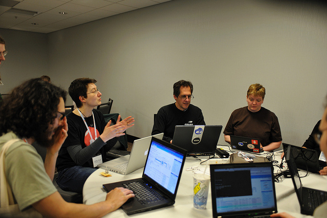
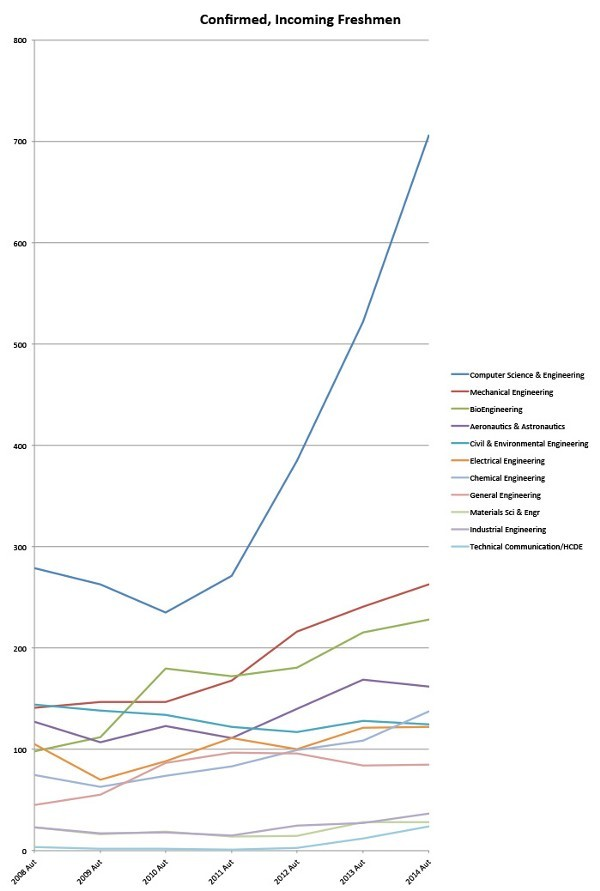
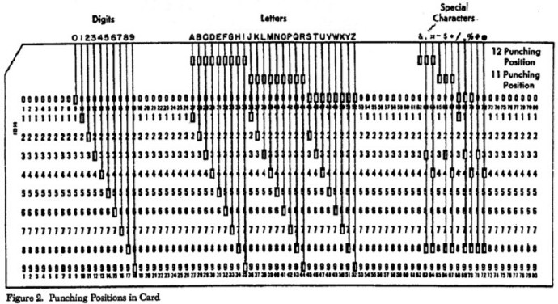
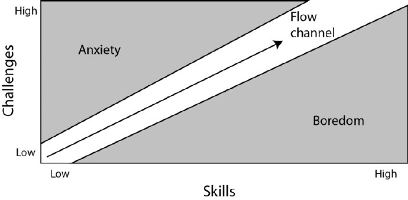

### [花一万个小时练习Coding，不要浪费一万小时无谓地Debugging](http://blog.jobbole.com/74825/)
// 转注：这篇译文的译者来自台湾。

Coding 之于科技的重要性不言可喻，也不再是软体工程师的专利，医师、律师、会计师、护理师、金融从业人员，甚至是听起来摸不着边的政治家，不论是哪个行业，学习Coding 已经成为世界新趋势。

本文作者Waseem Ahmad 为一个程式设计师，同时也是旅行家与终身学习者。以下文字以作者第一人称撰写。

一切都要归功于Code.org 与其他Coding 自学网站，学生可以从网站学到学校没教的电脑科学，这不仅激发了学生对Coding 的兴趣，也掀起一波学Coding 热潮。

当软体工程师的需求远远大过供给时，毫无疑问的，世界需要更多电脑科学专家。但是根据我个人经验和Reddit里面的评论，电脑科学相当的困难，流失率通常也很高。我曾花了好一段时间和力气，在莱斯大学上电脑科学的课程，比起其他的课要难许多。

我很早就对电脑萌生兴趣，大学也毫不犹豫地主修电脑科学，从没有后悔过。怀着强烈的兴趣开始了编写程式的课程，像是了解基本的资料架构、功能及程式回圈等等，在学习的过程中我体认到电脑科学不等于写程式，彻底的挑战了我长久以来的信念。

接下来几年的时光，我不断地吸收更多更多的知识，向我的指导教授和导师学习，我上了很多电脑科学的课程，也担任其中两门课的教学助理。暑假时我做了关于无人飞行载具（UAV）的计画，接下来的时间我在Google 和Facebook 实习。

在大四的时候，我担任莱斯电脑科学社团的社长，后来有机会可以和数百个莱斯的学生深度对谈，谈论职涯与抱负的课题。我以宏观的角度思考这所顶尖大学的电脑科学教育，体认到我有义务要写这篇文章：如何成功的学习电脑科学这门学问。

#### 积沙成塔，一切从基础开始
在莱斯的第一学期，我深刻地记得我举了手，问了Scott Rixner 教授一个问题：「为了迎合业界需求的新课程中，我们会学到什么程式语言呢？」在教授回答我的问题前，教授闪过一丝恼火的神情，我马上就明白了我完全搞错重点了。

用时间一再地证明，他强调在电脑科学领域，一个好的教育应该是要教你怎么思考，怎么学习。一开始我拒绝接受他的想法，但当我和在工作的校友聊天中、在我面试的过程中，深刻的明白原来最好的公司，不会在意你知道多少程式语言，最棒的工程师不会有「Java专家」、「Ruby开发者」这类的标签。

要如何为接收到的资讯建立模型、要怎么以电脑运算进行的资料呈现出来？要怎么抓住问题并用演算法来解决它们？当你以电脑计算的思维思考着，就能解决这些问题。

全世界的电脑科学部门，专注于理论与实务二者的比重不同，相较于学习更多程式语言与架构，可一再被套用的概念与抽象思考，对你的职涯会帮助更大，受惠更多。也就是说，时时保持好奇心和专注于最基础也是最重要的事情上吧！思考是绝对少不了的。

编码就像它的第二个本质
以实务而言，写程式是电脑科学中最主要的部份，它包含了写指令来执行资料架构的基础、逻辑、演算法和系统设计。虽然以基本要素为优先，但写程式仍是相当重要的一环，特别是你想要成为一个软体工程师，这不是靠着有一张电脑科学的文凭就可以办的到的事。

在Malcolm Gladwell的书《Outlier》中，列举了许多非常著名且相当成功的人为例子，这些佼佼者为了达到该领域的翘楚，投入约莫一万个小时，也就是超过一年的时间。这个引起我兴趣的故事，同时强调精通程度和运气，当透过乏味无趣的卡片穿孔机，根据指示命令将它们放入主架构的电脑跑程式，却找出一个错误，然后就得要重新跑一次，要获得更多写程式的实务经验是件相当困难的事。

比尔盖兹就很幸运，身为八年级生的他，能有机会接触到计算机终端，并且能接触到即时程式，1968 年的当时，电脑终端是相当新颖和稀少的。而当盖兹一接触到写程式，他就深深的受到吸引，爱的无法自拔，为了要免费使用电脑来写程式，他甚至在凌晨三点到六点，偷偷溜出家门跑到华盛顿大学。

1975 年，比尔盖兹和保罗艾伦（美国发明家、投资家和慈善家，是Microsoft 的创办人之一）辍学了，利用10,000 个小时，只专注做一件事情：不停地写程式。

10,000 个小时都做同一件事情，你能想像吗？从他们的例子，证明了一句话：专注与坚持，能成就不凡的未来。

10,000 个小时听起来很吓人，但是以另外一个例子来说－篮球员，和他的队友们在球场上花了无数个小时；又或者是说，一个软体工程师，以写程式为志业，一整天都看着电脑，看着无数行从脑中诞生的程式码，甚至回到家之后继续为了开源计画在做编程。一个人会爱上他们所做的事情，除了自身能力的培养外，特别是当这项工作是具有多样性、挑战性，从工作的过程中发现问题、解决问题，然后获得更多经验与成就感，对他们而言，这已经不是工作了，是兴趣，是乐在其中的。

在开始工作之前，我花了两个月在做以下两件事情：其中一个月我投入全部的心力，来完成程式的专案；剩下的一个月，我和我的朋友在欧洲玩，整整一个月。写程式和旅游，对我来说都一样地令我热血沸腾！

你说有什么捷径可以获得更多写程式的经验，或是变得更专精吗？没有，没有捷径，也没有替代方案，只有花心思、花时间，你才能变成首屈一指的专家。

### 是10,000 个小时的练习、练习，再练习，不是10,000 个小时的垂头丧气
透过作业打分数，以及和学生们谈话，我看到花了8 个小时所做出来的极佳作业，对比花了30 个小时却做的不怎么样的作业。

从这点可以看出，时间长短不是重点。

在写程式中最令人沮丧的，就是侦测出问题但你却找不到原因在哪。

我担任COM​​P446:Mobile Device Application（行动装置应用）这门课的教学助理，我的朋友告诉我，他想要让下载指示器可以在其中一个他所写的iOS Apps 中显示，花了整整六个小时，我们一同找出所有可能的错误和问题，然后一一删除，结果原因是，下载指示器的显图是白色的，但是显示背景也是白色的，难怪看不出来，你能想像我朋友脸上的表情吗？

我朋友花了长达6 个小时的时间找错误，结果只不过是颜色的问题；我的学生花了30 个小时，却做不出一个好成果，这两种情形，你能说是因为他们天生资质不足吗？当然不是。

每个人都可能会发生这样的状况，重要的不是你花了多少时间，而是在不断的找错误、在花心思反覆尝试所有可能的这整个专注过程，总要经历恼人的过程，才能避免犯下相同的错误，这才是最重要的。

当错误以不同样态出现时，就很可能一错再错；但你该做的不只是治疗这个错误症状，因为诚如刚刚所说，它会以不同样貌再出现，必须要找出其中的原因、专注于整个导致错误与一再尝试的过程，过程是怎么样的，这很重要。

然而，有的时候错误是来自于对手边的任务缺乏透彻的了解。当你一股脑儿的栽进写程式时，你不知道你真正的目的是什么，这将会变成一场灾难，功亏一篑。

就拿我自身的例子来说好了，关于操作系统作业的第一份作业，我把20 页的讲义反覆看了超过3 遍，还写了笔记，最终想出我觉得我应该做的点子；但是当我和我的经理开会时，他还花了半小时告诉我我该做什么，因为其实说到底，我并没有完全了解我应该要做什么。

除此之外，千万不要花太多的时间卡在一个问题上，寻求他人的帮助吧，不只是用另一双眼－也就是一个全新的角度来看你的问题，还可以让你知道你的指导员、助教、朋友、经理或是合伙人如何思考这个问题，如何解决它。不论它是理论的问题集、程式作业、或是你的实习任务，你会注意到在寻求帮助和独立作业间的Goldilocks Zone（又称为适居带），也就是取得了一个最佳的平衡。

你的经验和努力求进步的过程会帮助你在这两者－也就是在独立完成和寻求帮助间找到一个权衡，并且随着遇到不同的问题而调整。让你解决问题更有方法，更有效率。

#### 亲手创造，你能获得更多属于自己的体验
在大学时期，大部分的令我印象深刻的Coding 专案，是来自于自身兴趣的多方尝试－也就是所谓的Side project（也就是目前工作不直接相关，主要为了兴趣或好奇而执行的计画方案）。

它与课程作业或是实习工作最大的不同点在于，在做这些感兴趣的Side project 的过程，没有任何进度压力与要求，拥有极大的自由度，让我能够尽情的发挥自己的想法。不论在创意的激发，或者是完成后的成就感，都大大地超过完成一般作业和工作任务。

在这四年间，最令我骄傲的Side project，是开发出了一套名为Rice Election 的网页App－用于校内各种意见的调查。目前这套系统已被多达22 个校内组织，包含学生会，用于超过130 个选举及意见调查。开发这套系统，是我第一次开发具有实际用途App 的经验。

在过程中，我不只学到了与写程式相关的技能如资料库建立，使用者经验设计，甚至接触到了与电脑科学本身无关，但却在产品商业化中不可或缺的行销及市场评估。

对于一个主修电脑科学的大学生来说，像Rice Election 这种大型的专案并非一蹴可几的；但是透过逐渐累积经验，Side Project 的复杂度也跟着增加。

拿我自身为例子，我的第一个Side Project 是为了一个名为Parade 的Hackathon（骇客松，也就是编程马拉松） 所开发的诗文押韵产生器。当时这个App 花了我和队友Dennis 整整14 个小时，边做边学才完成的。然而经历过这段呕心沥血的经验；若是现在要写出一个类似的App，大概只需要不到一个小时。题外话一下，我强烈推荐参与Hackathon 这样的活动，真的非常的有趣！

同时，这些Side Project的开发经验，在未来的面试当中，不但能展现出对于Coding的热情与专注，更能表现出结合独立开发与现实生活需要的问题解决能力，拥有解决问题的能力，这很重要，也对于未来求职、工作的过程有相当大的帮助。除此之外，别小看Side Project的点子，未来可能隐藏有巨大的商业潜力，Mark Zuckerberg一手创办的Facebook就是一个很棒的例子！

#### 争取每个你感兴趣的机会
对于你有兴趣而尝试的机会，千万不要犹豫，要花尽所有力气去争取；别漏掉生活中的每个环节，说不定都潜藏着机会，只是你没有主动去寻求而已。

对某堂课中所提到的主题有兴趣吗？那可以询问教授是否有相关的研究机会；利用暑假期间去实习，将所学到的理论面知识加以应用在实务面上，Google 和Facebook 都有提供许多相关的机会。

像是Google 和Facebook 这样全世界数一数二的顶尖公司，你会担心，你会胆怯，就算你觉得你得到实习机会的机率根本微乎其微，还是要勇敢的寄出履历表，也许它并不如你想像中的渺茫，很多时候，事情都还没有一个定论，而我们却先被内心的恐惧与不安吓跑了。

在大学第二年的暑假，为了找到实习工作，我寄出了超过30份的申请，结果只有3家公司愿意给我机会。非常幸运的是，其中一家就是Google。为了准备第二三轮的技术面试，我花了好几个礼拜的时间，看完《Cracking the Coding Interview》，来模拟面试的状况。

如果在实习期间表现的不错的话，很可能会得到下个暑假实习的机会，甚至是毕业后的工作机会。

然而，我并不建议你再次回到相同公司实习，特别是在不确定毕业后能得到工作机会的情况下。同时如果是在已经有经验的情况下，申请其他公司的实习机会也会变得比较容易。由于实习大多为期约三个月，对大学生来说，这将是个能够体验及选择之后工作内容及环境的好机会。

You won’t know what you’re missing out until you try !

对我来说，在Google 的再次实习机会其实让我犹豫了很久。当然，毕业后能到Google 工作是我梦寐以求的梦想，而我怕若没有接受这个再次实习的机会，全职工作的机会也将随之消失。然而，我最后还是选择了其他公司完成我大三暑假实习，很棒的是，我得到观察职场的全新角度，这对我来说是个很棒的经验，而且我毕业后，Google 还是给了我工作机会！

#### 不只是电脑科学领域，这是给大家的人生建议
#### 别再和他人比较，而是与自己比较

当人开始不断地和他人比较的时，很容易陷入复杂的情绪。

对那些从11 岁就开始学程式设计的，和在大学前就赢了编程马拉松的人来说，因为拥有深厚的底子，或是丰富的实务经验，相较于同领域的其他人，他们容易瞧不起别人。然而，反观那些费尽好一番功夫，试图听懂教授在讲什么的学生，当他们看到那些可以一直举手回答教授问题的同学，会开始质疑自己，反覆的问自己「要怎样才能变得跟他一样好？」这种比较心态导致忌妒或是藐视，甚至会丧失自信心；而那些优秀的，会变得更自大，更不可一世。

与其想着别人有多好、多厉害，专注于自身的独特点，思考什么对你来说是重要的事情，设定目标，并且花心思找寻方法来一一达成，这才是最实际也最重要的。

比如说，不妨想想，现在的自己跟一年前的自己有什么不同？看看成长了多少、进步了多少，一年后，你想成为怎样的人？自觉，会渐渐地改变你，会更凸显出你的个人特质，无形中让你越来越好。

不要过度投入，要懂得取舍，以及了解自己的底线

如果喜欢的事情很多，反而要小心不要过度投入。大一时我一路顺遂，然后变得非常有野心，我觉得自己很厉害，什么都难不倒我，因此我抓住每个我所遇到的机会。

大二的第二学期，我选了一​​个普通的课程和其他三门非常花时间的课。其中一门是COMP446: 行动装置应用，其实我没有修过它的先修课程，我也没有写过物件导向程式的经验，同时我正在打工和当资讯工程大一的助教。

除此之外，我很疯狂又热血的参加了三个学生社团，成为所属学院的学生会主席，参与网站设计，我把时间都花在上课和开会上，我从晚上八点开始工作但是到了凌晨三点就因为太累了而停止。从此之后，我开始失眠了，每天直到五六点才睡着，但是一到九点我便起床准备早上的课，日复一日，到了学期中，课程内容越来越深入，课外活动也不减反增，我简直要崩溃了。

我参加了一个Rice Wellness Center 所办的聚会，和我的教授、研究助理，和朋友们聊聊，我找到了可以减轻压力的方法，也就是放弃那些我快被当掉的课，以及把课外的事情做到最低限度，不再事必躬亲，这段时间可说是我人生中的低潮，而尝到苦头的我，最大的收获，就是真正学到处理事情的优先顺序和对事情说不。

我的朋友Veronica写了一篇文章－《别过度投入，以及做不值得做的工作－第二篇：建立履历表》，真希望我早就读过这篇文章了。

#### 多交点朋友，以及找到归属感

朋友是一辈子的资产，也是支柱。

当你从大学毕业后，你不会想起你高分通过的考试，你会记得又珍惜的，是每段友谊和与朋友共处的时光。当你踏出舒适圈，并且极尽所能地交各种朋友，不管是系上的也好，或是系外的也好，当和朋友一起思考、一起解决很困难的问题时，你会感受到你并不孤单；朋友们会跟着你一起参加你原本不会参加活动，让你变得更加的圆滑，获得更多不一样的快乐。

#### 相信自己

这听起来很俗套，但是，你如何对待自己，别人就会怎么对待你，记得，你所走的路，是你的自信心带着你，在前引领着你的，所以建立自信，是绝对重要的事情。你要明白你的优势是什么，以及你的独到之处，当你达到某个目标时，就尽情地享受那份成就感与荣耀，谦逊地接受赞美，并且要以乐观积极的心态，面对未来每个挑战。
