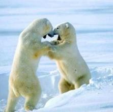

### 动物游戏之谜
周立明
在缅甸的热带丛林里，高达十几米的树顶上，两只叶猴跳荡着、嬉闹着。它们依仗长尾巴出色的平衡功能，在树枝上玩着“走钢丝”和“倒立”的把戏；它俩相互推挤，好像竭力要把对方推下树去，可被推的一方总是抓住树枝，巧妙地跳开去，绝不会失足坠地……它们是在打架吗?

在北极地区的冰雪陡坡上，一群北极渡鸦发出欢快的聒噪声。它们飞上坡顶，像小孩坐滑梯一样一只挨着一只滑雪而下，滑到坡底后，又飞上去……它们是在表演吗？
在美洲巴塔哥尼亚②附近的大海里，每当刮起大风时，成群的露脊鲸把尾鳍高高举出水面，正对着大风．以便像船帆似的．让大风推着它们，得意洋洋地“驶”向海岸。靠近海岸后，这些巨大的海兽又会潜回去，重复刚才的举动……露脊鲸又是在干什么呢?

动物学家对此做出的解释也许会使我们吃惊：这些动物是在游戏!并不是童话故事中拟人化的“游戏”，而是实实在在的游戏，是与人类儿童的游戏行为有着相似特征的游戏行为。动物的游戏行为，被认为是动物行为中最复杂、最难以捉模、引起争论最多的行为。
研究动物行为的科学家，按照动物游戏的形式，把它们分成三种最基本的类型：单独游戏、战斗游戏、操纵事物的游戏。

单独游戏的特征是无需伙伴，动物个体可以独自进行。单独游戏时，动物常常兴高采烈地独自奔跑、跳跃，在原地打圈子。例如，马驹常常欢快地连续扬起前蹄，轻盈地蹦跳；猴类喜欢在地上翻滚，拉着树枝荡秋千……单独游戏时动物显得自由自在，这是最基本的游戏行为。
战斗游戏得由两个以上的个体参加，是一种社会行为。战斗游戏时，动物互相亲密地厮打，看似战斗激烈，其实极有分寸，它们配合默契，绝不会引起伤害。研究者认为，战斗游戏可能要比真的战斗更为困难，因为这种游戏要求双方的攻击有分寸，对伙伴十分信赖，动物严格地自我控制，使游戏不会发展成真的战斗。

操纵周围事物的游戏，在一定程度上表现出动物支配环境的能力。北极熊常常玩这样的游戏：把一根棍子或石块衔上山坡，从坡上扔下来，自己跟在后面追，追上石块或棍子后，再把它们衔上去。野象喜欢把杂草老藤滚成草球，然后用象牙“踢”草球。
近二十年来，动物的游戏行为引起了研究者的极大兴趣，成为行为研究中最有争议的领域。争议的焦点，是动物为什么要进行游戏。

生物世界有一条普遍规律，就是尽可能节省能量。在动物身上，无论从形态结构、生理过程，还是行为方面去分析，尽可能节省能量的例子比比皆是。那么，动物为什么要消耗大量能量来进行这种没有明确目的的游戏呢？对此，研究者有着不同的看法。
著名的黑猩猩研究者珍妮•古多尔③发现，幼小的黑猩猩常常玩这样的游戏：用手掌舀一点水，用牙齿嚼珍妮·古多尔烂树叶，来汲取手掌中的水。而成年黑猩猩在干旱的季节，就是用嚼烂的树叶汲取树洞中的水解渴的。根据这样的发现，一些科学家认为，游戏行为是未来生活的排演或演习，游戏行为使得动物从小就能熟悉未来生活中要掌握的各种“技能”，例如追逐、躲藏、搏斗等等，熟悉未来动物社会中将要结成的各种关系。这对于动物将来的生存适应是非常重要的。这种假说可以称为“演习说”，基本观点是“游戏是生活的演习”。
有一些科学家不同意“演习说”。他们指出，游戏行为并不限于幼小动物，成年动物也同样需要。他们举出不少成年动物游戏的例子。对于成年动物来说，不存在用游戏来演习生活的需要。他们还指出，有些动物的游戏与生存适应毫无关系，例如河马喜欢玩从水下吹起浮在水面上的树叶的游戏，渡鸦喜欢玩从雪坡上滑梯的游戏等。这些科学家认为，动物游戏是为了“自我娱乐”，而“自我娱乐”是动物天性的表现，正像捕食、逃避敌害、繁殖行为等是动物的天性一样。越是进化程度高、智力发达的动物，这种“自我娱乐”的天性越强。游戏正是这种自我娱乐的集中表现。通过自得其乐的游戏，使动物紧张的自然竞争生活得到某种调剂和补偿，使它们在生理上、心理上容易保持平衡，从而得到一定的自我安抚和自我保护。因而，不仅幼小动物，成年动物也需要游戏。以上假说可以称为“自娱说”。

不久前，美国加州大学神经生理学家汉斯•特贝、哈佛大学社会生物学家斯塔•阿特曼等提出一种引人注目的新假说——“学习说”。他们认为，游戏是一种实践性很强的学习行为。特贝曾经在卡那里群岛④上研究黑猩猩的学习行为。他发现，如果给黑猩猩一根棍子，它们就会用棍子做出各种游戏行为：会用棍子互相赶来赶去，像人们赶鸭子似的；也会用棍子去取挂着的食物。经历过这种游戏的黑猩猩，在今后生活中容易学会使用棍子。同样，“捉迷藏”和追逐游戏，也使动物学会利用有利地形保护自己的本领。游戏的实践性强，能产生直接的效果反馈，对锻炼动物的速度、敏捷、隐蔽、争斗、利用环境等能力很有效。游戏向动物提供了大量机会，使它们能把自身的各种天赋技能和复杂的自然环境、社会环境巧妙地结合起来，因而无论对幼小动物还是成年动物，游戏都是一种十分重要的学习行为。

美国爱达荷大学的约翰•贝叶和加拿大动物学家保尔•赖特认为，游戏不仅是学习，而且是“锻炼”。贝叶注意到，西伯利亚羱羊⑤的游戏带有明显的锻炼倾向：它们选择游戏场地时，似乎总是从“实战”出发，选择在坎坷的斜坡上奔跑追逐，在陡峭的悬崖上跳跃，好像是在锻炼它们逃避敌害的能力。赖特发现，哈得逊湾⑥的北极熊冬季生活艰难，要花很大力气去捕捉海豹、鱼类，过着紧张的流浪生活。到了夏季，冰雪消融了，北极熊转移到陆上生活，这时，食物来源丰富了，北极熊不必为猎食而整天奔波。它们吃饱喝足了，就进行各种游戏，如摔跤、奔跑、追逐、滑坡等。夏季游戏好像体育运动，使北极熊在食物丰富的季节保持了身体的灵活和力量，这对于它们冬季捕食显然大有好处。因此，这两位学者提出“锻炼说”来补充“学习说”。

这几种假说，哪一种更有道理？动物的游戏，究竟是为了“演习”，为了“自娱”，为了“学习”，还是为了“锻炼”？研究者们各执己见，众说纷纭。而且，目前这些假说都难以圆满解释的问题是，动物在游戏行为中表现出来的智能潜力、自我克制能力、创造性、想像力、狡猾、计谋、丰富多彩的通信方式等，都远远超出人们对它们的估计。英国动物生态学家罗伯特•亨德指出：动物的游戏行为是如此复杂的行为，甚至要给这种游戏行为下一个确切的定义也很不容易。游戏行为有点儿像体育运动，有点儿像演戏，它既无目的，又无结果，在动物行为中即兴发生，没有一定模式，没有不变的规则，内容复杂多变，实在令人捉摸不透。亨德和所有研究动物游戏行为的专家都相信，要解开动物游戏的所有秘密，还需要做更加深入的研究。

